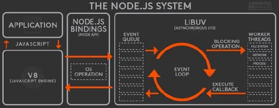

# Introduction to Javascript Runtime

Javascript is a **single threaded language**. This means it has one Call Stack and one Memory Heap. As expected, it executes code in order and must finish executing a piece code before moving onto the next.

**The heart of any JavaScript Runtime is always a JavaScript Engine. Without an engine there is no runtime and there is no JavaScript at all**.

However, **_the engine alone is not enough_. In order to work properly, we also need access to the web APIs (ex. DOM, Timers, Fetch API etc)**.

So essentially **web APIs are functionalities provided to the engine, but which are actually not part of the JavaScript language itself**. _JavaScript simply gets access to these APIs through the global `window` object_.

A typical JavaScript runtime also includes a so called **callback queue. This is a data structure that contains all the callback functions that are ready to be executed**. For example we attach event handler functions to DOM elements like a button to react to certain events, and these event handler functions are also called callback functions. So as the event happens, for example a click, the callback function will be called. And here is how that actually works behind the scenes: so the first thing that actually happens after the event is that the callback function is put into the callback queue. Then when the stack is empty the callback function is passed to the call stack so that it can be executed (this happens by something called the **event loop**). **_So basically the event loop takes callback functions from the callback queue and puts them in the call stack so that they can be executed. The event loop only runs once the call stack is empty and the entire Javascript file has been run once_**.

JavaScript is a single threaded language that can be non blocking. It has one Call Stack and it does one thing at a time. In order to not block the single thread, it can be **_asynchronous with callback functions_** _and these callback functions gets run in the background through the Callback queue and then the Event Loop bring it back into the Call Stack_.


## Web APIs

API stands for **A**pplication **P**rogramming **I**nterface. API are piece of software that can be used by another piece of software, in order to allow applications to talk to each other. APIs are ready-made sets of code building blocks that allow a developer to implement programs that would otherwise be hard or impossible to implement.

There are be many types of APIs in web development:

- a **Web API** is an _application programming interface for the web_
- a **Browser API** can _extend the functionality of a web browser_
- a **Server API** can extend the functionality of a web server

The **Web APIs are not a part of the JavaScript Engine**, but they are **part of the runtime environment provided by the browser**.

### Browser APIs

All browsers have a set of built-in Web APIs to support **complex operations**, and to **help accessing data**. Web APIs are functionalities provided to the engine, accessible on `window` object.

Browser APIs are built into your web browser, and are able to expose data from the surrounding computer environment, or do useful complex things. For example:

- The `DOM (Document Object Model) API` allows you to manipulate HTML and CSS, creating, removing and changing HTML, dynamically applying new styles to your page, etc. Every time you see a popup window appear on a page, or some new content displayed for example, that's the DOM in action.
- The `Geolocation API` retrieves geographical information. This is how Google Maps is able to find your location and plot it on a map.
- The `Canvas` and `WebGL` APIs allow you to create animated 2D and 3D graphics. People are doing some amazing things using these web technologies.
- `Audio` and `Video` APIs like `HTMLMediaElement` and `WebRTC` allow you to do really interesting things with multimedia, such as play audio and video right in a web page, or grab video from your web camera and display it on someone else's computer.

A Web API is a developer's dream.

- It can extend the functionality of the browser
- It can greatly simplify complex functions
- It can provide easy syntax to complex code

Features like event listeners, timing functions and AJAX requests all sit in the Web APIs container until an action gets triggered. A request finishes receiving its data, a timer reaches its set time or a click happens and this triggers a callback function to be sent to the callback queue.

### Third Party APIs

Third party APIs are not built into the browser by default, and you generally have to grab their code and information by downloading the source code from the web. Examples:

- YouTube API allows you to display videos on a web site.
- Twitter API allows you to display Tweets on a web site.
- Facebook API allows you to display Facebook info on a web site.
- The Google Maps API allows you to embed custom maps into your website, and other such functionality.

## Event Loop & Callback Queue

When you run some JavaScript code in a browser, the **engine starts to parse the code**. **Each line is executed and popped on and off the call stack**. But, what about Web API's? Web API's are not something JavaScript recognizes, so the parser knows to pass it off to the browser for it to handle. When the browser has finished running its method, it puts what is needed to be ran by JavaScript into the **callback queue**. **The callback queue cannot be ran until the call stack is completely empty**. So, the **event loop** is constantly checking the call stack to see if it is empty so that it can add anything in the callback queue back into the call stack. And finally, once it is back in the call stack, it is ran and then popped off the stack.

```js
console.log('1'); // goes on call stack and runs 1

setTimeout(() => {
  console.log('2'), 1000;
});
// gets sent to web api
// web api waits 1 sec, runs and sends to callback queue
// the javascript engine keeps going

console.log('3');
// goes on call stack and runs 3
// event loop keeps checking and see call stack is empty
// event loop sends calback queue into call stack
// 2 is now ran

// 1
// 3
// 2

// Example with 0 second timeout
console.log('1');

setTimeout(() => {
  console.log('2'), 0;
});

console.log('3');

// 1
// 3
// 2

// Still has the same output
```

In the last example above, we get the same output. How does this work if it waits 0 seconds? The JavaScript engine will still send off the setTimeout() to the Web API to be ran and it will then go into the callback queue and wait until the call stack is empty to be ran. So, we end up with the exact same end point.

> Nifty Snippet: Until 2009, JavaScript was only run inside of the browser. That is when Ryan Dahl decided it would be great if we could use JavaScript to build things outside the browser. He used C and C++ to build an executable (exe) program called Node JS. Node JS is a JavaScript runtime environment built on Chrome's V8 engine that uses C++ to provide the event loop and callback queue needed to run asynchronous operations.



## Job Queue or Microtask Queue

The **job queue** or **microtask queue** came about with promises in ES6. With promises we needed **another callback queue that would give higher priority to promise calls**. The JavaScript engine is going to **check the job queue before the callback queue**.

```js
// 1 Callback Queue ~ Task Queue
setTimeout(() => {
  console.log('1', 'is the loneliest number');
}, 0);
setTimeout(() => {
  console.log('2', 'can be as bad as one');
}, 10);

// 2 Job Queue ~ Microtask Queue
Promise.resolve('hi').then(data => console.log('2', data));

// 3
console.log('3', 'is a crowd');

// 3 is a crowd
// 2 hi
// undefined Promise resolved
// 1 is the loneliest number
// 2 can be as bad as one
```

## References

1. [The Complete JavaScript Course. From Zero to Expert! - Jonas Schmedtmann](https://www.udemy.com/course/the-complete-javascript-course/?utm_source=adwords&utm_medium=udemyads&utm_campaign=JavaScript_v.PROF_la.EN_cc.ROWMTA-B_ti.6368&utm_content=deal4584&utm_term=_._ag_130756014153_._ad_558386196906_._kw__._de_c_._dm__._pl__._ti_dsa-774930039569_._li_1011789_._pd__._&matchtype=&gclid=CjwKCAjwiuuRBhBvEiwAFXKaNCuaAhZ8UB5kIldtb76eeAyfM0SUKeceBq3FKF24pNxDVe-_g0-DPxoCnWwQAvD_BwE)

2. [Understanding the JavaScript runtime environment - medium.com](https://medium.com/@gemma.stiles/understanding-the-javascript-runtime-environment-4dd8f52f6fca)

3. [Web APIs - Introduction - w3schools](https://www.w3schools.com/js/js_api_intro.asp)

4. [Introduction to web APIs - MDN](https://developer.mozilla.org/en-US/docs/Learn/JavaScript/Client-side_web_APIs/Introduction)

5. [Web APIs - MDN](https://developer.mozilla.org/en-US/docs/Web/API)

6. [What is JavaScript?](https://developer.mozilla.org/en-US/docs/Learn/JavaScript/First_steps/What_is_JavaScript)
