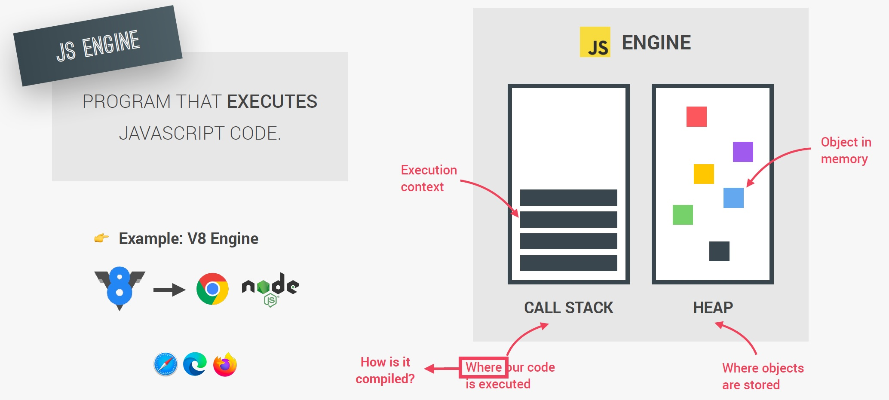

# Introduction to JavaScript Engine

JavaScript Engine is ==**a "program" that executes JavaScript code**. Any JavaScript Engine (ex. V8 for Google Chrome) always contains a **Call Stack** and a **Memory Heap**. The Call Stack is _where our code is actually executed_, using something called **execution contexts**. The Memory Heap is an **unstructured memory** pool which _stores all the objects that our application needs_.==



Almost everyone that has worked with JavaScript has heard of the V8 engine, the idea of the JavaScript Engine, and most people know that ==JavaScript is a **single threaded language**== that it uses a ==**Callback Queue**==. You may also hear phrases like ==JavaScript is an **interpreted language**==. What is this engine that we speak of? If I write some code like `const isHappy = true;`, how does the computer read this code?

If I gave a computer with a CPU a file that is a JavaScript file, and I tell it "Read this file and do something for me", the computer only understands 1 and 0 at the end of the day, so ==the computer doesn't really know what JavaScript is. So how are we able to communicate using a JavaScript file so that the computer do something for me? And this is the first step in our learning, and that is the JavaScript Engine. **By having a JavaScript Engine, it allows you to give this engine the JavaScript file and this engine is going to understand the JavaScript file and tell the computer what to do**==. In a sense, you just created a ==**translator**== so you can communicate with somebody that doesn't know your language, and this special engine called ==JavaScript Engine understands JavaScript==. Our computer finally understands us because of this JavaScript Engine.

But do you think there's one JavaScript Engine or many JavaScript Engines? Well, ==there are a ton of engines and they're called ECMAScript engines==. So any time we use an engine, we're able to give it a JavaScript file and this JavaScript file gets understood by the engine, and it allows this engine to communicate and tell the machine, the computer, to do what we ask it to do with JavaScript.

Now, these engines are written by programmers, for example, ==V8 engine is written in C++==, but why do people write these engines? 2008 marked a really pivotal moment in history when it comes to JavaScript, because V8 was released by Google. Before then, most browsers used engines that were very basic, which meant that JavaScript was a little bit slow. You see, Google had this problem, they had something called Google Maps, and Google Maps, as you know, requires a lot of power, and all the previous engines before V8 would make Google Maps very, very slow on the browser. So with Google Maps and their own Chrome browser, they said, we're going to write our own JavaScript Engine, the V8 engine, so that JavaScript runs way faster on the browser than it's done previously, and in 2008 they released V8.

## Memory Heap & Call Stack

What is a program? Well, a program has to do some simple things. It has to ==**allocate memory**==, otherwise we wouldn't be able to have variables or even have a file on our computer. It also has to ==**parse and execute scripts**==, which means read and run commands.

The JavaScript Engine consists of two parts. First part is ==a place to **store and write our data**==, and second  part is ==a place to **keep track, line by line, of what's executing**==.

The ==**Memory Heap**== is a place to ==**store and write information**==, so that we can use our memory appropriately. It is ==a place to **allocate**, **use**, and **remove** memory as needed==.

```js
// Tell the memory heap to allocate memory for a number
const number = 11;

// Allocate memory for a string
const string = 'some text';

// Allocate memory for an object and it's values
const person = {
  first: 'Brittney',
  last: 'Postma',
};
```

The ==**Call Stack**== ==**keeps track of where we are in the code, so we can run the program in order**. Things are placed into the Call Stack on top and removed as they are finished. It **runs in a "first in - last out" mode. Each call stack can point to a location inside the Memory Heap**==.

```js
function subtractTwo(num) {
  return num - 2;
}

function calculate() {
  const sumTotal = 4 + 5;
  return subtractTwo(sumTotal);
}

debugger;
calculate();
```


We need the Memory Heap as a place to store and write information, because at the end of the day all programs are just read and write operations, that way we have a place to allocate, use and release memory. And two, with the Call Stack, we need a place to keep track of where we are in the code so that we can run the code in order. And with these two things, the JavaScript Engine is able to do that.

_Now, since every JavaScript Engine has different implementations, where variables are allocated is not 100% the same all the time. So a good way to think about it is that **simple variables can usually be stored on the stack** and **data structures like objects, arrays and functions are stored in Memory Heap**_.

## References

1. [The Complete JavaScript Course. From Zero to Expert! - Jonas Schmedtmann](https://www.udemy.com/course/the-complete-javascript-course/?utm_source=adwords&utm_medium=udemyads&utm_campaign=JavaScript_v.PROF_la.EN_cc.ROWMTA-B_ti.6368&utm_content=deal4584&utm_term=_._ag_130756014153_._ad_558386196906_._kw__._de_c_._dm__._pl__._ti_dsa-774930039569_._li_1011789_._pd__._&matchtype=&gclid=CjwKCAjwiuuRBhBvEiwAFXKaNCuaAhZ8UB5kIldtb76eeAyfM0SUKeceBq3FKF24pNxDVe-_g0-DPxoCnWwQAvD_BwE)

2. [Understanding the JavaScript runtime environment - medium.com](https://medium.com/@gemma.stiles/understanding-the-javascript-runtime-environment-4dd8f52f6fca)
