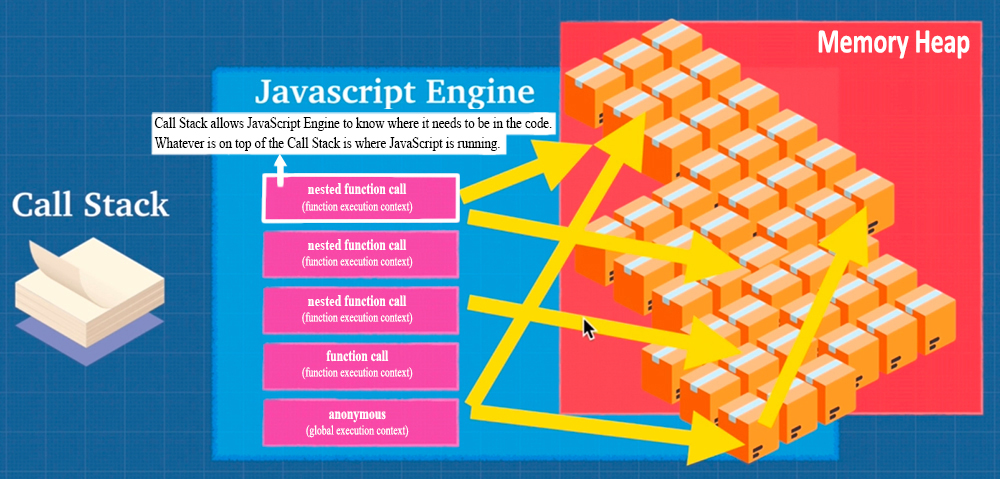
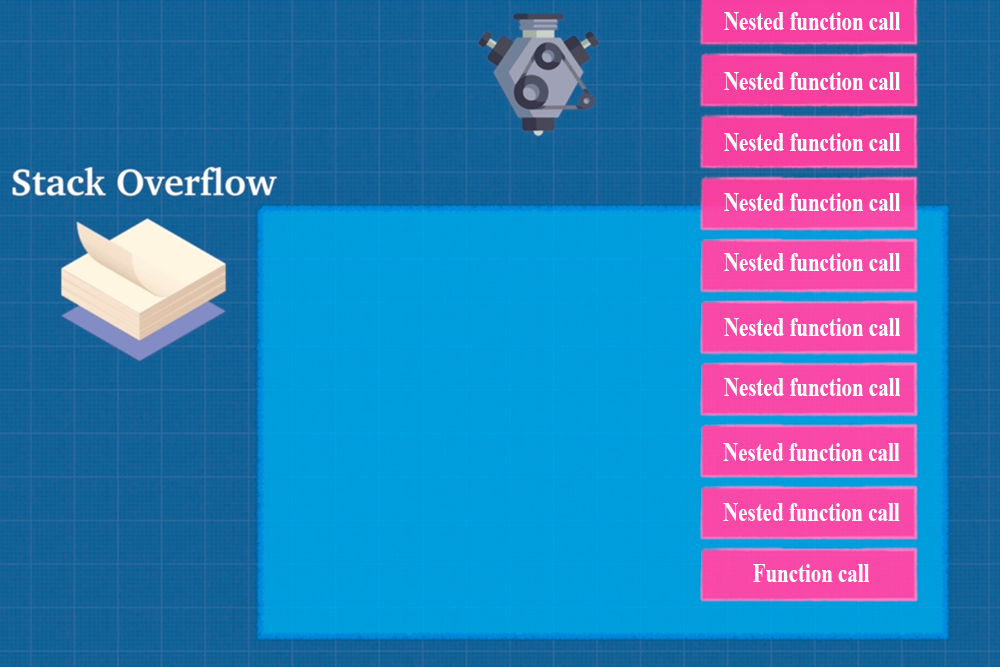
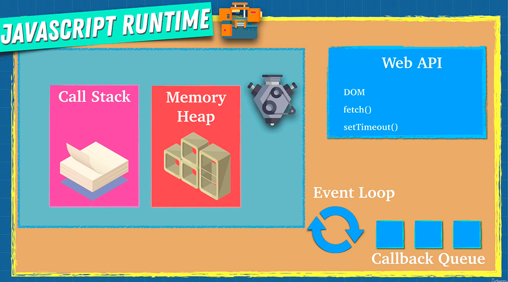

# Introduction to JavaScript Engine (part 2)

With Interpreters and Compilers, we learned that the JavaScript Engine does a lot of work for us, but the biggest thing is actually ==**reading** our code and **executing** it==. What do you think the two most important things in these steps are?

- We need ==a place to **store** and **write** _information_==,  to store our variables, our objects, our data of our apps, otherwise we wouldn't be able to have variables, or even have a file on our computer. So in other words, ==a place to **allocate memory**==;
- We need ==a place to **keep track, line by line, of what's executing**==.

## Memory Heap & Call Stack

JavaScript Engine use ==**Call Stack**== and ==**Memory Heap**== when is reading and executing the JavaScript code. We need the Memory Heap as a place to store and write information, and the Call Stack as a place to keep track of where your code is in it's execution, so that we can _execute the code in order_.

```js
// Memory Heap
const number = 11; // Tell the Memory Heap to allocate memory for a number
const string = "some text"; // Allocate memory for a string
const person = { // Allocate memory for an object and it's values
  first: "Brittney",
  last: "Postma"
};
function subtractTwo(num) { // Allocate memory for a function
  return num - 2;
}
function calculate1() { // Allocate memory for a function
  const sumTotal = 4 + 5;
  return subtractTwo(sumTotal);
}
function calculate2() { // Allocate memory for a function
  const sumTotal = 4 + 5;
  return subtractTwo(sumTotal);
}

// Call Stack
calculate1(); // Keep track of where your code is in it's execution, so that we can execute the code in order:
// subtractTwo()
 // calculate1()
  // anonymous (Global Execution Context)
calculate2(); // Keep track of where your code is in it's execution, so that we can execute the code in order:
 // calculate2()
  // anonymous (Global Execution Context)
```


So JavaScript Engine is ==a "program" that read and execute JavaScript code. Any JavaScript Engine (ex. V8 for Google Chrome) always contains a Call Stack and a Memory Heap. The Call Stack is _where our code is actually executed_, using something called **execution contexts**. The Memory Heap is an **unstructured memory** pool which _stores all the objects that our application needs_.==


The ==**Memory Heap**== is a place to ==**store and write information**==, so that we can use our memory appropriately. It is ==a place to **allocate**, **use**, and **remove** memory as needed==.

The ==**Call Stack**== is ==**a place to keep track of where your code is in it's execution, so that we can _execute the code in order_**==. It runs in a ==**"first in - last out" mode**==, that means the first one in is the last one getting popped out of the Call Stack. Each Call Stack can point to a location inside the Memory Heap, so we use the Memory Heap to actually point to different variables and objects and data that we store.t



_Now, since every JavaScript Engine has different implementations, where variables are allocated is not 100% the same all the time. So a good way to think about it is this: **simple variables can usually be stored on the Call Stack**, and **data structures like objects, arrays and functions are stored in Memory Heap**_.

The cool thing about Call Stack is that it allows JavaScript Engine to know where it needs to be in the code. ==**Whatever is on top of the Call Stack is where JavaScript is running**==.

## Stack Overflow

If you have only functions that don't have inside any nested functions, on every single time that functions will be called, the Call Stack is going to get pushed on and then popped off. But what happens if we have functions with nested functions inside on them and keep ==calling **functions nested inside of each other**, over and over and over==, so that we keep ==growing the Call Stack until it gets larger and larger and larger, until we can't do it anymore==? Well, that's called ==**Stack Overflow**==.



But what about the Memory Heap> Is there a way to do something like stack overflow with the Memory Heap? We can growing the Memory Heap until it gets larger and larger and larger, until we can't do it anymore?

## Garbage collection & Memory Leaks

JavaScript is a ==**garbage collected language**==. That means when JavaScript allocates memory, let's say within a function,we create an object and that object gets stored somewhere in our Memory Heap automatically with JavaScript. When we finish calling the function and we don't need that object anymore, JavaScript is going to clean the object in the Memory Heap for us. So ==only the data that is still useful to us remains in the Memory Heap==, so that this way we make sure we don't use up all the memory we have available, because as we know, memory is limited.

In garbage collected languages like JavaScript, the ==**garbage collector** frees memory on the Memory Heap and prevents what we call **memory leaks**==.

```js
// Memory Leaks
let array = [];
for (let i = 5; i > 1; i++) {
    array.push(i-1)
}
// When I run this code, we're going to run an infinite loop that keeps pushing to the array "i-1" over and over and over, until we fill up the Memory Heap and there's no memory space for us to use, and we're going to crash the browser. The garbage collection wasn't  working because we still using the array, garbage collection only removes data from Memory Heap if we are not using anymore.
```

There are ==**3 common memory leaks**==, so you need to avoid them in your application:

- _global variables_;
- _event listeners_ that you never remove when you don't need them;
- _setInterval_ functions that have in their body referencing to external objects, and these objects are going to never be collected by the garbage collector, because the setInterval, unless we clear it and stop it, is going to keep running and running and running.

```js
// Global variables
let a = 1;
let b = 'As';
let c = false;

// Event Listeners
let element = document.querySelector('.class');
element.addEventListener('click', onClick);

// setInterval
setInterval(() => {
    // referencing variables...
})
```

## Single threaded language

JavaScript is a ==**single threaded** programming language==. What does that mean? Being single threaded means that ==only one set of instructions is executed at a time==, single threaded languages ==not doing multiple things==. The biggest way to check that a language is single threaded is that ==it has **only one Call Stack**==. This single Call Stack allows us to run code one at a time, we're never running functions in parallel. The Call Stack keeps growing as we push new functions on the Call Stack, and then we pop them one at a time. Because of this ==JavaScript is **synchronous**==.

When we talk about JavaScript, _most of the time you're never just using only the_ ==**JavaScript Engine**, which is _synchronous_==. _We need to use the_ ==**JavaScript Runtime**, which is _asynchronous_==.



In order for us to write code that we can use in this modern day, we need something beyond just the JavaScript Engine, and that is JavaScript Runtime.

## References

1. [The Complete JavaScript Course. From Zero to Expert! - Jonas Schmedtmann](https://www.udemy.com/course/the-complete-javascript-course/?utm_source=adwords&utm_medium=udemyads&utm_campaign=JavaScript_v.PROF_la.EN_cc.ROWMTA-B_ti.6368&utm_content=deal4584&utm_term=_._ag_130756014153_._ad_558386196906_._kw__._de_c_._dm__._pl__._ti_dsa-774930039569_._li_1011789_._pd__._&matchtype=&gclid=CjwKCAjwiuuRBhBvEiwAFXKaNCuaAhZ8UB5kIldtb76eeAyfM0SUKeceBq3FKF24pNxDVe-_g0-DPxoCnWwQAvD_BwE)

2. [Understanding the JavaScript runtime environment - medium.com](https://medium.com/@gemma.stiles/understanding-the-javascript-runtime-environment-4dd8f52f6fca)

3. [JavaScript: The Advanced Concepts - Andrei Neagoie](https://www.udemy.com/course/advanced-javascript-concepts/)

