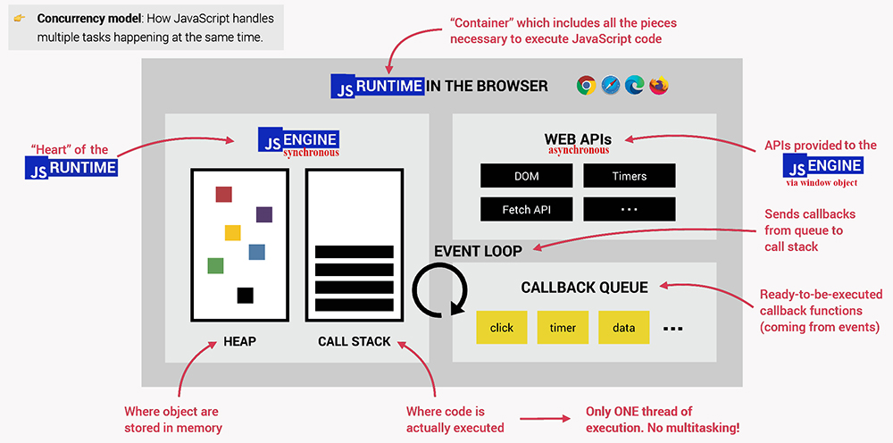
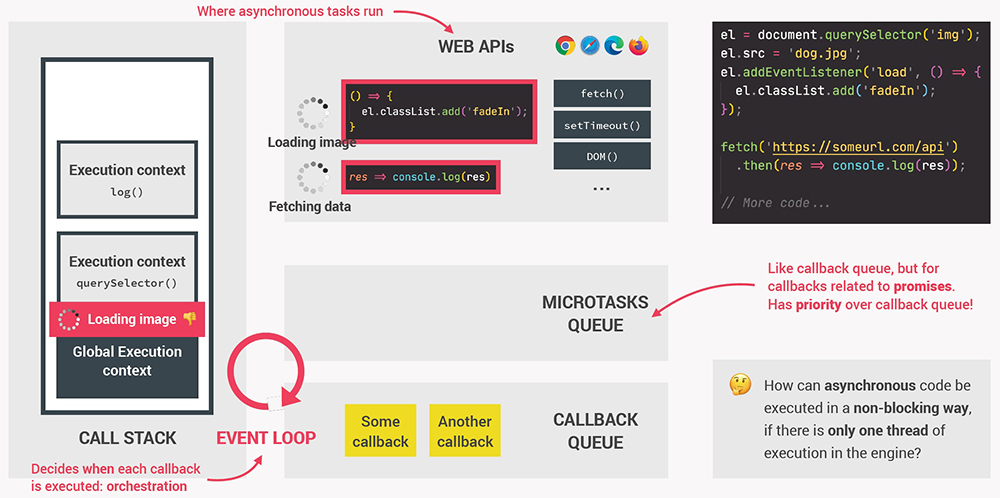
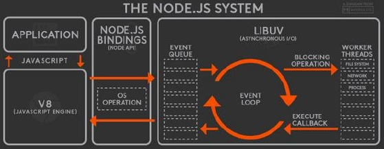

# Introduction to JavaScript Runtime

JavaScript is a ==**single threaded programming language**==. This means it has ==only _one_ Call Stack== and ==only _one_ Memory Heap==. As expected, ==it executes code _in order_== and ==must finish executing a line of code before moving onto the next one==. If a line of code takes a really, really long time, well, things are going to be really slow for our program. This is where JavaScript Runtime comes in.

==**The heart of any JavaScript Runtime is always a JavaScript Engine**. Without the JavaScript Engine, there is no JavaScript Runtime, and there is no JavaScript at all. However, **JavaScript Engine alone is not enough**, because being single threaded (synchronous), if you have code that takes a long, long time to execute, your application will be very, very slow. In order to your application work properly, we also need a JavaScript Runtime that gave access to the Web APIs (ex. DOM, Timers, Fetch API etc.)==.



## Web APIs

Browsers (Chrome, Firefox, Safari, etc.) comes in with a JavaScript Engine and a JavaScript Runtime. All of them have their own JavaScript Engine implementation, and all of them have a JavaScript Runtime that provide a Web APIs. These Web APIs can do a variety of things like send HTTP requests, listen to DOM events, delay execution of code using something like ```setTimeout``` or ```setInterval```, database storage on the browser, etc. 

In the JavaScript Runtime case the ==web browser is working in the background, while the JavaScript Engine is running==, and ==JavaScript Runtime is using these **Web APIs to communicate with the JavaScript Engine**== and let it know "Hey, I'm back with some data, some work that you told me to do in the background".

The Web APIs are provided to the JavaScript Engine via global ```window``` object. In ```window``` object we can see different things that the JavaScript Runtime provides for us, that our JavaScript Engine can use. ==These Web APIs (setIntervals, setTimeout, fetch, localStorage, document object, etc.) are **not native to JavaScript language itself**==, these Web APIs are provided by JavaScript Runtime via ```window``` object , so they are native to the browser. JavaScript simply gets access to these APIs through the global ```window object```. 

The browsers, via Web APIs, are helping us create rich web applications, so that users aren't just sitting around waiting for our synchronous JavaScript Engine to execute code that takes a very long, long time. Anything  code that can be offloaded to the Web APIs, Web APIs will take care of that code for us in the background.

These ==Web APIs are what we call **asynchronous**==. That means you can _instruct these APIs to do something in the background and return data once it's done_, meanwhile, we can just continue working on our JavaScript Call Stack and execute functions.

## Callback Queue & Event Loop 

==A typical JavaScript Runtime also includes a so called **Callback Queue**. This is a **data structure that contains all the Web APIs callback functions that are finish to run in the background, and now are ready to be executed by the JavaScript Engine**==.

When you run some JavaScript code in a browser, the **JavaScript Engine starts to parse (read) the code** and **executed each functions line by line popped on and off functions to the Call Stack**. But, what  happen when JavaScript Engine meets a Web APIs function in our code? Web APIs are not part of JavaScript language itself, JavaScript Engine don't recognizes them, so Web APIs are pass off to the JavaScript Runtime to handle it. When the JavaScript Runtime has finished running it's Web APIs, it puts what is needed to be ran by JavaScript Engine into the Callback Queue. The Callback Queue cannot be ran until the Call Stack is completely empty. So, the job of the Event Loop is to constantly checking the Call Stack to see if it is empty, so that it can add anything that's in the Callback Queue into the Call Stack. Once a Web APIs function is in the Call Stack, it is ran and then popped off the stack.



```js
console.log('1'); // goes on call stack and runs 1

setTimeout(() => {
  console.log('2'), 1000;
});
// gets sent to Web APIs
// Web APIs waits 1 sec, runs and sends to callback queue
// the Javascript Engine keeps going

console.log('3');
// goes on Call Stack and runs 3
// Event Loop keeps checking and see Call Stack is empty
// Event Loop sends calback queue into Call Stack
// 2 is now ran

// 1
// 3
// 2

// Example with 0 second timeout
console.log('1');

setTimeout(() => {
  console.log('2'), 0;
});

console.log('3');

// 1
// 3
// 2

// Still has the same output
```

In the example above, we get the same output. How does this work if it waits 0 seconds? The JavaScript Engine will still send off the ```setTimeout()``` to the Web API to be ran, and it will then go into the Callback Queue and wait until the Call Stack is empty to be ran. So, we end up with the exact same end point.

JavaScript is a single threaded language that can be non-blocking. It has one Call Stack and it does one thing at a time. In order to not block the single thread, it can be **_asynchronous with callback functions_** and these callback functions gets run in the background through the Callback Queue, and then the Event Loop bring that callback functions back into the Call Stack.

> Nifty Snippet: Until 2009, JavaScript was only run inside of the browser. That is when Ryan Dahl decided it would be great if we could use JavaScript to build things outside the browser. He used C and C++ to build an executable (exe) program called Node JS. Node JS is a JavaScript Runtime environment built on Chrome's V8 engine that uses C++ to provide the Event Loop and Callback Queue needed to run asynchronous operations.



## Job Queue or Microtask Queue

The ==**Job Queue** _or_ **Microtask Queue**== came about with Promises in ES6. With Promises we needed ==**another Callback Queue that would give higher priority to Promise calls**==. The JavaScript Engine is going to ==**check the Job Queue before the Callback Queue**==.

```js
// 1 Callback Queue ~ Task Queue
setTimeout(() => {
  console.log('1', 'is the loneliest number');
}, 0);
setTimeout(() => {
  console.log('2', 'can be as bad as one');
}, 10);

// 2 Job Queue ~ Microtask Queue
Promise.resolve('hi').then(data => console.log('2', data));

// 3
console.log('3', 'is a crowd');

// 3 is a crowd
// 2 hi
// undefined Promise resolved
// 1 is the loneliest number
// 2 can be as bad as one
```

## More things about Web APIs

API stands for ==**A**==pplication ==**P**==rogramming ==**I**==nterface. API are ==**piece of software that can be used by another piece of software**, in order to **allow applications to talk to each other**==. APIs are ready-made sets of code building blocks that allow a developer to implement programs that would otherwise be hard or impossible to implement.

There are be many types of APIs in web development:

- a **Web API** is an _application programming interface for the web_
- a **Browser API** can _extend the functionality of a web browser_
- a **Server API** can extend the functionality of a web server

The ==**Web APIs are not a part of the JavaScript Engine**, but they are **part of the JavaScript Runtime environment provided by the browser**.==

### Browser APIs

==All browsers have a set of built-in Web APIs to support **complex operations**, and to **help accessing data**. Web APIs are functionalities provided by the JavaScript Runtime to the JavaScript Engine, accessible on window object.==

Browser APIs are built into your web browser, and are able to expose data from the surrounding computer environment, or do useful complex things. For example:

- The `DOM (Document Object Model) API` allows you to manipulate HTML and CSS, creating, removing and changing HTML, dynamically applying new styles to your page, etc. Every time you see a popup window appear on a page, or some new content displayed for example, that's the DOM in action.
- The `Geolocation API` retrieves geographical information. This is how Google Maps is able to find your location and plot it on a map.
- The `Canvas` and `WebGL` APIs allow you to create animated 2D and 3D graphics. People are doing some amazing things using these web technologies.
- `Audio` and `Video` APIs like `HTMLMediaElement` and `WebRTC` allow you to do really interesting things with multimedia, such as play audio and video right in a web page, or grab video from your web camera and display it on someone else's computer.

A Web API is a developer's dream.

- It can extend the functionality of the browser
- It can greatly simplify complex functions
- It can provide easy syntax to complex code

Features like event listeners, timing functions and AJAX requests all sit in the Web APIs container until an action gets triggered. A request finishes receiving its data, a timer reaches its set time or a click happens and this triggers a callback function to be sent to the callback queue.

### Third Party APIs

==Third party APIs are not built into the browser by default, and you generally have to grab their code and information by downloading the source code from the web==. Examples:

- YouTube API allows you to display videos on a web site.
- Twitter API allows you to display Tweets on a web site.
- Facebook API allows you to display Facebook info on a web site.
- The Google Maps API allows you to embed custom maps into your website, and other such functionality.

## References

1. [JavaScript: The Advanced Concepts - Andrei Neagoie](https://www.udemy.com/course/advanced-javascript-concepts/)

2. [The Complete JavaScript Course. From Zero to Expert! - Jonas Schmedtmann](https://www.udemy.com/course/the-complete-javascript-course/?utm_source=adwords&utm_medium=udemyads&utm_campaign=JavaScript_v.PROF_la.EN_cc.ROWMTA-B_ti.6368&utm_content=deal4584&utm_term=_._ag_130756014153_._ad_558386196906_._kw__._de_c_._dm__._pl__._ti_dsa-774930039569_._li_1011789_._pd__._&matchtype=&gclid=CjwKCAjwiuuRBhBvEiwAFXKaNCuaAhZ8UB5kIldtb76eeAyfM0SUKeceBq3FKF24pNxDVe-_g0-DPxoCnWwQAvD_BwE)

3. [Understanding the JavaScript runtime environment - medium.com](https://medium.com/@gemma.stiles/understanding-the-javascript-runtime-environment-4dd8f52f6fca)

4. [Web APIs - Introduction - w3schools](https://www.w3schools.com/js/js_api_intro.asp)

5. [Introduction to web APIs - MDN](https://developer.mozilla.org/en-US/docs/Learn/JavaScript/Client-side_web_APIs/Introduction)

6. [Web APIs - MDN](https://developer.mozilla.org/en-US/docs/Web/API)

7. [What is JavaScript?](https://developer.mozilla.org/en-US/docs/Learn/JavaScript/First_steps/What_is_JavaScript)
