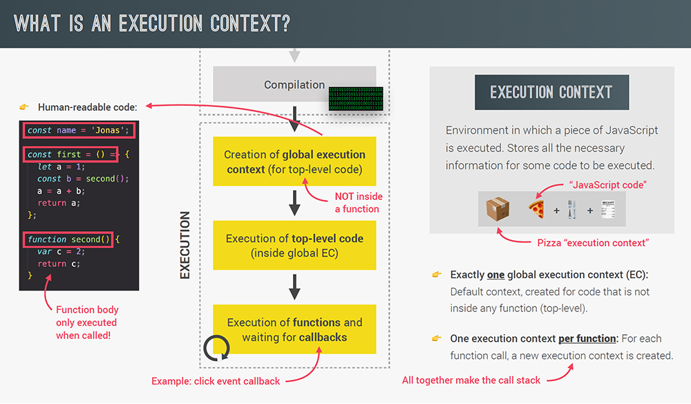
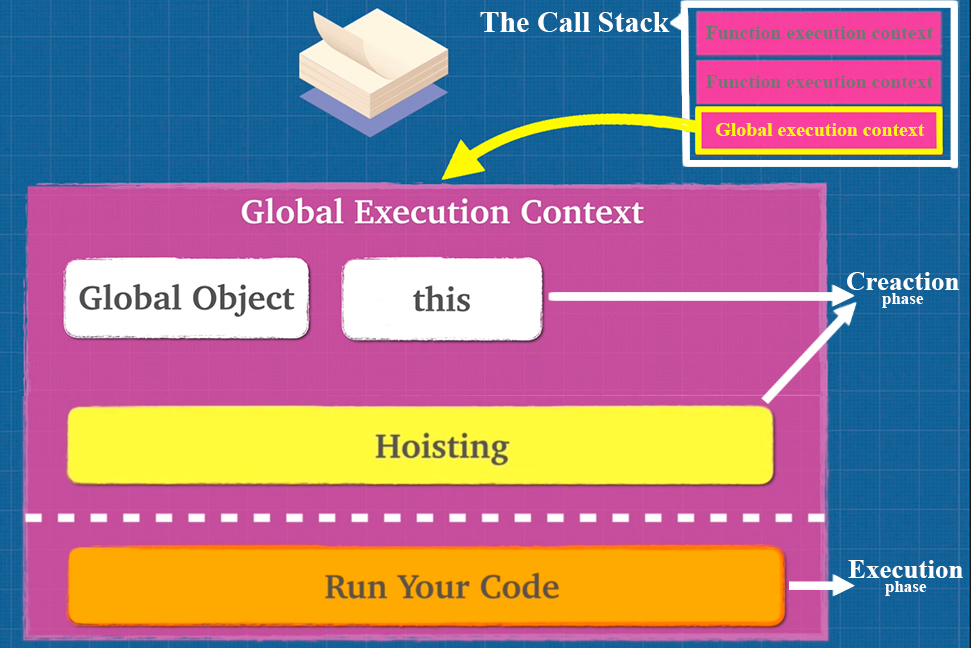

# Execution Context and the Call Stack

How do we run code in JavaScript? Well, we ==assign variables== and then we ==run functions==, right? That's all we really do in a programming language. When you give your JavaScript file to a browser, the JavaScript Engine start to read and execute the code inside your file, line by line, in order. As the JavaScript Engine starts to read your code, it creates something called the ==**global execution context**==. Whenever JavaScript Engine sees a function call in you code, it's going to create something called an ==**function execution context**==. Each function call gets its own execution context.

Code in JavaScript is always ran inside a type of execution context. Execution context is simply the ==**environment within which your code is ran**==. So any time we run code in JavaScript, it's always going to be part of an execution context, it's part of global or inside of some function that we call.

==Each execution context has its own **variable environment**==.

There are ==two **types**== of execution context in JavaScript:

- **==global==** 
-  **==function==**
  There are ==two **stages**== as well to each context, **the ==creation==** and **==executing== phase**.

_Initially, our JavaScript Engine is going to create a global execution context. We don't see this, it's underneath the hood, but it's saying "Hey, here's the JavaScript file for you, just start reading it for me", and on top of global execution context, that's when we start adding functions calls and then eventually, as these execution context (execution context for the functions calls) get popped off, the last thing that remains is the global execution context. And when the final line of our code runs and we're done with the JavaScript Engine, global execution context is going to get popped off the Call Stack_.



## Global execution context

==Global execution context is the very **first item on the Call Stack**==, _the first thing the JavaScript Engine does is to create the global execution context, and it gives you two things: first thing is a **global object `window`** and the other thing is that **`this` keyword** in JavaScript_. 

But to start things off, global execution context gives us these two things right off the JavaScript Engine starts up. So let's test this assumption: if what I just told you is correct, that means _I can just give an empty JavaScript file to the browser and I should have a `window` object and the `this` keyword already defined without me having to do anything_. So I get these two things that `this` keyword and `window` object without even writing a piece of JavaScript, because the browser has created a global execution context for me.

_To the global object (in our case `window` object), we can assign variables, we can add functions and we can add different things to this global object_.



So once we have done what we call a creation phase in our JavaScript Engine, we then have a second phase and that second phase is called the _execution phase_, where you actually run your code.

### Creation Phase

1. Global Object created (in the browser the global object is **`window`**)
2. Initializes **`this`** keyword to global

### Executing Phase

3. Variable Environment created - memory space for `var` variables and functions created
4. Initializes all variables to `undefined` (also known as hoisting) and places them with any functions into memory

```js
this;
window;
this === window;

// Window {...}
// Window
```

Don't forget that ==**each execution context has its own _variable environment_**==.

## Function execution context

A function context is created by the JavaScript Engine ==when it sees a **function call**==. ==Each function gets its own execution context==.

### Creation Phase

1. **`arguments`** object created with any arguments (on each execution context we create a new `arguments` object)
2. Sets **`this`** to the global object unless in strict mode, where it's `undefined`

### Executing Phase

3. **Variable Environment** created - _memory space for variable and functions created_
4. **Initializes all variables** to `undefined` and places them into memory with any new functions

```js
// Function Execution Context creates arguments object
function showArgs(arg1, arg2) {
  console.log('arguments: ', arguments);
  return `argument 1 is: ${arg1} and argument 2 is: ${arg2}`;
}

showArgs('hello', 'world');

// arguments: { 0: 'hello', 1: 'world' }
// argument 1 is hello and argument 2 is world

function noArgs() {
  console.log('arguments: ', arguments);
}

noArgs();

// arguments: {}
// even though there are no arguments, the object is still created
```

```js
function showArgs(arg1, arg2) {
  console.log('arguments: ', arguments);
  console.log(Array.from(arguments));
}

showArgs('hello', 'world');

// arguments: { 0: 'hello', 1: 'world' }
// [ 'hello', 'world' ]

function showArgs2(...args) {
  console.log(console.log('arguments: ', args));
  console.log(Array.from(arguments));
  return `${args[0]} ${args[1]}`;
}

showArgs2('hello', 'world');

// arguments: [ 'hello', 'world' ]
// [ 'hello', 'world' ]
// hello world
```

The keyword `arguments` can be dangerous to use in your code as is. In ES6, a few methods were introduced that can help better use `arguments`.

We don't really get `arguments` in the global object, do we? If I run `arguments` in the console, I'll get an error "Argument is not defined" because, well, **`arguments` is only available to us when we create a function execution context**.

All right, so we got the `arguments` object, but you might remember something from our previous videos? **Remember when we talked about how to help the JavaScript Engine optimize our code, and I told you not to use `arguments`?**

_Now, I said that `arguments` is a little bit dangerous to use. Why is that? Well, because **`arguments` looks like an array, but it's not really an array**, so there are many things that you can do with the `arguments` keyword that might make the Compiler or the JavaScript Engine less able to optimize your code because **you can't really use array methods on `arguments`**. And with the new JavaScript, they introduced a few little tools that we can use so that we avoid using `arguments` because there are some cases where we might want to iterate or loop through `arguments` instead of just accessing them regularly_.

_One way to go about it is to say `console.log(Array.from(arguments))` and `Array.from()` method will create an array from whatever we give it_.

_Another way is to use the `spread` operator_.

**So with modern JavaScript, you most likely want to avoid `arguments`, it's one of those tricky things that was initially added to JavaScript that caused a lot of problems and headache**. _But using the techniques that I've shown you, we can actually convert `arguments` into an array like object so that when you do those operations, it'll be helpful for you_.


## References

1. [JavaScript: The Advanced Concepts - Andrei Neagoie](https://www.udemy.com/course/advanced-javascript-concepts/)
1. [The Complete JavaScript Course. From Zero to Expert! - Jonas Schmedtmann](https://www.udemy.com/course/the-complete-javascript-course/?utm_source=adwords&utm_medium=udemyads&utm_campaign=JavaScript_v.PROF_la.EN_cc.ROWMTA-B_ti.6368&utm_content=deal4584&utm_term=_._ag_130756014153_._ad_558386196906_._kw__._de_c_._dm__._pl__._ti_dsa-774930039569_._li_1011789_._pd__._&matchtype=&gclid=CjwKCAjwiuuRBhBvEiwAFXKaNCuaAhZ8UB5kIldtb76eeAyfM0SUKeceBq3FKF24pNxDVe-_g0-DPxoCnWwQAvD_BwE)
