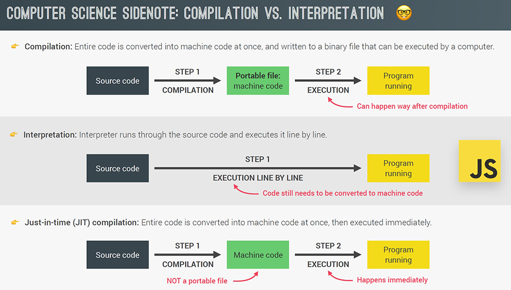
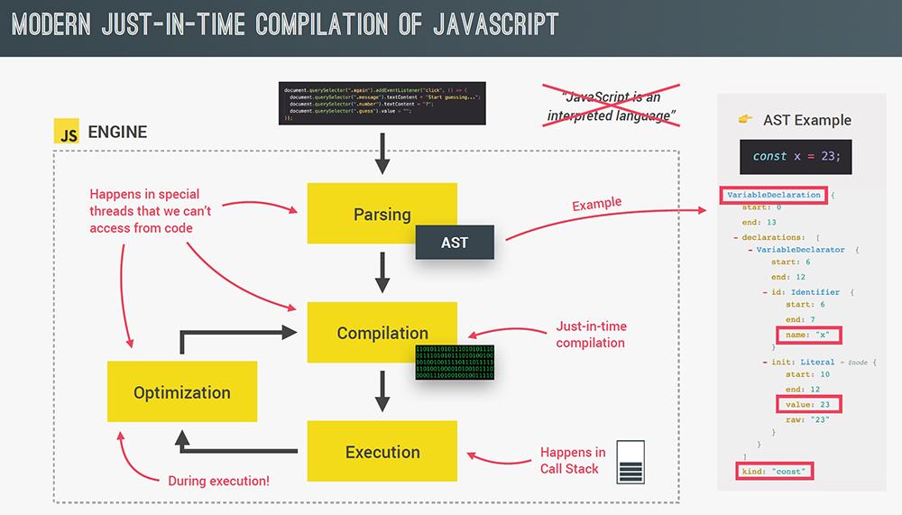
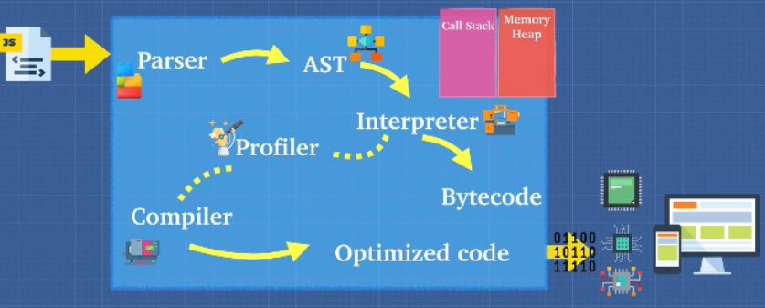

## Interpreter/Compiler/JIT Compiler and Writing Optimized Code







**The Parser**: Parsing is the **process of analyzing the source code**, checking it for errors, and breaking it up into parts. During the parsing process, the code is parsed into a data structure called the Abstract Syntax Tree or AST. This works by first splitting up each line of code into pieces that are meaningful to the language, like the const or function keywords, and then saving all these pieces into the tree in a structured way. This step also checks if there are any syntax errors and the resulting tree will later be used to generate the machine code.

**The Interpreter**: An interpreter directly **executes each line of code line by line, without requiring them to be compiled into a machine language program**. Interpreters can use different strategies to increase performance. They can parse the source code and execute it immediately, translate it into more efficient machine code, execute precompiled code made by a compiler, or some combination of these. **In the V8 engine, the interpreter outputs bytecode**.

**The Compiler**: The compiler works ahead of time to convert instructions into a machine-code or lowerlevel form so that they can be read and executed by a computer. It **runs all of the code and tries to figure out what the code does and then compiles it down into another language that is easier for the computer to read**.

**The Combo**: In modern engines, the **interpreter starts reading the code line by line** while the **profiler watches for frequently used code and flags then passes is to the compiler to be optimized**. In the end, the JavaScript engine takes the bytecode the interpreter outputs and mixes in the optimized code the compiler outputs and then gives that to the computer. This is called **'Just in Time'** or **JIT Compiler**.

Let's talk about **interpreters** and **compilers**, which, as we can see, are important pieces in our JavaScript engine.

You see, **in programming, there are generally two ways of translating to machine language or something that our computers can understand** and what we're going to talk about here actually applies to most programming languages, not just JavaScript, Python, Java, C++, any language you can think of is going to use some of these concepts, so it's very important.

Let's start with the first one, the interpreter. **With an interpreter, what we do is we _translate and read the files line by line_**.

A **compiler**, unlike an interpreter, **_doesn't translate on the fly_**. What it does is it **_works ahead of time to create a translation of what code we've just written and it compiles down to usually a language that can be understood by our machines. A compiler take one pass through the code and try to understand what the code does_**. And it's going to take the program in JavaScript or any type of language and write a new program in your new language, let's say to programming language.

So _compiler tries to understand what we want to do and takes our language and changes it into something else and this usually happens into something called a lower level language, such as machine code_. Now, in some respects, all languages have to be interpreted and compiled because it has to run (it has to be interpreted) and it also has to most likely get translated into something low level like machine code.

But the main takeaways is this: **there are two ways to run JavaScript using an interpreter or a compiler**. Now, I know it's still a little bit fuzzy, but if I ask you, why would we want to do one over the other? What are the pros and cons on each? What do you think that is? Why would you pick one over the other?

**Babel + TypeScript**: Have you heard of Babel or TypeScript? They are heavily used in the Javascript ecosystem and you should now have a good idea of what they are: **Babel is a Javascript compiler that takes your modern JS code and returns browser compatible JS (older JS code). Typescript is a superset of Javascript that compiles down to Javascript. Both of these do exactly what compilers do: take one language and convert into a different one!**

Let's have a look at the pros and cons of each: First off, **interpreters are quick to get up and running**, right? Because if we want to run a Javascript code, with an interpreter we don't have to convert the code into another language, like language acts like I showed you with a compiler. There's no compilation step before you can start running your code, you just give the code to an interpreter and the interpreter starts translating their first line and just runs the code for us. Because of this, an interpreter is a natural fit for something like JavaScript and JavaScript originally was created for the browser, so being able to interpret JavaScript and run it as fast as possible. Well, that was ideal and this is exactly why it JavaScript used interpreters at the beginning, but there's a cons with using an interpreter. And this is the same problem that Google had back in the day when they had Google Maps running a lot of JavaScript, but it will get slower and slower and slower because **the problem with interpreters is that when you're running the same code more than once, for example, if you're in a loop where we're running a piece of code over and over and over, even though it gives us the same result, it can get really, really slow. The compiler actually helps us here. It takes a little bit more time to start up because it has to go through that compilation step at the beginning, go through our code, understand it and split it out into a another language. But the compiler will be smart enough that when it sees code like loop over a thing and the loop has the same inputs returning the same outputs, well, it can actually just simplify that code**.

**What if instead of using the compiler and interpreter, we combine these two and create something called a JIT compiler or Just In Time compiler? And this is exactly what browsers started doing, browser's started mixing compilers, specifically these JIT compilers for Just In Time compilation to make the engines faster**.

So is JavaScript an interpreted language? I mean, yes, initially when JavaScript first came out, you had JavaScript engines such as Spider Monkey that interpreted JavaScript to bytecode and that engine was able to run inside of our browsers to tell our computers what to do but things have evolved. _Now we don't have just interpreters, we also use compilers to optimize the code_. So this is a common misconception when somebody says JavaScript is an interpreted language. Yes, there is some truth to it but it actually depends on the implementation, you can make an implementation of JavaScript, of the JavaScript engine that perhaps only compiles.

We want to write **code that helps the compiler make its optimizations**, not work against it making the engine slower.

Why do we just learn all of this? Well, because now we know a critical part in being a JavaScript programmer, **we want to write code in a way that helps the compiler make optimizations**. We don't want to work against it and make things slow throughout the rest of the course. We're going to learn different ways to write efficient code. But I want to give you some basic things to watch out for when working with JavaScript Engine. Now, keep in mind that most of these things I'm going to show you will seem like things you don't really use or see that much anymore, and that's because most developers don't use them, since they can be bad for optimisations. But it never hurts to know what they are. It doesn't mean that you should never use them, but that the use cases for them are very rare. So here's the list: `eval()`, `arguments`, `for...in`, `with`, `detele`.

## Memory Leaks & Stack Overflow

**Memory leaks** happen when you have **unused memory**, such as variables that are declared globally but you don't use them, but they's still there. Well, _by having unused memory just laying around, it fills up the Memory Heap_ and that's why you might hear why global variables are bad. Global variables are bad because if we don't forget to clean up after ourselves, we fill up the Memory Heap and eventually the browser will not be able to work.

So what happens if you keep calling functions that are nested inside each other? When this happens it’s called a **stack overflow**. Example below:

```js
// When a function calls itself, it is called RECURSION
function inception() {
  inception();
}

inception(); // returns Uncaught RangeError: Maximum call stack size exceeded
```

_What stack overflow means? Well, stack overflow is this when a stack is overflowing, kind of like we talked about Memory Leaks and how the Memory Heap of a JavaScript engine can overflow. Well, with stack overflow, this happens when the Call Stack just gets bigger and bigger and bigger until it just doesn't have enough space anymore_.

_What happens if we keep calling functions nested inside of each other over and over and over so that we keep growing the Call Stack until it gets larger and larger and larger and larger and larger, until we can do it anymore? Well, that's called_ **stack overflow**.

**Recursion is a _function calling itself_**, there are some cases where things like recursion is quite useful, but that's something beyond the scope of this course and it's something I teach in my other courses for data structures and algorithms. But **recursion is one of the most common ways to create a stack overflow** or a lot of functions nested inside of each other to create that stack that keeps growing and growing and growing. In this case, if I run inception function, it's going to keep adding things onto the stack more and more and more. So what do you think happens if I run the inception function? I get an error like **Uncaught RangeError: Maximum call stack size exceeded**. Now back in the day with Chrome, it wouldn't give you this error and the browser will eventually just crash, but in order to prevent the browser from crashing, if it reaches a limit, it's going to print out this error saying, hey, you've just created a stack overflow.

Let's create our own memory leak:

```js
const array = [];

for (let i = 5; i > 1, i++) {
    array.push(i-1);
}
```

Now, when I run this code above, what's going to happen is we're going to run an infinite loop and we fill up our memory and there's nothing left for us to use and well, we're going to crash the browser. Now, this was a silly example, and most likely you're not going to do in your programs, but there are **3 common memory leaks** that happened that I want to show you so you can avoid them in your application.

**The first one is global variables**. _If I just keep adding variables to my environment, well, we're adding more and more pieces of memory_.

**The second one is event listeners**. Now, _the event listeners is one of the most common ways to leak memory and that is you add an event listeners and you never remove them when you don't need them_, so that you keep adding, keep adding, keep adding event listeners and because they're just there in the background, you forget about them and next thing you know, you create a memory leak. This happens a lot, especially if you go back and forth between single page applications where you're not removing the event listeners off the page and as a user goes back and forth, back and forth, the memory keeps increasing more and more as more event listeners are added.

**The thirth one is setInterval()**. _This setInterval(), unless we clear it and stop it, is going to keep running and running and running_.

_Just something to be aware of that **memory is limited**. That is when it comes to Call Stack and Memory Heap. Those are two places that JavaScript remembers or stores memory and we have limited use of them_. So for us to write efficient code, we have to be conscious to not have stack overflow or a memory leak and to manage that memory well.

## Garbage Collection

JavaScript is a garbage collected language. If you allocate memory inside of a function, JavaScript will automatically remove it from the memory heap when the function is done being called.

JavaScript completes garbage collection with a **mark** and **sweep** method.

```js
var person = {
  first: 'Brittney',
  last: 'Postma',
};

person = 'Brittney Postma';
```

In the example above a **memory leak** is created. **By changing the variable person from an object to a string, it leaves the values of first and last in the memory heap and does not remove it**. This can be avoided by trying to keep variables out of the global namespace, only instantiate variables inside of functions when possible. JavaScript is **a single threaded language**, meaning only one thing can be executed at a time. It only has one call stack and therefore it is a **synchronous** language.

## Single Threaded Model

Each browser has its own version of **JavaScript Runtime** with a set of **Web API**'s, methods that developers can access from the **`window`** object. **In a synchronous language, only one thing can be done at a time**. Imagine an alert on the page, blocking the user from accessing any part of the page until the OK button is clicked. If everything in JavaScript that took a significant amount of time, blocked the browser, then we would have a pretty bad user experience. This is where **concurrency** and the **event loop** come in.
