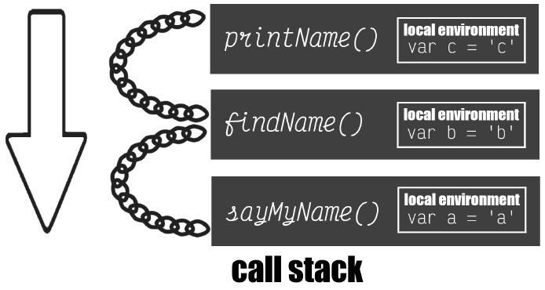

# Scope Chain

```js
function sayMyName() {
  let a = 'a';
  return function findName() {
    let b = 'b';
    return function printName() {
      let c = 'c';
      return 'Brad Pitt';
    };
  };
}
```

Each environment context that is created has a link outside of its lexical environment called the scope chain. **The scope chain gives us _access to variables in the parent environment_**.

```js
var x = 'x';

function findName() {
  console.log(x);
  var b = 'b';
  return printName();
}

function printName() {
  var c = 'c';
  return 'Brittney Postma';
}

function sayMyName() {
  var a = 'a';
  return findName();
}

sayMyName();

// sayMyName runs a = 'a'
// findName runs
// x
// b = 'b'
// printName runs c = 'c'
// Brittney Postma
```

In this example, all the functions have access to the global variable `x`, but trying to access a variable from another function would return an error. The example below will show how the scope chain links each function.

```js
function sayMyName() {
  var a = 'a';
  console.log(b, c); // returns error
  return function findName() {
    var b = 'b';
    console.log(a); // a
    console.log(c); // returns error
    return function printName() {
      var c = 'c';
      console.log(a, b); // a, b
    };
  };
}

sayMyName()()(); //each function is returned and has to be called
```

In this example, you can see that the functions only _get access to the variables in their parent container, not a child_. **The scope chain only links down the call stack, so you almost have to think of it in reverse. It goes up to the parent, but down the call stack**.



We learned that the **global scope is the outermost scope**, so _variables declared outside a function are in what we call global_ scope and they can be access in any other scope that is inside of the functions, we can always access global scope.

Now, **local scope, that is any scope that is local to a function**, now **variables declared in this local scope are accessible within this scope as well as any scopes surrounding it**.

_And that's scope is, it just **defines the accessibility of variables and functions in the code**, it tells us what we can access, what we can not_.

_By the way, remember how I told you that `eval()` and the `with` statement are not a good idea, it doesn't help our JavaScript engine optimize our code? Well, it's because of the issues that it has with scope, because with `eval()` and `with` you can actually change how scope and scope chain work internally in JavaScript_.
