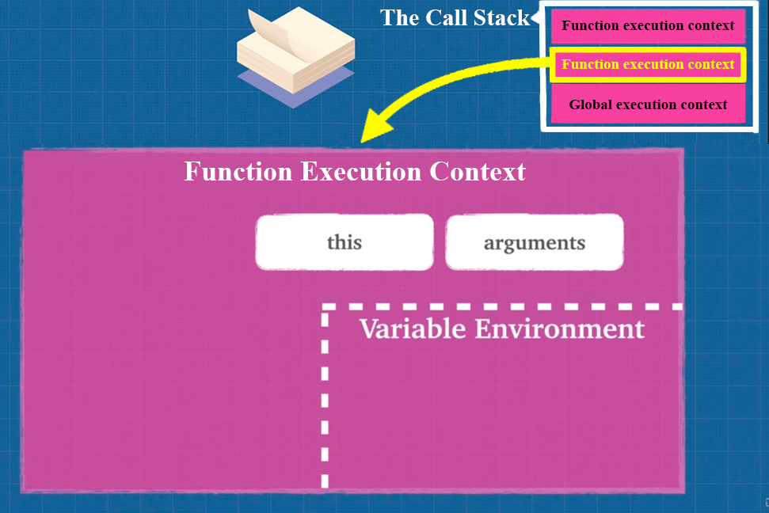
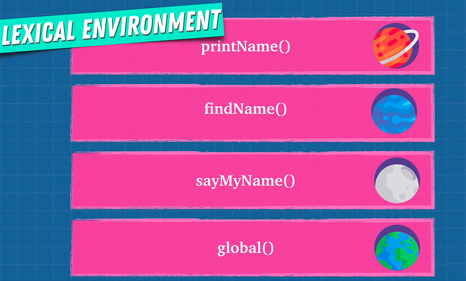

# Variable Environment

We learned that can be many execution contexts (global & function), but you might be asking yourself, what about variables that are created inside of these individual execution contexts? They all technically live in our JavaScript Engine memory, but ==they need to know **how they relate to one another**==. Some functions have access to their certain variables and some don't.



Remember what I said in the Lexical Environment article? You can think of each execution context like its own little planet, its own little universe. These worlds don't really communicate with each other, or know of each other.



Remember from Lexical Environment article that where you write your code is Important? And the ==Lexical Environment (where you write your data & variables where the function was defined) determines the **available variables**==.

```js
function one() {
  let isValid = true; // local environment
  two(); // new execution context
}

function two() {
  let isValid = null; // local environment
}

let isValid = false; // global environment

one();
/*
two() isValid = null          function two() execution context
 one() isValid = true           function one() execution context
  global() isValid = false        global execution context
------------------------
Call Stack
*/
```

Keep in mind that ==**each execution context (global/function) has its own variable environment**==.

## References

1. [JavaScript: The Advanced Concepts - Andrei Neagoie](https://www.udemy.com/course/advanced-javascript-concepts/)