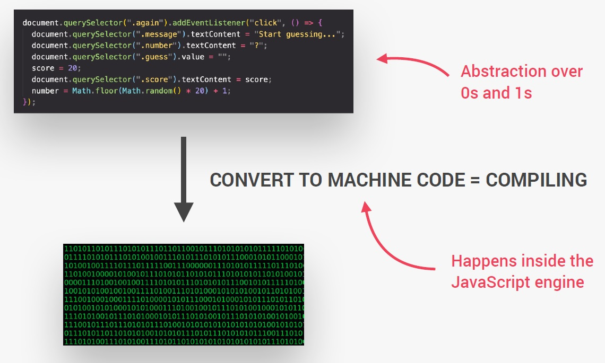
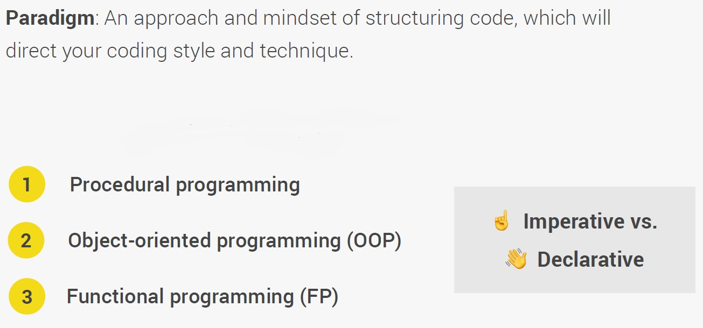
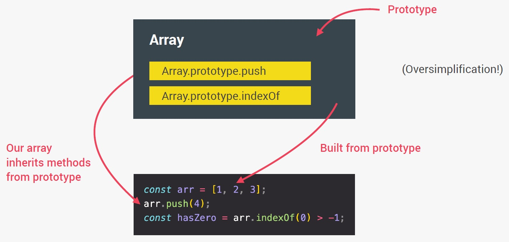
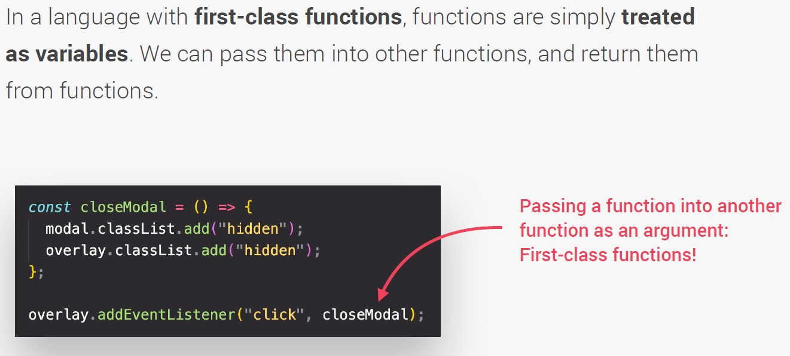
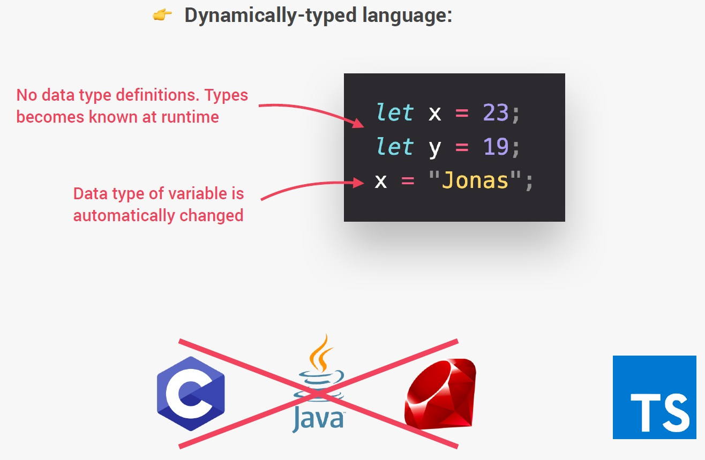
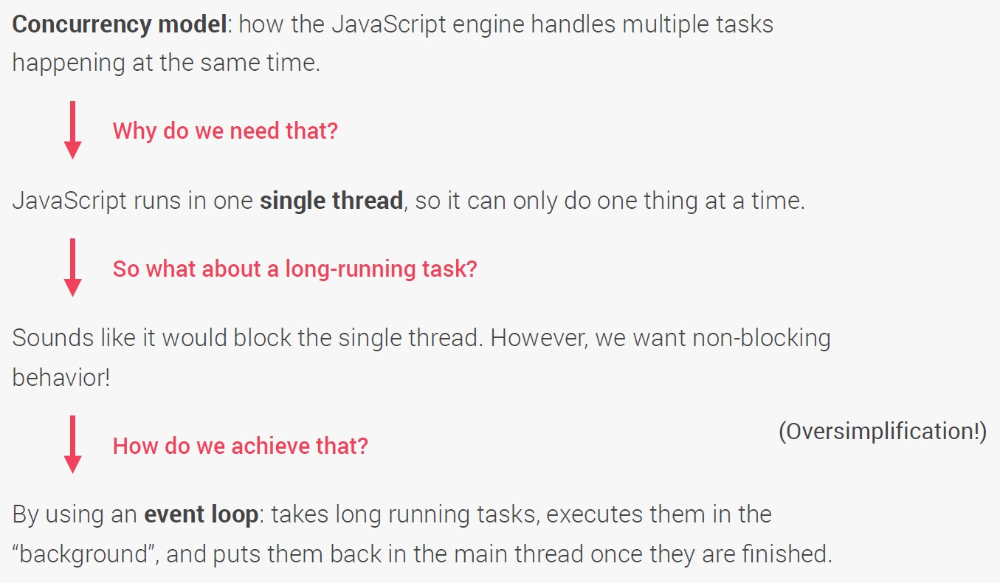

# What is JavaScript?

JavaScript is a **scripting** or **programming language** that allows you to implement complex features on web pages.

JavaScript is a:

- High-level
- Garbage-collected
- Interpreted or Just-In-Time compiled
- Multi-paradigm
- Prototype-based object-oriented
- First-class functions
- Dynamic
- Weakly typed
- Single-threaded
- Non-blocking event loop concurrency model

## High-level

## Garbage-collected

JavaScript is a garbage collected language. If you allocate memory inside of a function, JavaScript will automatically remove it from the Memory Heap when the function is done being called. However, that does not mean you can forget about memory leaks. No system is perfect, so it is important to always remember memory management. JavaScript completes garbage collection with a mark and sweep method.

## Interpreted or Just-In-Time compiled

You might hear the terms **interpreted** and **compiled** in the context of programming. **In interpreted languages**, the code is run from top to bottom and the result of running the code is immediately returned. You don't have to transform the code into a different form before the browser runs it. The code is received in its programmer-friendly text form and processed directly from that.

**Compiled languages** on the other hand are transformed (compiled) into another form before they are run by the computer. For example, C/C++ are compiled into machine code that is then run by the computer. The program is executed from a binary format, which was generated from the original program source code.

**JavaScript is a lightweight interpreted programming language**. The web browser receives the JavaScript code in its original text form and runs the script from that. From a technical standpoint, most modern JavaScript interpreters actually use a technique called Just-In-Time compiling to improve performance; the JavaScript source code gets compiled into a faster, binary format while the script is being used, so that it can be run as quickly as possible. However, JavaScript is still considered an interpreted language, since the compilation is handled at run time, rather than ahead of time.

## Multi-paradigm

## Prototype-based object-oriented

## First-class functions

## Dynamic

## Single-threaded & Non-blocking event loop concurrency model

## References

1. [The Complete JavaScript Course. From Zero to Expert! - Jonas Schmedtmann](https://www.udemy.com/course/the-complete-javascript-course/?utm_source=adwords&utm_medium=udemyads&utm_campaign=JavaScript_v.PROF_la.EN_cc.ROWMTA-B_ti.6368&utm_content=deal4584&utm_term=_._ag_130756014153_._ad_558386196906_._kw__._de_c_._dm__._pl__._ti_dsa-774930039569_._li_1011789_._pd__._&matchtype=&gclid=CjwKCAjwiuuRBhBvEiwAFXKaNCuaAhZ8UB5kIldtb76eeAyfM0SUKeceBq3FKF24pNxDVe-_g0-DPxoCnWwQAvD_BwE)

2. [What is JavaScript? - MDN](https://developer.mozilla.org/en-US/docs/Learn/JavaScript/First_steps/What_is_JavaScript)
