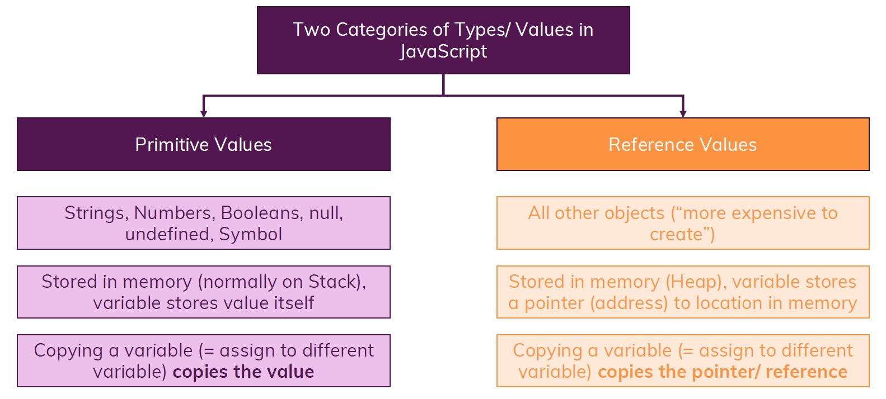

# Primitive vs Reference Values



## Primitive Values

```js
const name1 = 'Max';
const name2 = name1;

name1 = 'Manuel';

console.log(name1); // Manuel
console.log(name2); // Max
```

## Reference Values

```js
const person1 = { age: 30 };
const person2 = { age: 30 };

person1 === person2; // false
```

This behavior above makes a lot of sense, because keep in mind that what we actually stored in `person1` and `person2` is a pointer at a place in memory and these are two totally different objects, even though they hold the same data, but they are two different distinct objects stored in different places, so at different addresses in memory. Since `person1` stores a different address than the `person2`, we have two different addresses and therefore if we compare `person1` to `person2`, what we effectively compare is whether the address of `person1` is equal to the address of `person2` and that is not the case. This is why we get the false result and this is why they're not equal, because of that reference type thing, and it's the same for comparing arrays.

Another important implication which also can be confusing when you work with reference types is this one:

```js
const hobbies = ['Sport'];

hobbies.push('Cooking'); // ['Sport', 'Cooking']
```

Would you expect that this code above works? Keep in mind that `hobbies` is a constant so we can't change the value after it has been created. Well you might expect an error therefore but we get no errors and if I have a look at `hobbies`, we see `cooking` was added. So how does that work?

Well again keep in mind, `['Sport']` array gets created somewhere in memory and what's getting stored in `hobbies` variable is the address of `['Sport']` because arrays are objects, so the address is getting stored in `hobbies` constant. Now when we call `hobbies.push('Cooking')`, we certainly do manipulate the data in memory but what do we not manipulate? The address, it's still the same address. The data in memory changed but it's still at the same address, maybe more memory was allocated to it, that's something the browser does but we don't care, we don't care if more memory was allocated, the address is the same.

So in `hobbies` constant, the value never changed because the value in `hobbies` is the address of `['Sport']` array and the address didn't change, just the data behind the address but that's not what's getting stored in `hobbies` constant, therefore we can change `hobbies` constant like `hobbies.push('Cooking')` without getting an error.

It's different if we try to assign a new array like `hobbies = ['Sport', 'Running']`. If I try to do that, I will get an error, why? Because we used the equal sign and that means we try to assign a new array. Now of course as you learned, the array will never really be stored in there but what matters is that we do indeed create a brand new array, which means a brand new place in memory, a brand new address and therefore Javascript tries to store a brand new address in `hobbies`. So now the value of `hobbies` would get changed and that indeed is not allowed because it's a constant.

So using constants with a single equal sign to assign a new value is never allowed but changing the objects which might be stored in them, that is allowed as long as you use something like `push` method.

Now of course, you can't change primitives stored in constants because these are not stored in memory and there is no address stored in the constant but instead the real value is stored in it but for objects and arrays, this works.

### Another example

```js
const person = { age: 32 };
person.age = 40;
```

You could argue that I am using the single equality operator, so the assignment operator but I am using it on `age` property, not on `person` object. I'm not saying `person = 40` , that would fail if I set `person` to a new value/object, this would fail but I'm setting `age` property inside of the `person` object to a new value, not `person` object itself. So I'm only setting a part of the data stored in memory to a new value just as we did it with the `hobbies` array, and therefore the data in memory certainly changes, the address does not and therefore the address stored in the constant `person` also does not change.

I'm really emphasizing this because it is such a crucial concept and that can lead to a lot of confusion. Constant, arrays and objects which suddenly change are a common source of confusion and the same is true for data which you change in place A and it suddenly also changes in place B because people forgot or never were aware that there is something like reference values which really matters a lot because it explains all that behavior. So this is a must know when you work with Javascript and I hope that these lectures really made it clear what primitive values and reference values are, how they work, how they behave, why they are important, why they are useful and how you work with them.

## References

1. [JavaScript - The Complete Guide (Beginner + Advanced) - Maximilian Schwarzmüller](https://www.udemy.com/course/javascript-the-complete-guide-2020-beginner-advanced/)

2. [Reference vs Primitive Values - academind.com](https://academind.com/tutorials/reference-vs-primitive-values)
