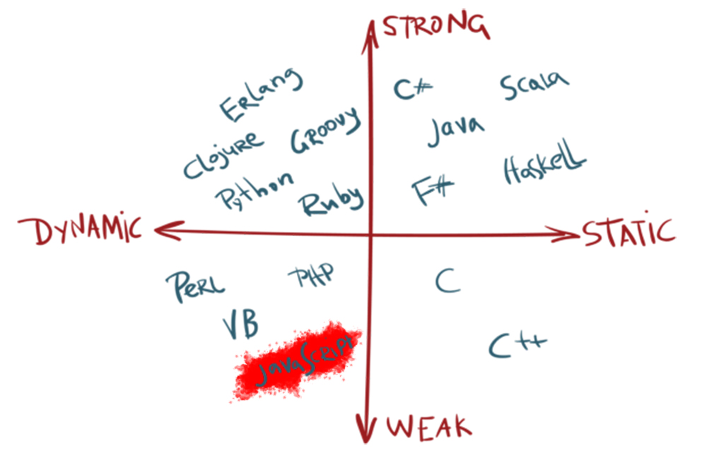

# JavaScript Types

All programming languages have types. That is the building blocks that allow us to write in that language. We can have numbers, strings, booleans and many more. 



## Dynamically vs Statically Typed

In programming, there are two types of languages: 

- ==**dynamically** typed== languages;
- ==**statically** typed== languages.

==JavaScript is a **dynamic language** with **dynamic types**==. _Variables in JavaScript are not directly associated with any particular value type, and any variable can be assigned (and re-assigned) values of all types_.

```js
let foo = 42; // foo is now a number
foo = "bar"; // foo is now a string
foo = true; // foo is now a boolean
```

With a statically typed language we have to declare the variables explicitly before using them. Dynamically typed languages are not bound to this constraint, they're not bound to a particular type. TypeScript allows us to make JavaScript to behave like a statically typed language.

## Strongly vs Weakly Typed 

==JavaScript is also a **weakly typed language**==, _which means it ==**allows implicit type conversion**== when an operation involves mismatched types, instead of throwing type errors_.

```js
const foo = 42; // foo is a number
const result = foo + "1"; // JavaScript coerces foo to a string, so it can be concatenated with the other operand
console.log(result); // 421
```

## Primitive vs Reference Types

In JavaScript, there are 7 ==**primitive** types== (aka "primitive values"):

- Numbers type;
- Strings type;
- Booleans type;
- Null type;
- Undefined type;
- BigInt type;
- Symbol type.

Also, there are ==**reference** types==:

- Objects type (Arrays, Objects and Functions)

All types, except objects types, define _immutable values_ (that is, values which can't be changed). For example, Strings are immutable. We refer to values of these types as "*primitive values*".

### The typeof Operator

JavaScript has a `typeof` operator that you can use to find the type of a JavaScript variable. The `typeof` operator returns the type of a variable or an expression.

```js
typeof "John"         // returns "string"
typeof 0              // returns "number"
typeof true           // return "boolean"
```

## References

1. [JavaScript data types and data structures - MDN](https://developer.mozilla.org/en-US/docs/Web/JavaScript/Data_structures)
2. [JavaScript Data Types - w3schools](https://www.w3schools.com/js/js_datatypes.asp)
3. [JavaScript: The Advanced Concepts - Andrei Neagoie](https://www.udemy.com/course/advanced-javascript-concepts/)