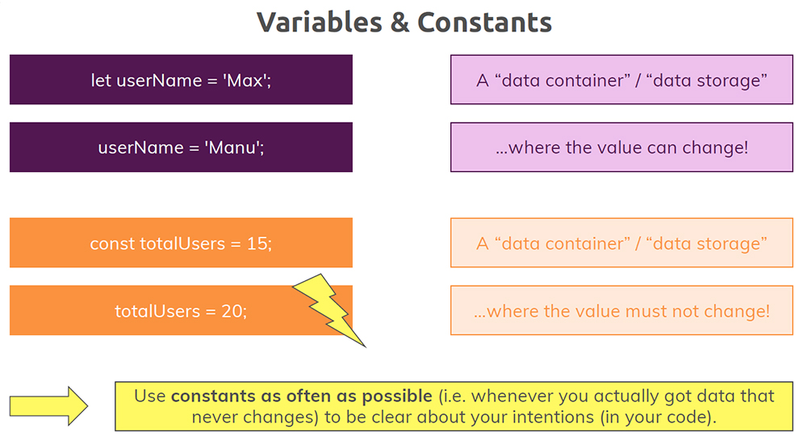

# const statement

Constants are ==**block-scoped**==, much like variables declared using the `let` keyword. The value of a constant ==**can't be changed through reassignment**== (i.e. by using the assignment `=` operator), and it ==**can't be redeclared**== (i.e. through a variable declaration). However, ==if a constant is an object or array its properties or items can be updated or removed==.

Global constants do not become properties of the `window` object, unlike `var` variables.

==**An initializer for a constant is required**==. You must specify its value in the same statement in which it's declared (this makes sense, given that it can't be changed later).

==The `const` declaration creates a **read-only reference to a value**. It does not mean the value it holds is immutable — just that the variable identifier cannot be reassigned. For instance, in the case where the content is an object, this means the object's contents (e.g., its properties) can be altered==.

All the considerations about the "temporal dead zone" apply to both `let` and `const`.

A constant cannot share its name with a function or a variable in the same scope.



## Constants in JavaScript

As well as variables, you can declare constants. These are like variables, except that:

- you ==must initialize them when you declare them==;

- you ==can't assign them a new value after you've initialized them==.

For example, using `let` you can declare a variable without initializing it:

```js
let count;
```

If you try to do this using `const` you will see an error:

```js
const count; // Uncaught SyntaxError: Missing initializer in const declaration
```

Similarly, with `let` you can initialize a variable, and then assign it a new value (this is also called reassigning the variable):

```js
let count = 1;
count = 2;
```

If you try to do this using `const` you will see an error:

```js
const count = 1;
count = 2; // Uncaught TypeError: Assignment to constant variable.
```

Note that although a constant in JavaScript must always name the same value, you can change the content of the value that it names. This isn't a useful distinction for simple types like Numbers or Booleans, but consider an object:

```js
const bird = { species: 'Kestrel' };
```

You can update, add, or remove properties of an object declared using ```const```, because even though the content of the object has changed, the constant is still pointing to the same object:

```js
bird.species = 'Striated Caracara';
```

## References

1. [Storing the information you need — Variables - MDN](https://developer.mozilla.org/en-US/docs/Learn/JavaScript/First_steps/Variables)

2. [const - MDN](https://developer.mozilla.org/en-US/docs/Web/JavaScript/Reference/Statements/const)

   
