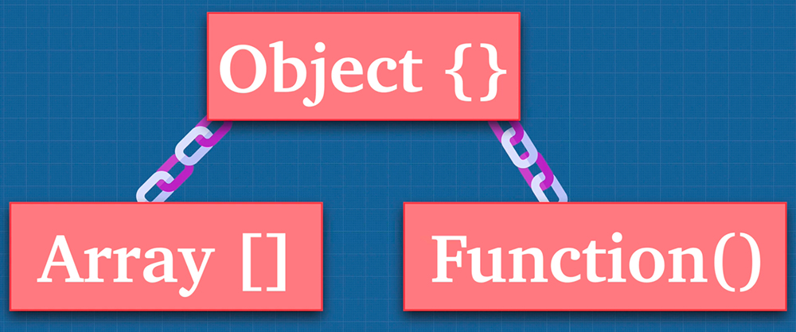

# Constructor Functions & Prototypal Inheritance

Functions are objects in JavaScript, which is not true for other languages. JavaScript uses something called prototypal inheritance. What does that mean? ==Inheritance is an object getting access to the properties and methods of another object==.



Because functions are objects, they can be called multiple ways, but they can also be constructors. A function constructor creates a new object and returns it. Every JavaScript function, is actually a function object itself.

```js
(function() {}.contructor === Function);
// true

// function constructor
new Function("optionalArguments", "functionBody");

const four = new Function("return four"); // 4
const sum = new Function("x", "y", "return x + y");
console.log(sum(2, 3)); // 5
```

Almost everything in JavaScript can be created with a constructor. Even basic JavaScript types like numbers and strings can be created using a constructor.

```js
// examples of constructor functions in JavaScript
const five = new Number(5);
const assignFive = 5;
// this is different than using regular assignment
const newString = new String(`I am a new string`);
const assignString = `I am an assigned string`;
typeof five; // object
typeof assignFive; // number
typeof newString; //object
typeof assignString; // string
five === assignFive; // false
five == assignFive; // true - types are coerced
// Notice how the types are different
// depending on how they are created.
// Arrays, Booleans, Dates, Objects, and Strings
// can be created this way as well.
```

## References

1. [JavaScript: The Advanced Concepts - Andrei Neagoie](https://www.udemy.com/course/advanced-javascript-concepts/)
