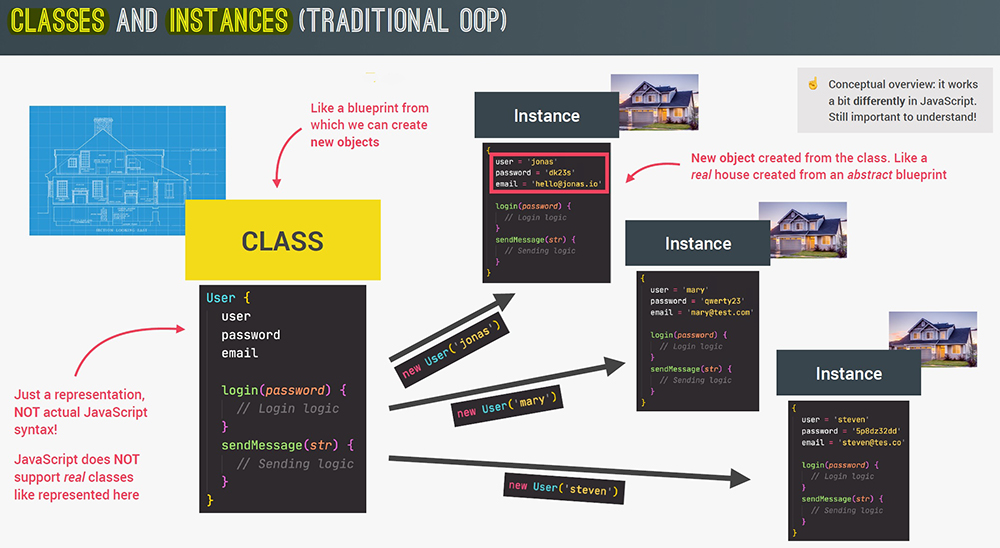
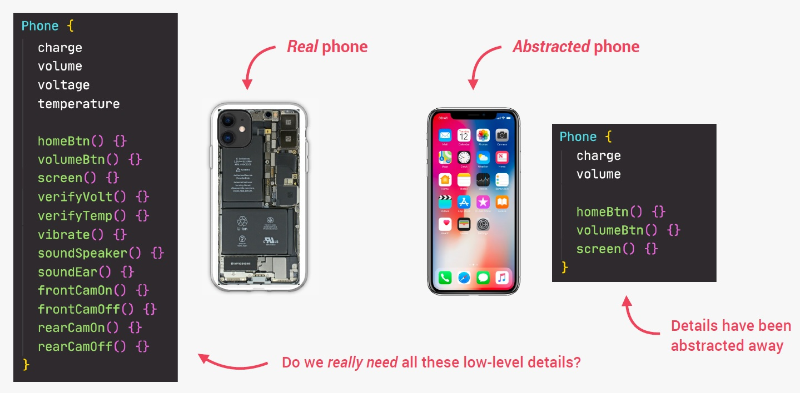
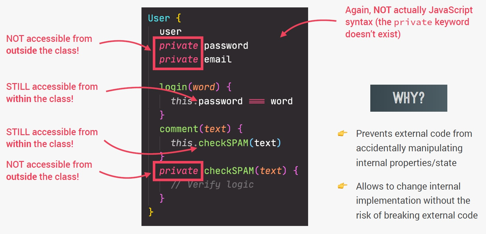
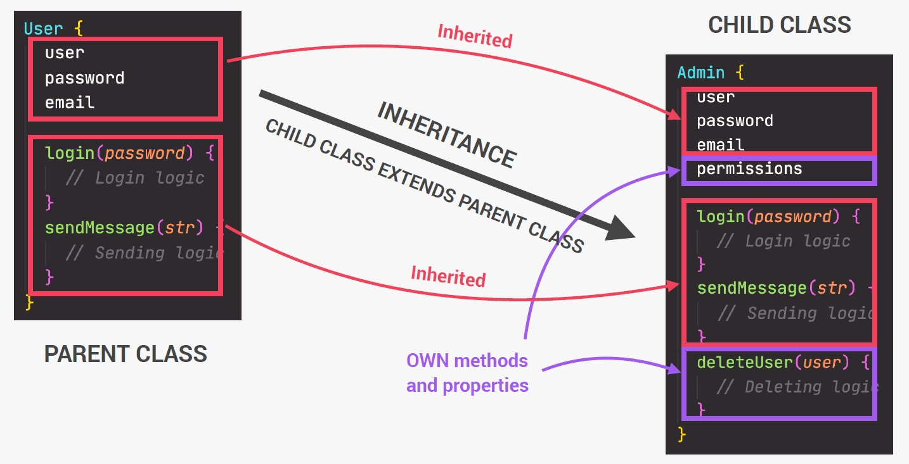
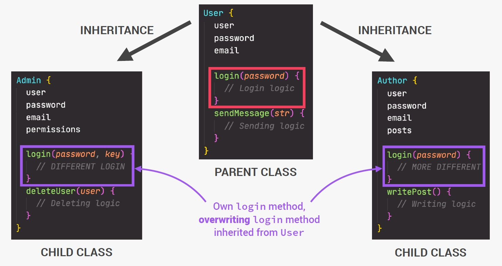

# Introduction to Object-Oriented Programming (OOP)

Object-Oriented Programming (OOP) is a ==**programming paradigm**== fundamental to many programming languages, including Java and C++.

Object-Oriented Programming is about ==**modeling a system** as a **collection of objects**==, which each represent some particular aspect of the system. Objects contain both ==functions (or methods)== and ==data==. An object provides a ==**public interface**== to other code that wants to use it, but it maintains its own ==**private internal state**==: this means that other parts of the system don't have to care about what is going on inside the object.

## Object-Oriented Programming characteristics

- We use objects to ==**model/describe**== ==real-world== (E.g. user or todo list item) or ==abstract features== (E.g. HTML component or data structure);
- Objects may contain data (properties) and code (methods). By using objects, we ==pack **data** and the corresponding **behavior** into one block==;
- In OOP, objects are ==self-contained== pieces/blocks of code;
- Objects are ==building blocks== of applications, and ==interact== with one another;
- Interactions happen through a ==**public interface (API)**==: methods that the code **outside** of the object can access and use to communicate with the object;
- OOP was developed with the goal of ==**organizing**== code, to make it ==more **flexible**== and ==easier to **maintain**== (avoid “spaghetti code”).

## Traditional OOP in others programming languages (Classes and Instances)

Up until now, we have basically only used objects as loose collections of data and ==without making them interact with one another==. Also, we didn't have a way to ==generate objects **programmatically**==. All we ever did was using simple object literals, but in OOP, we actually need a way to generate, so to create new objects from our code. And to do that ==in **traditional OOP**, we use something called **classes**==.

_You can think of a ==**class as a blueprint**==, which can then be used to create new objects based on the rules described in the class_. So it's just like an architecture where the architect develops a blueprint to exactly plan and describe a house but the blueprint is really just an abstract plan, like a set of rules, but nothing tangible that you can actually touch. However, from that blueprint, many real houses can then be built in the real world. And with classes it's just the same.

An ==**instance**== is a ==**real object**== that we can use in our code, which was ==**created from a class**==, and ==**a class itself is not an object**==.

The beauty of this is that now we can _use a class like the class in the image below to create as many instances as we need in our application_, just like we can build multiple houses from just one blueprint, right? And all of these instances, so these objects, of course can have ==**different data**== in them, but they all ==**share the same functionality**==. _So now we know that we can create classes to **generate objects from these classes**_.

## The 4 fundamental principles of Object-Oriented Programming

- Abstraction
- Encapsulation
- Inheritance
- Polymorphism

### Abstraction

==Ignoring or hiding details that don’t matter==, allowing us to get an ==overview perspective== of the thing we’re implementing, instead of messing with details that don’t really matter to our implementation.

### Encapsulation

Keeping ==properties and methods **private** inside the class==, so they are not accessible from outside the class. ==Some methods can be **exposed** as a **public interface (API)**==.

### Inheritance

Making all properties and methods of a certain class ==available to a child class==, forming a hierarchical relationship between classes. This allows us to ==**reuse common logic**== and to model real-world relationships.

### Polymorphism

==A child class can **overwrite** a method it inherited from a parent class== [it’s more complex that that, but enough for our purposes].

References

1. [Object-oriented programming - MDN](https://developer.mozilla.org/en-US/docs/Learn/JavaScript/Objects/Object-oriented_programming)
2. [The Complete JavaScript Course. From Zero to Expert! - Jonas Schmedtmann](https://www.udemy.com/course/the-complete-javascript-course/?utm_source=adwords&utm_medium=udemyads&utm_campaign=JavaScript_v.PROF_la.EN_cc.ROWMTA-B_ti.6368&utm_content=deal4584&utm_term=_._ag_130756014153_._ad_558386196906_._kw__._de_c_._dm__._pl__._ti_dsa-774930039569_._li_1011789_._pd__._&matchtype=&gclid=CjwKCAjwiuuRBhBvEiwAFXKaNCuaAhZ8UB5kIldtb76eeAyfM0SUKeceBq3FKF24pNxDVe-_g0-DPxoCnWwQAvD_BwE)
