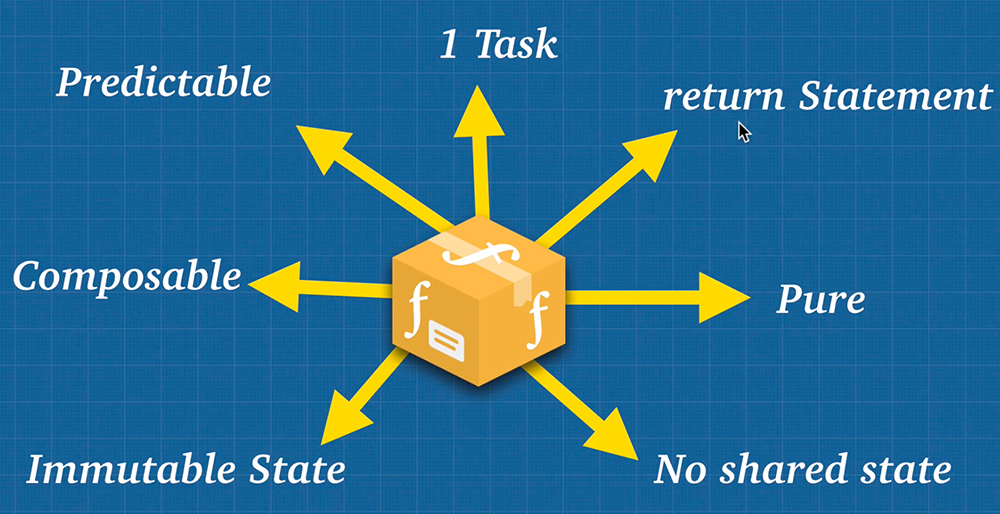

# Pure functions

What are pure functions when it comes to pure functions? There's two main things:

- a function has to always return the same output, given the same input
- the function cannot modify anything outside of itself (no side effects)

A pure function has no side effects to anything outside of it and given the same input will always output the same value. They do not change any data passed into them, but create new data to return without altering the original. However, it is not possible to have 100% pure functions. At some point you need to interact with the DOM or fetch an API. Even `console.log` makes a function unpure because it uses the `window` object outside of the function. Fact is a program cannot exist without side effects, so the goal of functional programming is to minimize side effects by isolating them away from the data.

How do we build the perfect function?



Build lots of very small, reusable and predictable pure functions that do the following:

- Complete 1 task per function
- Do not mutate state
- Do not share state
- Be predictable
- Be composable, one input and one output
- Be pure if possible
- Return something

## Referential transparency

One important concept of functional programming is referential transparency, the ability to replace an expression with the resulting value without changing the result of the program.

```js
function a(num1, num2) {
  return num1 + num2;
}

function b(num) {
  return num * 2;
}

b(a(3, 4)); // 14
// a should always return 7 so it could be changed to 7 and the output is the same
b(7); // 14
```

## Idempotence

The idea of idempotence is a function that always returns or does what we expect it to do. Idempotence is another important piece of functional programming. It is the idea that given the same input to a function, you will always return the same output. The function could be used over and over again and nothing changes. This is how you make your code predictable.

​	What do we care about and idempotence? Well, because this idea of being able to call something a thousand times and always giving you the same result is extremely valuable when it comes to things like parallel and distributed computation, because it makes our code predictable.

## Imperative vs Declarative

==**Imperative** programming tells the computer **what to do** and **how to complete it**. **Declarative** programming **only tells the computer what to do**, but not how to do things==. Humans are declarative by nature, but computers typically need more imperative type programming. However, using higher level languages like JavaScript is actually being less declarative. This is important in function programming because we want to be more declarative to better understand our code and let the computer handle the dirty work of figuring out the best way to do something.

Functional programming helps us be more declarative by using functions which is composing functions. We tell our programs what to do, instead of how to do it.

```js
// More imperative
for (let i = 0; i < 10; i++) {
  console.log(i);
}

// More declarative
let arr = [1, 2, 3, 4, 5, 6, 7, 8, 9, 10];
arr.forEach(item => console.log(item));

```

## Immutability

==Immutability is simply **not modifying the original data or state**==; instead we should create copies of the state inside our functions and return a new version of the state.

```js
// Bad code
const obj = { name: 'Brittney' };
function clone(obj) { return {...obj}; }; // this is pure
obj.name = 'Joe'; // mutated the state

// Better code
function updateName(obj) {
    const newObj = clone(obj);
    newObj.name = 'Joe';
    return newObj;
}
const updatedNameObj = updateName(obj);
console.log(`obj = ${obj}`, `updatedNameObj = ${updatedNameObj})
```

You may be thinking that this could get really expensive, memory wise, to just copy code over and over. However, there is something called **structural sharing** that allows the data to only copy new information and points to the original state for any commonalities.

> The idea behind immutability is that when a new object, array or any sort of data structure is created, we don't actually copy everything, if it's a massive object or an array, you can see that being very expensive. Instead of storing the entire copy, underneath the hood what happens is that only the changes that were made to the state will be copied, but the things that don't change in memory are actually still there. And this is called **structural sharing**.

In functional programming, the idea of immutability is very important. We can change things inside of our function, but we don't want to affect the outside world in our programs. We are simply saying "Hey, this data is not mine. Any data that I receive is not mine. So I'm just going to borrow it and I'm only going to copy and make a new copy of this data so other people can still use this".

## Currying

Currying is the technique of translating the evaluation of a function that takes multiple arguments into evaluating a sequence of functions, each with a single argument. You can think of currying like this: you take a function that can take multiple parameters and use currying to modify it to a function that takes one parameter at a time.

```js
// Without currying
const multiply = function(a, b) {
    return a * b;
};
multiply(2, 4);

// With currying
const multiply = function(a) {
    return function (b) {
        return a * b;
    };
};
const multiplyByTwo = multiply(2);
const multiplyByFive = multiply(5);
multiplyByTwo(4);	// 8
multiplyByFive(4);	// 20
```

Why currying  is useful? With currying I can now create multiple utilities functions out of `multiply` function.

## Partial application

Partial application is a way for us to partially apply a function. Partial application is the process of producing a function with a smaller number of parameters.

Partial application is expanding on the idea of currying and taking it a step farther by separating a parameter out. If you have more than 2 arguments in a functions, then you can bind one of them to a value to be used later:

```js
const multiply = (a, b, c) => a * b * c;
const partialMultiplyBy5 = multiply.bind(null, 5); // this is null
partialMultiplyBy5(4, 10); // 200
```

The main difference between currying and partial application:

- partial application, on the second call, expects all the arguments 
- currying expects one argument at a time

## Compose & Pipe

#### Compose

Composing or composition is the idea that any sort of data transformation that we do should be obvious.

```
data --> fn ---> data --> fn --> ...
```

```js
const multiplyBy3 = number => number * 3;
const makePositive = number => Math.abs(number);

// Composition function
const compose = function(f, g) {
    return function(data) {
        return f(g(data)); // compose is going from left to right
    };
};

const multiplyBy3AndAbsolute = compose(multiplyBy3, makePositive);
multiplyBy3AndAbsolute(-50);
```

Using compose we've created our little assembly line where we can ==compose different functions together==, and that's what compose is. The power in compose is now we can compose functions, build them together to add extra functionality, to create that data flow where we take a piece of data, we take it through all the functions, and then finally we have some sort of data that gets outputted, because all those functions are pure and all those functions are composable.

#### Pipe

Pipe is essentially the same thing like compose, except instead of going from right to left, it goes left to right.

```js
const multiplyBy3 = number => number * 3;
const makePositive = number => Math.abs(number);

// Pipe function
const pipe = function(f, g) {
    return function(data) {
        return g(f(data)); // pipe is going from right to left
    };
};

const multiplyBy3AndAbsolute = pipe(multiplyBy3, makePositive);
multiplyBy3AndAbsolute(-50);
```

> **Note**: The Pipeline Operator is in the experimental stage 1 of being introduced to JavaScript. Stage 1 means that it has only started the process and could be years before it is a part of the language. The pipeline operator `|>` would be syntactic sugar for composing and piping functions the long way. This would improve readability when chaining multiple functions.
>
> ```js
> const double = n => n * 2;
> const increment = n => n + 1;
> 
> // Without pipeline operator
> double(increment(double(double(5)))); // 42
> 
> // With pipeline operator
> 5 |> double |> double |> increment |> double; // 42
> ```

## Arity

Arity simply means the number of arguments a function takes. The more parameters a function has the harder it becomes to break apart and reuse. Try to stick to only 1 or 2 parameters when writing functions.

## Summary

So, is functional programming the answer to everything? No, but it is great in situations where you have to perform different operations on the same set of data. Functional programming just lays the foundation for creating reusable functions that can be moved around as needed. For example, it is great in areas of industry and machine learning and it is even in some front end libraries like React and Redux. Redux really popularized functional programming for JavaScript developers.

Now that we've gone through the functional programming concepts, I hope you understand the idea of going from procedural to functional programming. At the end of the day, a function without a return statement is just a procedure. Functional programming gave us this idea of pure function, and functions are useful because we limit repetitions. Every time we use a function, it's something that is reusable, we can reuse that function somewhere else. Now, the one benefit of functional programming that you may have noticed is that it's really, really good at doing one to one data transformations. That is, we have a piece of data and we have functions acting upon it.

The reason that we were able to do functional programming was because JavaScript makes it easy to assign functions to variables, pass them into other functions, return functions from functions, compose functions, pipe functions. JavaScript also allows us to use immutable concepts like primitive types or using `map()` or `concat()` on arrays, `Object.assign()`, cloning objects using spread operator, and we learned a lot of difficult functional programming terms, but at the end of the day, all the terms mean is that we're building pure functions and we're trying to have as many pure functions as possible to try and avoid mutating state as much as we can in order to have this clean, predictable code.

The idea with functional programming is this idea of separation of data and functions, or data and the effects that happen on that data. If you try to perform effects and logic at the same time, the problem is that you may create hidden side effects which cause a lot of bugs, if multiple things in your program handle some piece of data at the same time. Well, that gets really complicated, and it can cause many problems. So the idea in functional programming of keeping functions small and pure and composable, doing one thing at a time and doing it well. This idea of immutability, the idea that function take inputs and return outputs so that it can be used with other functions, it allows us to have a predictable program where it minimizes bugs because everything is so simple. And as long as we are able to combine these small little functions together, we're able to create really complex programs, these small little pieces that eventually build something like a pyramid, something great.

Functional vs object-oriented, it all depends on the problem you have. There are times when object-oriented programming might be better. You're building a fairy tale game and you have clear objects characters in the game that have some sort of state and that can interact with that state, and others can interact with them as well. Or you have something like an Amazon shopping cart where there's a clear data that needs to get processed.

## References

1. [JavaScript: The Advanced Concepts - Andrei Neagoie](https://www.udemy.com/course/advanced-javascript-concepts/)