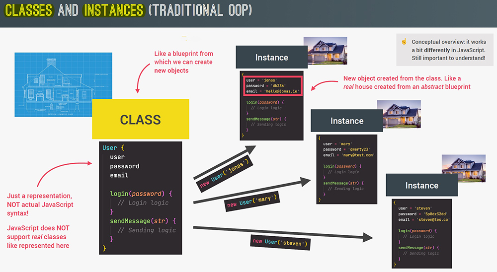
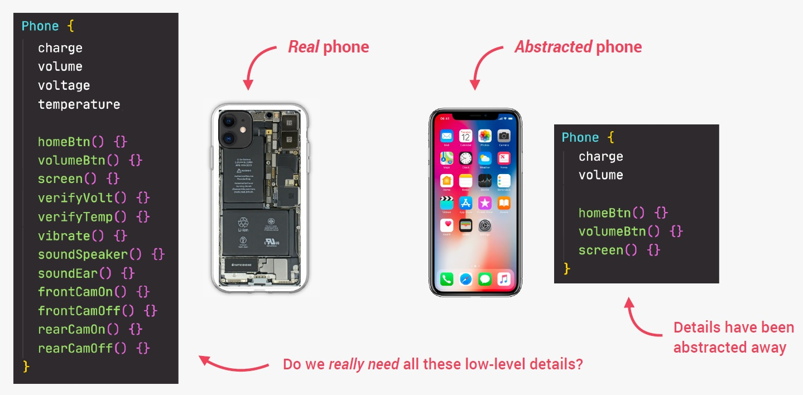
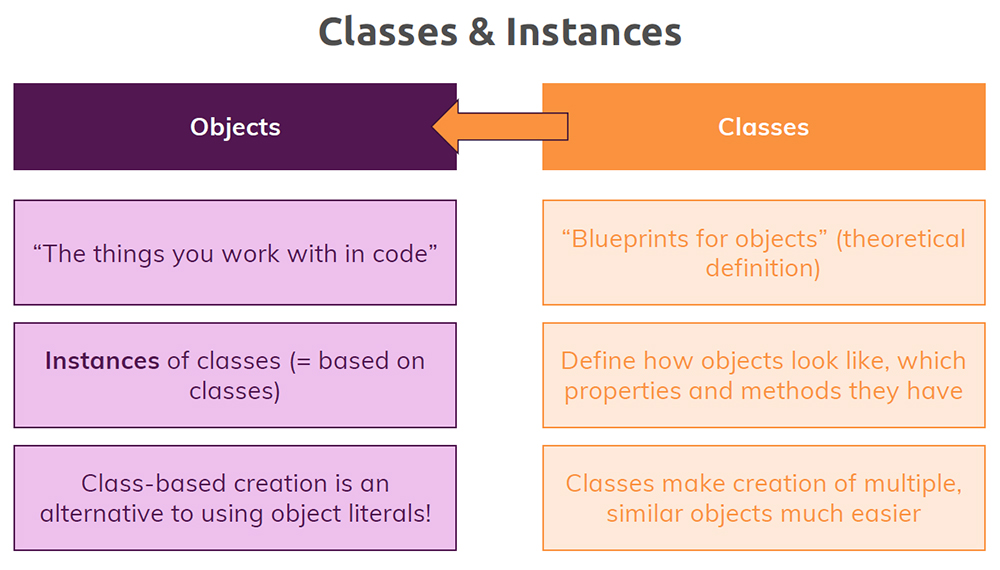

# Introduction to "traditional" Object-Oriented Programming (OOP)

Object-Oriented Programming (OOP) is a ==**programming paradigm**== fundamental to many programming languages, including Java and C++. JavaScript uses something called Prototypal Inheritance (via constructors and prototypes) to implement OOP, and Prototypal Inheritance differs from "classical" object-oriented programming. In this article, we'll describe some of the basic principles of "classical" object-oriented programming, and look at the ways it is different from the prototype model in JavaScript.

We'll describe three main concepts: **classes and instances**, **inheritance**, and **encapsulation**. For now, we'll describe these concepts without reference to JavaScript in particular, so all the examples are given in pseudocode. After that, we'll look at how constructors and the prototype chain relate to these OOP concepts, and how they differ.

## OOP characteristics

OOP is about ==**modeling a system** as a **collection of objects**, which each represent some particular aspect of the system==. Objects contain both ==functions (or methods)== _and_ ==data==. An object provides a ==**public interface**== to other code that wants to use it, but it maintains its own ==**private internal state**==; this means that other parts of the system don't have to care about what is going on inside the object.

- We use objects to ==**model/describe**== ==real-world== (e.g. user or todo list item) or ==abstract features== (e.g. HTML component or data structure);
- Objects may contain data (properties) and code (methods). By using objects, we ==pack **data** and the corresponding **behavior** into one block==;
- In OOP, objects are ==self-contained== pieces/blocks of code;
- Objects are ==building blocks== of applications, and ==interact== with one another;
- Interactions happen through a ==**public interface (API)**==: methods that the code **outside** of the object can access and use to communicate with the object;
- OOP was developed with the goal of ==**organizing**== code, to make it ==more **flexible**== and ==easier to **maintain**== (avoid “spaghetti code”).

## Traditional OOP in others programming languages

### Classes & Instances

Up until now, we have basically only used objects as ==loose collections of data and without making them interact with one another==. Also, we didn't have a way to ==generate objects **programmatically**==. All we ever did was using simple object literals, but in OOP, we actually need a way to generate, so to create new objects from our code. And to do that, ==in **traditional OOP** we use something called **classes**==.

You can think of a ==**class as a blueprint**, which can then be used to create new objects based on the rules described in the class==. So it's just like an architecture where the architect develops a blueprint to exactly plan and describe a house, but the blueprint is really just an abstract plan, like a set of rules, but nothing tangible that you can actually touch. However, from that blueprint, many real houses can then be built in the real world, and with classes it's just the same.

An ==**instance** is a **real object**== that we can use in our code, which was ==created from a class==, and ==**a class itself is not an object**==.

The beauty of this is that now we can _use a class like the class in the image below to create as many instances as we need in our application_, just like we can build multiple houses from just one blueprint, right? All of these instances, so these objects, of course ==can have **different data** in them, but they all **share the same functionality**==. So now we know that ==we can create classes to **generate objects from these classes**==.



So when we model a problem in terms of objects in OOP, ==we create **abstract definitions representing the _types of objects_** we want to have in our system==. For example, if we were modeling a school, we might want to have objects representing professors. Every professor has some properties in common: they all have a name and a subject that they teach. Additionally, every professor can do certain things: they can all grade a paper and they can introduce themselves to their students at the start of the year, for example. So `Professor` could be a ==**class**== in our system. The definition of the class lists the data and methods that every professor has. In pseudocode, a `Professor` class could be written like this:

```
class Professor
    properties
        name
        teaches
    methods
        grade(paper)
        introduceSelf()
```

==**On its own, a class doesn't do anything**: it's a kind of **template for creating concrete objects of that type**==. _Each concrete professor we create is called an_ ==**instance**== _of the `Professor` class_. _The process of creating an instance is performed by a special function called a_ ==**constructor**==. We pass values to the constructor for any internal state that we want to initialize in the new instance.

Generally, the constructor is written out as part of the class definition, and it usually has the same name as the class itself:

```
class Professor
    properties
        name
        teaches
    constructor
        Professor(name, teaches)
    methods
        grade(paper)
        introduceSelf()
```

This constructor takes two parameters, so we can initialize the `name` and `teaches` properties when we create a new concrete professor.

Now that we have a constructor, we can create some professors. Programming languages often use the keyword `new` to signal that a constructor is being called.

```javascript
// This creates two objects, both instances of the Professor class.
walsh = new Professor("Walsh", "Psychology");
lillian = new Professor("Lillian", "Poetry");
```

## Inheritance

Suppose in our school we also want to represent students. Unlike professors, students can't grade papers, don't teach a particular subject, and belong to a particular year. However, students do have a name and may also want to introduce themselves, so we might write out the definition of a student class like this:

```
class Student
    properties
        name
        year
    constructor
        Student(name, year)
    methods
        introduceSelf()
```

==It would be helpful if we could represent the fact that students and professors share some properties, or more accurately, the fact that on some level, they are the *same kind of thing*. **Inheritance** lets us do this==.

We start by observing that students and professors are both people, and people have names and want to introduce themselves. We can model this by defining a new class `Person`, where we define all the common properties of people. ==Then,== `Professor` ==and== `Student` ==can both **derive** from== `Person`, ==adding their extra properties==:

```
class Person
    properties
        name
    constructor
        Person(name)
    methods
        introduceSelf()

class Professor : extends Person
    properties
        teaches
    constructor
        Professor(name, teaches)
    methods
        grade(paper)
        introduceSelf()

class Student : extends Person
    properties
        year
    constructor
        Student(name, year)
    methods
        introduceSelf()
```

==In this case, we would say that== `Person` ==is the **superclass** or **parent class** of both== `Professor` ==and==`Student`. ==Conversely,== `Professor` ==and== `Student` ==are **subclasses** or **child classes** of== `Person`.

You might notice that `introduceSelf()` is defined in all three classes. The reason for this is that while all people want to introduce themselves, the way they do so is different:

```js
walsh = new Professor("Walsh", "Psychology");
walsh.introduceSelf(); // 'My name is Professor Walsh and I will be your Psychology professor.'

summers = new Student("Summers", 1);
summers.introduceSelf(); // 'My name is Summers and I'm in the first year.'
```

We might have a default implementation of `introduceSelf()` for people who aren't students *or* professors:

```js
pratt = new Person("Pratt");
pratt.introduceSelf(); // 'My name is Pratt.'
```

==This feature - when a method has the same name but a different implementation in different classes - is called **polymorphism**. When a method in a subclass replaces the superclass's implementation, we say that the subclass **overrides** the version in the superclass==.

### Encapsulation

==_Objects provide an interface to other code that wants to use them but maintain their own internal state_. The object's internal state is kept **private**, meaning that it can only be accessed by the object's own methods, not from other objects. _Keeping an object's internal state private, and generally making a clear division between its public interface and its private internal state, is called_ **encapsulation**==.

This is a useful feature because it enables the programmer to _change the internal implementation of an object without having to find and update all the code that uses it_: it creates a kind of firewall between this object and the rest of the system.

For example, suppose students are allowed to study archery if they are in the second year or above. We could implement this just by exposing the student's `year` property, and other code could examine that to decide whether the student can take the course:

```js
if (student.year > 1) {
  // allow the student into the class
}
```

The problem is, if we decide to change the criteria for allowing students to study archery - for example by also requiring the parent or guardian to give their permission - we'd need to update every place in our system that performs this test. It would be better to have a `canStudyArchery()` method on `Student` objects, that implements the logic in one place:

```
class Student : extends Person
    properties
       year
    constructor
        Student(name, year)
    methods
       introduceSelf()
       canStudyArchery() { return this.year > 1 }
```

```js
if (student.canStudyArchery()) {
  // allow the student into the class
}
```

That way, if we want to change the rules about studying archery, we only have to update the `Student` class, and all the code using it will still work.

==In many OOP languages, we can prevent other code from accessing an object's internal state by marking some properties as== `private`. ==This will generate an error if code outside the object tries to access them==:

```
class Student : extends Person
    properties
       private year
    constructor
        Student(name, year)
    methods
       introduceSelf()
       canStudyArchery() { return this.year > 1 }

student = new Student('Weber', 1)
student.year // error: 'year' is a private property of Student
```

==In languages that don't enforce access like this, programmers use **naming conventions**, such as starting the name with an underscore, to indicate that the property should be considered private==.

## The 4 fundamental principles of OOP

- Abstraction
- Encapsulation
- Inheritance
- Polymorphism

### Abstraction

==Ignoring or hiding details that don’t matter==, allowing us to get an ==overview perspective== of the thing we’re implementing, instead of messing with details that don’t really matter to our implementation.



### Encapsulation

Keeping ==properties and methods **private** inside the class==, so they are not accessible from outside the class. ==Some methods can be **exposed** as a **public interface (API)**==.


### Inheritance

Making all properties and methods of a certain class ==available to a child class==, forming a hierarchical relationship between classes. This allows us to ==**reuse common logic**== and to model real-world relationships.


### Polymorphism

==A child class can **overwrite** a method it inherited from a parent class== (it’s more complex that that, but enough for our purposes).


## Traditional OOP vs JavaScript

JavaScript uses something called Prototypal Inheritance (via constructors and prototypes) to implement OOP, and Prototypal Inheritance differs from "traditional" object-oriented programming. The JavaScript Prototypal Inheritance features certainly have some relation to some of the OOP concepts described above:

- ==**constructors** in JavaScript provide us with something like a class definition, enabling us to define the "shape" of an object, including any methods it contains, in a single place==. But prototypes can be used here, too. For example, if a method is defined on a constructor's `prototype` property, then all objects created using that constructor get that method via their prototype, and we don't need to define it in the constructor.
- ==**the prototype chain** seems like a natural way to implement inheritance==. For example, if we can have a `Student` object whose prototype is `Person`, then it can inherit `name` and override `introduceSelf()`.

But it's worth understanding the differences between these features and the "classical" OOP concepts described above. We'll highlight a couple of them here:

1. First, in class-based OOP, classes and objects are two separate constructs, and objects are always created as instances of classes. Also, there is a distinction between the feature used to define a class (the class syntax itself) and the feature used to instantiate an object (a constructor). ==In JavaScript, we can and often do create objects without any separate class definition, either using a function or an object literal==. This can make working with objects much more lightweight than it is in classical OOP.

2. Second, although a prototype chain looks like an inheritance hierarchy and behaves like it in some ways, it's different in others. When a subclass is instantiated, a single object is created which combines properties defined in the subclass with properties defined further up the hierarchy. With prototyping, each level of the hierarchy is represented by a separate object, and they are linked together via the `__proto__` property. ==The prototype chain's behavior is less like inheritance and more like **delegation**. Delegation is a programming pattern where an object, when asked to perform a task, can perform the task itself or ask another object (its **delegate**) to perform the task on its behalf==. In many ways, delegation is a more flexible way of combining objects than inheritance (for one thing, it's possible to change or completely replace the delegate at run time).

That said, ==**constructors** and **prototypes** can be used to **implement class-based OOP patterns** in JavaScript==. But using them directly to implement features like inheritance is tricky, so JavaScript provides extra features, layered on top of the prototype model, that map more directly to the concepts of class-based OOP. These extra features comes with ES6 and are something called classes, and classes in JavaScript are only syntactic sugar, because JavaScript doesn't have real classes like Java or C++.



## Summary

This article has described the basic features of class-based object oriented programming, and briefly looked at how JavaScript constructors and prototypes compare with these concepts.

If you want to learn about classes in JavaScript, look at the the [Prototypal Inheritance: ES6 Classes & Prototypes](https://javascript-resume.netlify.app/src/markdowns/09_object_oriented_programming_(oop)/prototypal_inheritance_es6_classes), article that describes the features JavaScript provides to support class-based object-oriented programming

## References

1. [Object-oriented programming - MDN](https://developer.mozilla.org/en-US/docs/Learn/JavaScript/Objects/Object-oriented_programming)
2. [The Complete JavaScript Course. From Zero to Expert! - Jonas Schmedtmann](https://www.udemy.com/course/the-complete-javascript-course/?utm_source=adwords&utm_medium=udemyads&utm_campaign=JavaScript_v.PROF_la.EN_cc.ROWMTA-B_ti.6368&utm_content=deal4584&utm_term=_._ag_130756014153_._ad_558386196906_._kw__._de_c_._dm__._pl__._ti_dsa-774930039569_._li_1011789_._pd__._&matchtype=&gclid=CjwKCAjwiuuRBhBvEiwAFXKaNCuaAhZ8UB5kIldtb76eeAyfM0SUKeceBq3FKF24pNxDVe-_g0-DPxoCnWwQAvD_BwE)
