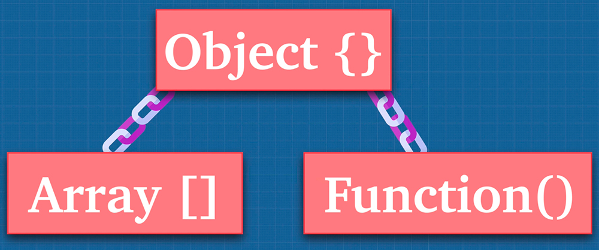
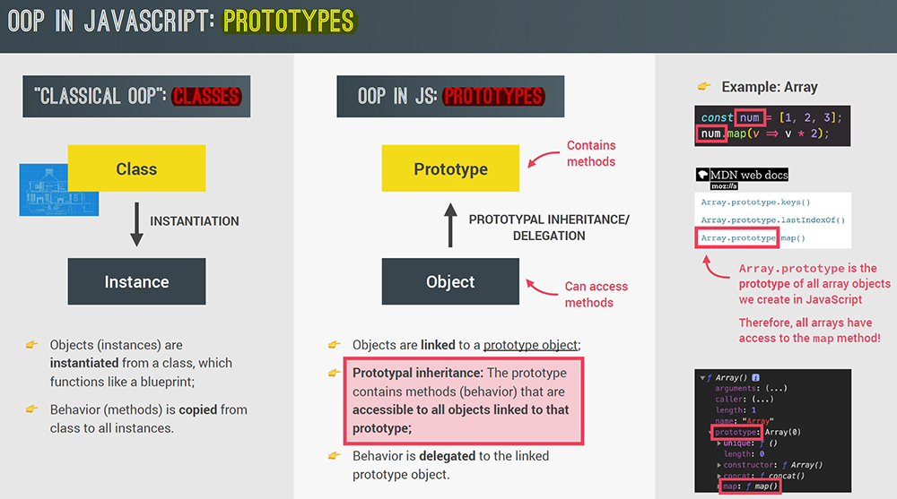
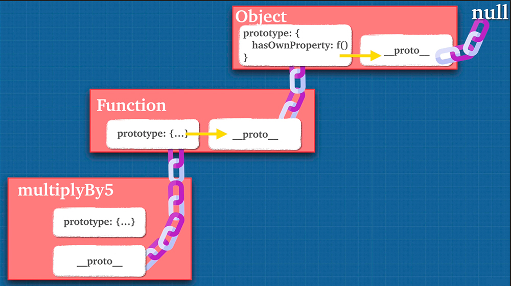
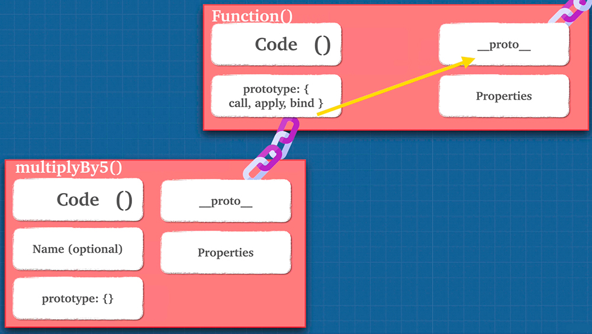
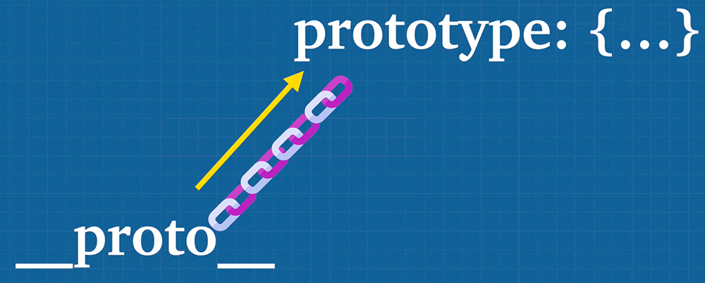

# Object prototypes

In JavaScript, most things are objects, from core JavaScript features like arrays to the browser [APIs](https://developer.mozilla.org/en-US/docs/Glossary/API) built on top of JavaScript.



JavaScript using something called ==**Prototypal Inheritance**==. What does that mean? ==Prototypal Inheritance (via prototypes) is a mechanism by which JavaScript **objects inherit features from one another**==.

```js
const arr = [];
arr.__proto__	// [constructor: ƒ, at: ƒ, concat: ƒ, copyWithin: ƒ, fill: ƒ, …]
Array.prototype // [constructor: ƒ, at: ƒ, concat: ƒ, copyWithin: ƒ, fill: ƒ, …]
arr.__proto__ === Array.prototype	// true
Array.prototype.isPrototypeOf(arr)	// true

const func = function() {};
func.__proto__		// ƒ () { [native code] }
Function.prototype	// ƒ () { [native code] }
func.__proto__ === Function.prototype	// true
Function.prototype.isPrototypeOf(func)	// true
```

==Is important to understand that via Prototypal Inheritance **objects INHERIT features, NOT COPY THEM**==.

```js
const dragon = {
    name: 'Tanya',
    fire: true,
    fight() { return 10 },
    sing() { return `${this.name} can sing!` },
};

const lizard = {
    name: 'Kiki',
    fight() { return 1 },
};

// You should never use __proto__ to set a object prototype. It's bad for performance and there's different ways that we want to inherit when it comes to prototype or inheritance. We never want to manually assign the prototype chain and create that chain ourselves. This is only demonstration purpose.
lizard.__proto__ = dragon; // setting the prototype of lizard

for (let prop in lizard) {
    if (lizard.hasOwnProperty(prop)) {
        console.log(prop)
    };
};
// name
// fight

// We see that "lizard" object only inherits features from "dragon" object, NOT COPY THEM. Even hasOwnProperty method is inherit from other object, called Constructor.
// The beauty is that JavaScript looks for you through the prototype chain automatically. We don't have to do any weird .__proto__.__proto__ to find hasOwnProperty method, JavaScript does it automatically for you.
```

So why is Prototypal Inheritance so useful? The fact that objects can share prototypes means that you can have objects with properties that are pointing to the same place in memory, thus being more efficient. Imagine if we had a ton of lizards, right? And we just copied all the functionality of the dragon onto the lizard into a different place in memory. That can get overwhelming fairly soon. Instead, with Prototypal Inheritance, instead of just copying all the dragon functionality into different places in memory, we have it in just one place.

Whenever the JavaScript Engine doesn't find anything up the prototype chain, we get errors or `undefined` because it goes all the way up to the base object and not find the method/property.

```js
const arr = [];
arr.hasOwnProperty('map');				// false
arr.__proto__.hasOwnProperty('map');	// true	
Array.prototype.hasOwnProperty('map')	// true

// With Prototypal Inheritance we're being efficient with our memory. "map" method should live only in one location in memory, up the prototype chain with the base array.
```

Prototypal Inheritance is quite unique and not that common in other popular languages like C# or Java, they use something called classical inheritance. JavaScript, on the other hand, uses Prototypal Inheritance.

Now, even though in JavaScript we do have the `class` keyword, and it's something that we're going to talk about, this is what we call syntactic sugar. There's actually no classes in JavaScript, we only have Prototypal Inheritance.



In this article, we explain ==what a prototype is==, ==how prototype chains work==, and ==how a prototype for an object can be set==.

## The Prototype Chain

Everything in JavaScript is an object, and arrays and functions in JavaScript are objects. They inherit through the prototype chain from the base object `Object.prototype`.

At the end of the day, Prototypal Inheritance is useful for us because using prototypes we avoid repeating ourselves, we avoid adding the same code over and over and over and being inefficient with our memory. With closures and prototypes we can start creating some interesting programming paradigms.





A function is a special type of object, it's a "callable object", where we have code that can be invoked, we have an optional "name" field, and we also have properties that we can add to the function because, well, it's an object.




```js
const func = function() {};
func.prototype; // {constructor: ƒ}

const obj = {};
obj.prototype; // undefined
Object.prototype // {constructor: ƒ, __defineGetter__: ƒ, ƒ, …}

const arr = [];
arr.prototype; // undefined
Array.prototype; // [constructor: ƒ, at: ƒ, concat: ƒ, copyWithin: ƒ, fill: ƒ, …]

String.prototype; // String {'', constructor: ƒ, anchor: ƒ, at: ƒ, big: ƒ, …}
'string'.prototype; // undefined
```

When we create a function, we don't really use the prototype property, the prototype just gets created automatically. We never really make use of it because prototypes, although they are a property on all functions, the only time we really use prototypes is using what we call Constructor Functions. Constructor Functions usually start with a capital letter and they contain the actual "blueprint" or a prototype that we use:

```js
func.__proto__ === Function.prototype			// true
func.__proto__.__proto__ === Object.prototype	// true
typeof Object // 'function' because Object is a Constructor Function
```

The `Object.prototype` is what we call the base object. That's the very last piece or the very last object that we can look for properties on before we point to `null`.

In the browser's console, try creating an object literal:

```js
const myObject = {
  city: 'Madrid',
  greet() {
    console.log(`Greetings from ${this.city}`);
  },
};

myObject.greet(); // Greetings from Madrid
```

This is an object with _one data property_, `city`, and _one method_, `greet()`. If you type the object's name _followed by a `.`_ into the console, like `myObject.`, then the console will pop up a list of all the properties available to `myObject` object. You'll see that besides `city` and `greet`, there are lots of other properties!

```
__defineGetter__
__defineSetter__
__lookupGetter__
__lookupSetter__
__proto__
city
constructor
greet
hasOwnProperty
isPrototypeOf
propertyIsEnumerable
toLocaleString
toString
toValueOf
```

If you access a one of them `myObject.toString(); // "[object Object]"` it works. What are these extra properties, and where do they come from?

==Every object in JavaScript has a **built-in property** _which is called its_ **prototype**==. The `prototype` ==is itself an **object**==, so the `prototype` will have its own prototype, making what's called a ==**prototype chain**==. The chain ends when we reach a prototype that has `null` for its own prototype.

> **Note**: The property of an object that points to its prototype is not called `prototype`. Its name is not standard, but in practice all browsers use `__proto__`. The standard way to access an object's prototype is the `Object.getPrototypeOf()` method:
>
> ```js
> // __proto__ property
> myObject.__proto__; // {constructor: f}
> 
> // Object.getPrototypeOf()
> Object.getPrototypeOf(myObject); // {constructor: f}
> ```

==When you try to access a property of an object, if the property can't be found in the object itself, the prototype is searched for the property. If the property still can't be found, then the prototype's prototype is searched, and so on until either the property is found, or the end of the chain is reached, in which case== `undefined` ==is returned==.

So when we call `myObject.toString()`, the browser:

- looks for `toString` in `myObject`
- can't find it there, so looks in the prototype object of `myObject` for `toString`
- finds it there, and calls it.

This is an object called `Object.prototype`, and it is the most basic prototype, that all objects have by default. The prototype of `Object.prototype` is `null`, so it's at the end of the prototype chain:


The prototype of an object is not always `Object.prototype`:

```js
const myDate = new Date();
let object = myDate;

do {
  object = Object.getPrototypeOf(object);
  console.log(object);
} while (object);

// Date.prototype
// Object {...}
// null
```

This code creates a `Date` object, then walks up the prototype chain, logging the prototypes. It shows us that the prototype of `myDate` is a `Date.prototype` object, and the prototype of that is `Object.prototype`.


In fact, when you call familiar methods, like `myDate2.getMonth()`, you are calling a method that's defined on `Date.prototype`.

## Shadowing properties

What happens if ==you define a property in an object, when a property with the same name is defined in the object's prototype==?

```js
const myDate = new Date(1995, 11, 17);

console.log(myDate.getYear()); // 95

myDate.getYear = function () {
  console.log('something else!');
};

console.log(myDate.getYear()); // 'something else!'
```

This should be predictable, given the description of the prototype chain. When we call `getYear()` the browser first looks in `myDate` for a property with that name, and **only checks the prototype if `myDate` does not define it**. So when we add `getYear()` to `myDate`, then the version in `myDate` is called.

This is called **"shadowing" the property**.

## Setting a prototype

How do we actually create prototypes? And how do we link objects to prototypes? There are various ways of setting an object's prototype in JavaScript.

#### 1. `Object.create()`

- The easiest and most straightforward way of ==linking an object to a prototype object==.

#### 2. Constructor functions

- Technique to ==create objects from a function==;
- This is how built-in objects like `Arrays`, `Maps` or `Sets` are actually implemented.

#### 3. ES6 Classes

- Modern ==alternative to Constructor Function syntax==;
- =="Syntactic sugar"==: behind the scenes, ES6 classes work exactly like Constructor Functions;
- ES6 classes do NOT behave like classes in "classical OOP" like Java or C++.

## Prototypes and inheritance

Prototypes are a powerful and very flexible feature of JavaScript, making it possible to ==reuse code== and ==combine objects==.

In particular they support a version of **inheritance**. Inheritance is a feature of OOP languages that lets programmers express the idea that some objects in a system are more specialized versions of other objects.

For example, if we're modeling a school, we might have *professors* and *students*: they are both *people*, so have some features in common (for example, they both have names), but each might add extra features (for example, professors have a subject that they teach), or might implement the same feature in different ways. In an OOP system we might say that professors and students both **inherit from** people.

You can see how in JavaScript, if `Professor` and `Student` objects can have `Person` prototypes, then they can inherit the common properties, while adding and redefining those properties which need to differ.

## References

1. [Object prototypes - MDN](https://developer.mozilla.org/en-US/docs/Learn/JavaScript/Objects/Object_prototypes)
2. [Object Prototypes - w3schools](https://www.w3schools.com/js/js_object_prototypes.asp)
3. [The Complete JavaScript Course. From Zero to Expert! - Jonas Schmedtmann](https://www.udemy.com/course/the-complete-javascript-course/?utm_source=adwords&utm_medium=udemyads&utm_campaign=JavaScript_v.PROF_la.EN_cc.ROWMTA-B_ti.6368&utm_content=deal4584&utm_term=_._ag_130756014153_._ad_558386196906_._kw__._de_c_._dm__._pl__._ti_dsa-774930039569_._li_1011789_._pd__._&matchtype=&gclid=CjwKCAjwiuuRBhBvEiwAFXKaNCuaAhZ8UB5kIldtb76eeAyfM0SUKeceBq3FKF24pNxDVe-_g0-DPxoCnWwQAvD_BwE)
4. [JavaScript: The Advanced Concepts - Andrei Neagoie](https://www.udemy.com/course/advanced-javascript-concepts/)

