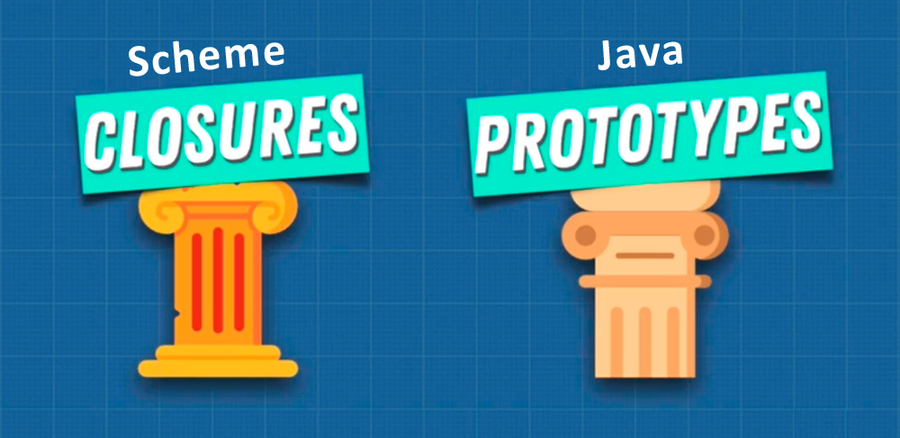

# Inspiration of JavaScript: Scheme & Java

The two pillars of JavaScript concepts are ==**Closures**== and ==**Prototypes**==, that not all programming languages have, that are quite complex, but are very powerful if you understand them. With these two pillars, we can start talking about ==programming paradigms==. These paradigms allow us to create programs that are not just simple, basic ones; complex heavy applications using good practices, and closures and prototypes are going to be something we're going to be talking about over and over and over, when we talk about ==**functional** programming== and ==**object oriented** programming==, two very important paradigms when it comes to becoming a great programmer. Now, to finish off this article, I want to talk to you about Scheme and Java.

==When Brendan Eich in 1995 released JavaScript, he was inspired by these two programming languages: Scheme & Java==. Scheme was a programming language that was created at MIT in the 1970s. It was a very unique programming language and I believe the first language to have closures in the program. At the time that JavaScript was created Java was the trendiest language, everybody was using it, everybody was talking about it, companies wanted to hire Java developers. 

Now Brendan Eich wanted to create a programming language that was very easy to use on the web but also used the popularity of Java, which is why JavaScript name kind of derived from. But there was an issue here, Schema and Java are quite different. You see, _Brendan Eich really liked the functional side of Scheme, this idea of closures and functions as first class citizens. But at the same time he also had pressure from the Java community, where classes and classical inheritance was really, really important. This idea of object oriented programming, where objects where the key to building beautiful programs, versus Scheme where functions are the key to building beautiful programs_.

 Now I'm simplifying things a little bit here, but I want you to realize that ==JavaScript was inspired by Scheme and Java, and because of this inspiration we have this multi paradigm language==. Unlike a lot of languages, you can mix and match these paradigms, and you can't really say that JavaScript is an object oriented programming language or a functional language. You can do whatever you want, which in my opinion is actually the beauty of JavaScript, that you can use multi paradigms to build your applications based on your needs, based on what you think will create the best outcome, the most maintainable, the most predictable code. Now that we have these two pillars of closures and prototypal inheritance, two key pieces for us to really dive deep into object oriented programming and functional programming, and how they allow us to create large scale programs.

## References

1. [JavaScript: The Advanced Concepts - Andrei Neagoie](https://www.udemy.com/course/advanced-javascript-concepts/)
