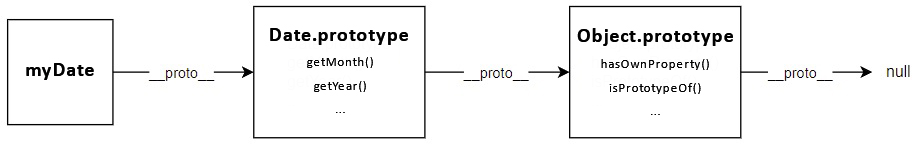

# Object-Oriented Programming in Javascript

## Classical OOP: Classes vs OOP in Javascript: Prototypes

Prototypes are the mechanism by which JavaScript **objects inherit features from one another**.


## The Prototype Chain

In the browser's console, try creating an object literal:

```js
const myObject = {
  city: 'Madrid',
  greet() {
    console.log(`Greetings from ${this.city}`);
  },
};

myObject.greet(); // Greetings from Madrid
```

This is an object with _one data property_, `city`, and _one method_, `greet()`. If you type the object's name _followed by a period_ into the console, like `myObject.`, then the console will pop up a list of all the properties available to `myObject` object. You'll see that besides `city` and `greet`, there are lots of other properties!

```
__defineGetter__
__defineSetter__
__lookupGetter__
__lookupSetter__
__proto__
city
constructor
greet
hasOwnProperty
isPrototypeOf
propertyIsEnumerable
toLocaleString
toString
toValueOf
```

If you access a one of them `myObject.toString(); // "[object Object]"` it works. What are these extra properties, and where do they come from?

Every object in JavaScript has a **built-in property**, which is called its `prototype`. The `prototype` **is itself an object**, so the `prototype` will have its own `prototype`, making what's called a **prototype chain**. The chain ends when we reach a prototype that has `null` for its own prototype. _**The property of an object that points to its prototype is not called `prototype`. Its name is not standard, but in practice all browsers use `__proto__`**_. The standard way to access an object's prototype is the `Object.getPrototypeOf()` method.

```js
// __proto__ property
myObject.__proto__; // {constructor: f}

// Object.getPrototypeOf()
Object.getPrototypeOf(myObject); // {constructor: f}
```

When you try to access a property of an object, if the property can't be found in the object itself, the prototype is searched for the property. If the property still can't be found, then the prototype's prototype is searched, and so on until either the property is found, or the end of the chain is reached, in which case `undefined` is returned.

So when we call `myObject.toString()`, the browser:

- looks for `toString` in `myObject`
- can't find it there, so looks in the prototype object of `myObject` for `toString`
- finds it there, and calls it.

This is an object called `Object.prototype`, and it is the most basic prototype, that all objects have by default. The prototype of `Object.prototype` is `null`, so it's at the end of the prototype chain:


The prototype of an object is not always `Object.prototype`:

```js
const myDate = new Date();
let object = myDate;

do {
  object = Object.getPrototypeOf(object);
  console.log(object);
} while (object);

// Date.prototype
// Object {...}
// null
```

This code creates a `Date` object, then walks up the prototype chain, logging the prototypes. It shows us that the prototype of `myDate` is a `Date.prototype` object, and the prototype of that is `Object.prototype`.



In fact, when you call familiar methods, like `myDate2.getMonth()`, you are calling a method that's defined on `Date.prototype`.

## Shadowing properties

What happens if you define a property in an object, when a property with the same name is defined in the object's prototype?

```js
const myDate = new Date(1995, 11, 17);

console.log(myDate.getYear()); // 95

myDate.getYear = function () {
  console.log('something else!');
};

console.log(myDate.getYear()); // 'something else!'
```

This should be predictable, given the description of the prototype chain. When we call `getYear()` the browser first looks in `myDate` for a property with that name, and **only checks the prototype if `myDate` does not define it**. So when we add `getYear()` to `myDate`, then the version in `myDate` is called.

This is called **"shadowing" the property**.

## Setting a prototype

How do we actually create prototypes? And how do we link objects to prototypes? There are various ways of setting an object's prototype in JavaScript.

1. `Object.create()`

   - The easiest and most straightforward way of _**linking an object to a prototype object**_.

2. Constructor functions

   - Technique to _**create objects from a function**_;
   - This is how built-in objects like Arrays, Maps or Sets are actually implemented.

3. ES6 Classes
   - Modern _**alternative to constructor function syntax**_;
   - "_**Syntactic sugar**_": behind the scenes, ES6 classes work exactly like constructor functions;
   - ES6 classes do NOT behave like classes in "classical OOP" like Java or C++.

References

1. [Object prototypes - MDN](https://developer.mozilla.org/en-US/docs/Learn/JavaScript/Objects/Object_prototypes)
2. [The Complete JavaScript Course. From Zero to Expert! - Jonas Schmedtmann](https://www.udemy.com/course/the-complete-javascript-course/?utm_source=adwords&utm_medium=udemyads&utm_campaign=JavaScript_v.PROF_la.EN_cc.ROWMTA-B_ti.6368&utm_content=deal4584&utm_term=_._ag_130756014153_._ad_558386196906_._kw__._de_c_._dm__._pl__._ti_dsa-774930039569_._li_1011789_._pd__._&matchtype=&gclid=CjwKCAjwiuuRBhBvEiwAFXKaNCuaAhZ8UB5kIldtb76eeAyfM0SUKeceBq3FKF24pNxDVe-_g0-DPxoCnWwQAvD_BwE)
