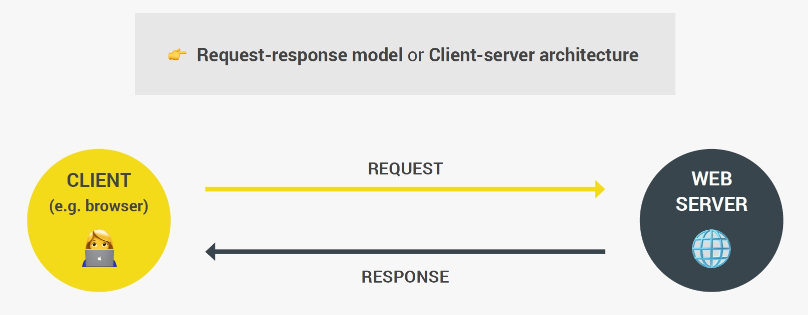
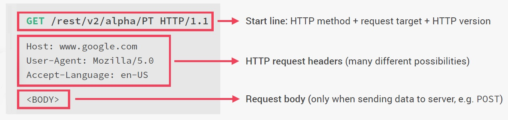

# How the web works: HTTP request and responses

Whenever we try to access a Web server, the Web browser (client) sends a _request_ to the Web server (server), and the server will then send back a _response_, and that response contains the Web page or the data that we requested. This process works the exact same way no matter if we're accessing an entire Web page or just some data from a Web API. This whole process actually has a name and it's called the ==**Client-Server Model** _or_ **Request-Response Model**==.

==HTTP is a **protocol for fetching resources**==, such as HTML documents. HTTP is ==the foundation of any data exchange on the Web and it is a **client-server protocol**==, which means requests are initiated by the recipient, usually the Web browser. A complete document is reconstructed from the different sub-documents fetched, for instance, text, layout description, images, videos, scripts, and more.

> **Hypertext Transfer Protocol (HTTP)** is an application-layer protocol for transmitting hypermedia documents, such as HTML. It was _designed for communication between web browsers and web servers_, but it can also be used for other purposes. _HTTP follows a classical client-server model_, with a client opening a connection to make a request, then waiting until it receives a response. HTTP is a [stateless protocol](https://en.wikipedia.org/wiki/Stateless_protocol), meaning that the server does not keep any data (state) between two requests.
>
> ==HTTP is a communication protocol and **a communication protocol is simply a system of rules that allows two or more parties to communicate**==. Now _in the case of HTTP, it's just a protocol that allows Web browsers (client) and web servers (server) to communicate and that works by sending requests and response messages from client to server and back_.

Clients and servers communicate by exchanging individual messages (as opposed to a stream of data). The messages sent by the client, usually a Web browser, are called ==*requests*== and the messages sent by the server as an answer are called ==*responses*==. ==The  Web browser is _always_ the entity initiating the request, it is never the server==.

## HTTP flow: what happens when we access a web server?

When a client wants to communicate with a server, it performs the following steps:

1. ==Open a **TCP connection**==: the TCP connection is used to send a request, or several, and receive an answer. The client may open a new connection, reuse an existing connection, or open several TCP connections to the servers.
2. ==Send an **HTTP message**==: HTTP messages (before HTTP/2) are human-readable. With HTTP/2, these simple messages are encapsulated in frames, making them impossible to read directly, but the principle remains the same.
3. ==Read the **response**== sent by the server.
4. ==Close or reuse the connection== for further requests.

==Every URL gets an HTTP or HTTPS==, which is for the protocol that will be used on the connection.

Then we have the ==domain name==, which in our case is `restcountries.eu`, and also after a slash we have to so-called resource (endpoint) that we want to access, and in this case that's `/rest/V2/alpha/PT`. Now this domain name `restcountries.eu` is actually not the real address of the server that we're trying to access, it's just a nice name that is easy for us to memorize. But what this means is that we need a way of ==converting the domain name to the real address of the server and that happens through a so-called **DNS**==. So DNS stands for domain name server and domain name servers are a special kind of server.

### 1. DNS

The first step that happens when we access any Web server is that the Web browser makes a request to a DNS, and this special server will then simply match the web address of the URL to the server's real IP address, and actually this all happens through your Internet service provider, but the complete details don't really matter here. What you need to retain from this first part is that ==the domain is not the real address and that a DNS will convert the domain name to the real IP address== and then after the real IP address has been sent back to the browser, we can finally call it.

### 2. TCP/IP socket connection

Once we have the real IP address, a **TCP socket connection is established between the Web browser and the Web server**, and so they are now finally connected. This connection is typically kept alive for the entire time that it takes to transfer all files of the website or all data. Now what are TCP and IP? TCP is the Transmission Control Protocol and IP is the Internet Protocol, and together they are ==**communication protocols** that define exactly how data travels across the Web. They are basically the Internet's fundamental **control system**, because they are the ones who set the rules about how data moves on the Internet==.

### 3. HTTP Request

But anyway, after TCP/IP socket connection, now it's time to finally make our request and the request that we make is an HTTP request.

> HTTP is another communication protocol and **a communication protocol is simply a system of rules that allows two or more parties to communicate**. Now _in the case of HTTP, it's just a protocol that allows Web browsers (client) and web servers (server) to communicate and that works by sending requests and response messages from client to server and back_.

Requests consist of the following elements:

- An [HTTP method](https://developer.mozilla.org/en-US/docs/Web/HTTP/Methods), usually a verb like [`GET`](https://developer.mozilla.org/en-US/docs/Web/HTTP/Methods/GET), [`POST`](https://developer.mozilla.org/en-US/docs/Web/HTTP/Methods/POST), or a noun like [`OPTIONS`](https://developer.mozilla.org/en-US/docs/Web/HTTP/Methods/OPTIONS) or [`HEAD`](https://developer.mozilla.org/en-US/docs/Web/HTTP/Methods/HEAD), that _defines the operation the client wants to perform_. Typically, a client wants to fetch a resource (using `GET`) or post the value of an [HTML form](https://developer.mozilla.org/en-US/docs/Learn/Forms) (using `POST`), though more operations may be needed in other cases, So you'll see that _an HTTP request to a server is not only for getting data, but we can also send data_.
- The path of the resource to fetch; the URL of the resource stripped from elements that are obvious from the context, for example without the [protocol](https://developer.mozilla.org/en-US/docs/Glossary/Protocol) (`http://`), the [domain](https://developer.mozilla.org/en-US/docs/Glossary/Domain) (here, `restcountries.eu/rest/V2/alpha/PT`).
- The version of the HTTP protocol.
- Optional, [HTTP headers](https://developer.mozilla.org/en-US/docs/Web/HTTP/Headers) that convey additional information for the servers.
- A body, for some methods like `POST`, similar to those in responses, which contain the resource sent.

> Now, of course, it's not us developers who manually write these HTTP requests, but it's still helpful and valuable that we understand what an **HTTP request** and also a **HTTP response** look like. Also, I want to mention that there's also HTTPS, and the main difference between HTTP and HTTPS is that HTTPS is encrypted using TLS or SSL, which are other protocols, but I'm not gonna bore you with these. But besides that, the logic behind HTTP requests and HTTP responses still applies to HTTPS.

So our HTTP request is formed and now it hits the server, which will then be working on it until it has our Web page or data ready to send back, and once it's ready it will send it back using an **HTTP response**.

### 4. HTTP Response

Responses consist of the following elements:

- The version of the HTTP protocol they follow.
- A [status code](https://developer.mozilla.org/en-US/docs/Web/HTTP/Status), indicating if the request was successful or not, and why.
- A status message, a non-authoritative short description of the status code.
- [HTTP headers](https://developer.mozilla.org/en-US/docs/Web/HTTP/Headers), like those for requests.
- Optionally, a body containing the fetched resource.

> As you see, The _HTTP response_ message actually looks quite similar to the _HTTP request_.

## APIs based on HTTP

The most commonly used API based on HTTP is the [`XMLHttpRequest`](https://developer.mozilla.org/en-US/docs/Web/API/XMLHttpRequest) API, which can be used to exchange data between a [user agent](https://developer.mozilla.org/en-US/docs/Glossary/User_agent) and a server. The modern [`Fetch API`](https://developer.mozilla.org/en-US/docs/Web/API/Fetch_API) provides the same features with a more powerful and flexible feature set.

## References

1. [The Complete JavaScript Course. From Zero to Expert! - Jonas Schmedtmann](https://www.udemy.com/course/the-complete-javascript-course/?utm_source=adwords&utm_medium=udemyads&utm_campaign=JavaScript_v.PROF_la.EN_cc.ROWMTA-B_ti.6368&utm_content=deal4584&utm_term=_._ag_130756014153_._ad_558386196906_._kw__._de_c_._dm__._pl__._ti_dsa-774930039569_._li_1011789_._pd__._&matchtype=&gclid=CjwKCAjwiuuRBhBvEiwAFXKaNCuaAhZ8UB5kIldtb76eeAyfM0SUKeceBq3FKF24pNxDVe-_g0-DPxoCnWwQAvD_BwE)
1. [HTTP - MDN](https://developer.mozilla.org/en-US/docs/Web/HTTP)
1. [An overview of HTTP - MDN](https://developer.mozilla.org/en-US/docs/Web/HTTP/Overview)
1. [HTTP request methods - MDN](https://developer.mozilla.org/en-US/docs/Web/HTTP/Methods)
1. [HTTP headers - MDN](https://developer.mozilla.org/en-US/docs/Web/HTTP/Headers)
1. [HTTP Messages - MDN](https://developer.mozilla.org/en-US/docs/Web/HTTP/Messages)
1. [HTTP response status codes - MDN](https://developer.mozilla.org/en-US/docs/Web/HTTP/Status)
