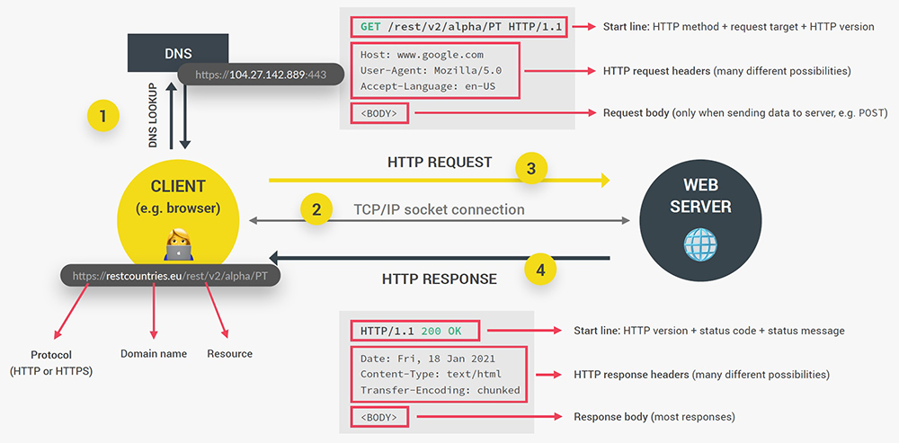
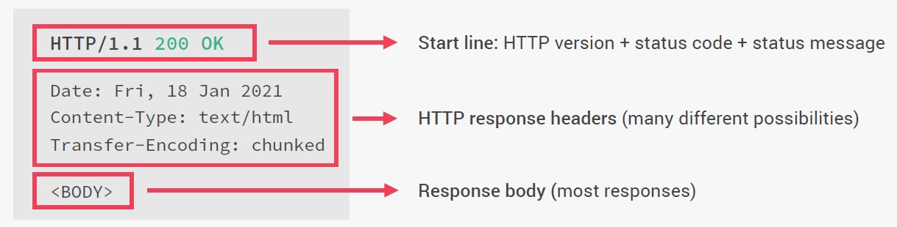

# How the web works: request and responses

Above is a diagram that we already saw when we first talked about AJAX calls. So just to recap, whenever we try to access a Web server, the browser, which is the client, sends a request to the server and the server will then send back a response and that response contains the data or the Web page that we requested. And that's right, this process works the exact same way no matter if we're accessing an entire Web page or just some data from a Web API. And this whole process actually has a name and it's called the Request-response model or also the Client-server architecture.

## What happens when we access a web server?

**Every URL gets an HTTP or HTTPS**, which is for the protocol that will be used on the connection. Then we have the **domain name**, which in our case is `restcountries.eu`, and also after a slash we have to so-called resource that we want to access and in this case, that's /rest/V2/alpha/PT.

Now this domain name, `restcountries.eu` is actually not the real address of the server that we're trying to access. It's really just a nice name that is easy for us to memorize. But what this means is that we need a way of kind of converting the domain name to the real address of the server and that happens through a so-called **DNS**. So DNS stands for domain name server and domain name servers are a special kind of server.

### 1. DNS

The first step that happens when we access any web server is that the browser makes a request to a DNS and this special server will then simply match the web address of the URL to the server's real IP address and actually this all happens through your Internet service provider, but the complete details don't really matter here. What you need to retain from this first part is that **the domain is not the real address and that a DNS will convert the domain to the real IP address and then after the real IP address** has been sent back to the browser, we can finally call it.

### 2. TCP/IP socket connection

Once we have the real IP address, a **TCP socket connection is established between the browser and the server** and so they are now finally connected. This connection is typically kept alive for the entire time that it takes to transfer all files of the website or all data. Now what are TCP and IP? Well TCP is the Transmission Control Protocol and IP is the Internet Protocol and together they are communication protocols that define exactly how data travels across the Web. They are basically the Internet's fundamental control system, because again, they are the ones who set the rules about how data moves on the Internet.

### 3. HTTP Request

But anyway, now it's time to finally make our request and **the request that we make is an HTTP request**, where HTTP stands for Hypertext Transfer Protocol. So after TCP/IP, **HTTP is another communication protocol** and by the way, **a communication protocol is simply a system of rules that allows two or more parties to communicate**. Now _in the case of HTTP, it's just a protocol that allows clients and web servers to communicate and that works by sending requests and response messages from client to server and back_.

A request message will look something like this image above. The beginning of the message is the most important part called the **start line** and this one contains the **HTTP method** that is used in the request, then the **request target** and the **HTTP version**. So about the HTTP methods, there are many available, but the most important ones are `GET` (for simply requesting data), `POST` (for sending data) and `PUT` and `PATCH` (to basically modify data). So you'll see that **an HTTP request to a server is not only for getting data, but we can also send data**.

Now about the request target this is where the server is told that we want to access the `rest/V2/alpha` resource in this case. So we had this in the URL before and now it is simply sent as the target in the HTTP request and so then the server can figure out what to do with it. Now, if this target was empty, so if it was just a slash basically then we would be accessing the website's route, which is just `restcountries.eu` in this example.

Then the next part of the request are the **request headers**, which is just some **information that we sent about the request itself**. There are **tons of standard different headers**, like what browser is used to make the request, at what time, the user's language and many, many more.

Now finally, **in the case we're sending data to the server**, there will also be a **request body** and that **body will contain the data that we're sending**, for example, coming from an HTML form. So that is the HTTP request.

Now, of course, it's not us developers who manually write these HTTP requests, but it's still helpful and valuable that you understand what an **HTTP request** and also a **response** look like. Also, I want to mention that there's also HTTPS, as you probably know and the main difference between HTTP and HTTPS is that HTTPS is encrypted using TLS or SSL, which are yet some are protocols, but I'm not gonna bore you with these. But besides that, the logic behind HTTP requests and responses still applies to HTTPS, alright?

So our request is formed and now it hits the server, which will then be working on it until it has our data or web page ready to send back and once it's ready, it will send it back using, as you can guess, an **HTTP response**.

### 4. HTTP Response

**The _HTTP response_ message actually looks quite similar to the _HTTP request_**. So also with a **start line**, **headers** and a **body**. Now, in this case, the start line has, besides the **version** also a **status code** and a **status message** and these are used to let the client know whether the request has been successful or failed. For example, `200` means okay, and the status code that everyone knows is `404`, which means page not found. So that is where this `404` code that everyone already knew, comes from.

Then the **response headers** are **information about the response itself**, so just like before, and there are a ton available and we can also make up our own actually.

finally, the last part of the response is, again, the **body**, which is **present in most responses**, and this **body usually contains the JSON data** coming back from an API or the HTML of the web page that we requested or something like that.

So we talked in great detail about the most important parts, which are the **HTTP request** and the **HTTP response**. But in our imaginary example, we only just did one request to `restcountries.eu` and got one response back, right? And that's how it's gonna work when all we do is to access an API.

However, if it's a web page that we're accessing then there will be many more requests and responses and that's because when we do the first request, all we get back is just the initial HTML file. That HTML file will then get scanned by the browser for all the assets that it needs in order to build the entire web page like JavaScript, CSS files, image files, or other assets, and then for each different file there will be a new HTTP request made to the server, so basically this entire back and forth between client and server happens for every single file that is included in the web page. However, there can be multiple requests and responses happening at the same time, but the amount is still limited because otherwise the connection would start to slow down. But anyway, when all the files have finally arrived, then the web page can be rendered in the browser, according to the HTML, CSS and JavaScript specifications that you already know.

## References

1. [The Complete JavaScript Course. From Zero to Expert! - Jonas Schmedtmann](https://www.udemy.com/course/the-complete-javascript-course/?utm_source=adwords&utm_medium=udemyads&utm_campaign=JavaScript_v.PROF_la.EN_cc.ROWMTA-B_ti.6368&utm_content=deal4584&utm_term=_._ag_130756014153_._ad_558386196906_._kw__._de_c_._dm__._pl__._ti_dsa-774930039569_._li_1011789_._pd__._&matchtype=&gclid=CjwKCAjwiuuRBhBvEiwAFXKaNCuaAhZ8UB5kIldtb76eeAyfM0SUKeceBq3FKF24pNxDVe-_g0-DPxoCnWwQAvD_BwE)
