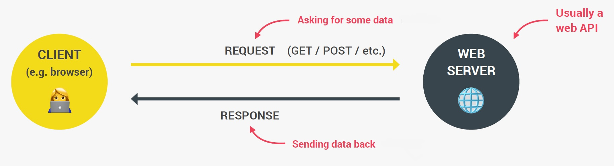
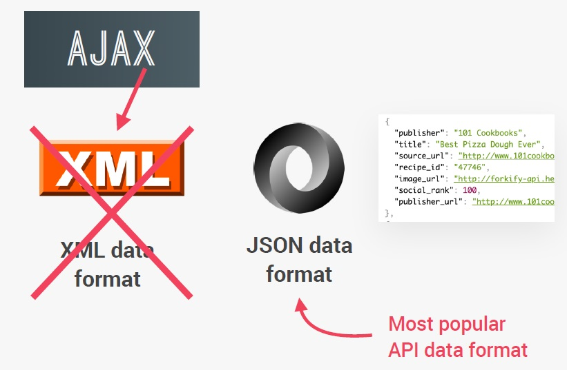

# Introduction to AJAX

==A==synchronous ==J==avaScript ==A==nd ==X==ML, while not a technology in itself (is not a programming language), is a term coined in 2005 by Jesse James Garrett, that describes a "new" approach to using a combination of existing technologies together, including [HTML](https://developer.mozilla.org/en-US/docs/Web/HTML) or [XHTML](https://developer.mozilla.org/en-US/docs/Glossary/XHTML), [CSS](https://developer.mozilla.org/en-US/docs/Web/CSS), [JavaScript](https://developer.mozilla.org/en-US/docs/Web/JavaScript), [DOM](https://developer.mozilla.org/en-US/docs/Web/API/Document_Object_Model), [XML](https://developer.mozilla.org/en-US/docs/Web/XML), [XSLT](https://developer.mozilla.org/en-US/docs/Web/XSLT), and most importantly the [`XMLHttpRequest`](https://developer.mozilla.org/en-US/docs/Web/API/XMLHttpRequest) object. When these technologies are combined in the AJAX model, web applications are able to make quick, incremental updates to the user interface without reloading the entire browser page. This makes the application faster and more responsive to user actions.

In a nutshell, AJAX is the use of the `XMLHttpRequest` object to communicate with servers. It can send and receive information in various formats, including JSON, XML, HTML, and text files. AJAX's most appealing characteristic is its "asynchronous" nature, which means it can communicate with the server, exchange data, and update the page without having to refresh the page.

The two major features of AJAX allow you to do the following:

- Make requests to the server without reloading the page
- Receive and work with data from the server



> **Note**: AJAX is a misleading name. AJAX applications might use XML to transport data, but it is equally common to transport data as plain text or [JSON](https://developer.mozilla.org/en-US/docs/Glossary/JSON) text. JSON is preferred over XML nowadays because of its many advantages such as being a part of JavaScript, thus being lighter in size. Both JSON and XML are used for packaging information in the AJAX model.
>
> 

### What is JSON?

JSON stands for ==J==ava==S==cript ==O==bject ==N==otation.

JSON is a ==**text format** for storing and transporting data==.

> **Note**: The JSON syntax is derived from JavaScript object notation, but the JSON format is text only. Code for reading and generating JSON exists in many programming languages.

#### Why use JSON instead XML?

The JSON format is syntactically similar to the code for creating JavaScript objects. Because of this, a JavaScript program can easily convert JSON data into JavaScript objects. Since the format is text only, JSON data can easily be sent between computers, and used by any programming language.

JavaScript has a built in function for converting JSON strings into JavaScript objects: `JSON.parse()`

JavaScript also has a built in function for converting an object into a JSON string: `JSON.stringify()`

When storing data, the data has to be a certain format, and regardless of where you choose to store it, *text* is always one of the legal formats. JSON makes it possible to store JavaScript objects as text.

## The core of AJAX: XMLHttpRequest API

`XMLHttpRequest` (XHR) objects are used to interact with servers. You can retrieve data from a URL without having to do a full page refresh. This enables a Web page to update just part of a page without disrupting what the user is doing. `XMLHttpRequest` is used heavily in AJAX programming.

> **Note:** The constructor `XMLHttpRequest` isn't limited to only XML documents. It starts with "XML" because when it was created the main format that was originally used for asynchronous data exchange was XML.

To make an [HTTP](https://developer.mozilla.org/en-US/docs/Web/HTTP) request to the server with JavaScript, you need an instance of an object with the necessary functionality. This is where `XMLHttpRequest()` constructor comes in.

## Using XMLHttpRequest API

To send an HTTP request, first you need create an `XMLHttpRequest` object:

```js
const httpRequest = new XMLHttpRequest();
```

> **Note**: The `XMLHttpRequest()` constructor initializes an `XMLHttpRequest`. It must be called before any other method calls.

After you create an `XMLHttpRequest` object, you need to actually make the request, by calling the [`open()`](https://developer.mozilla.org/en-US/docs/Web/API/XMLHttpRequest/open) and [`send()`](https://developer.mozilla.org/en-US/docs/Web/API/XMLHttpRequest/send) methods of the HTTP request object:

```js
httpRequest.open('GET', 'http://www.example.org/example.txt');
httpRequest.send();
```

After the transaction completes, you will receive a response back. The `XMLHttpRequest` object will contain useful information such as the response body and the [HTTP status](https://developer.mozilla.org/en-US/docs/Web/HTTP/Status) of the result. You need to handle that result by adding an event listener to the `XMLHttpRequest` object:

```js
httpRequest.addEventListener('load', function() {});
```

### Summary syntax

```js
const httpRequest = new XMLHttpRequest();
httpRequest.open('GET', 'http://www.example.org/example.txt');
httpRequest.send();
httpRequest.addEventListener('load', function() {});
```

## More on `XMLHttpRequest.open()`

### Syntax

```js
open(method, url)
open(method, url, async)
open(method, url, async, user)
open(method, url, async, user, password)
```

### Parameters

#### `method`

The [HTTP request method](https://developer.mozilla.org/en-US/docs/Web/HTTP/Methods) to use, such as `"GET"`, `"POST"`, `"PUT"`, `"DELETE"`, etc.

#### `url`

A string representing the URL to send the request to.

#### `async` _(optional)_

An optional Boolean parameter, defaulting to `true`, indicating whether or not to perform the operation asynchronously. If this value is `false`, the `send()` method does not return until the response is received. If `true`, notification of a completed transaction is provided using event listeners. This *must* be true if the `multipart` attribute is `true`, or an exception will be thrown.

#### `user` _(optional)_

The optional user name to use for authentication purposes; by default, this is the `null` value.

#### `password` _(optional)_

The optional password to use for authentication purposes; by default, this is the `null` value.

## More on `XMLHttpRequest.send()`

The `XMLHttpRequest` method `send()` sends the request to the server. If the request is asynchronous (which is the default), this method returns as soon as the request is sent and the result is delivered using events. If the request is synchronous, this method doesn't return until the response has arrived.

`send()` accepts an optional parameter which lets you specify the request's body; this is primarily used for requests such as [`PUT`](https://developer.mozilla.org/en-US/docs/Web/HTTP/Methods/PUT). If the request method is [`GET`](https://developer.mozilla.org/en-US/docs/Web/HTTP/Methods/GET) or [`HEAD`](https://developer.mozilla.org/en-US/docs/Web/HTTP/Methods/HEAD), the `body` parameter is ignored and the request body is set to `null`.

### Syntax

```js
send()
send(body)
```

### Parameters

#### `body` _(optional)_

A body of data to be sent in the XHR request. This can be:

- A [`Document`](https://developer.mozilla.org/en-US/docs/Web/API/Document), in which case it is serialized before being sent.
- An `XMLHttpRequestBodyInit`, which [per the Fetch spec](https://fetch.spec.whatwg.org/#typedefdef-xmlhttprequestbodyinit) can be a [`Blob`](https://developer.mozilla.org/en-US/docs/Web/API/Blob), an [`ArrayBuffer`](https://developer.mozilla.org/en-US/docs/Web/JavaScript/Reference/Global_Objects/ArrayBuffer), a [`TypedArray`](https://developer.mozilla.org/en-US/docs/Web/JavaScript/Reference/Global_Objects/TypedArray), a [`DataView`](https://developer.mozilla.org/en-US/docs/Web/JavaScript/Reference/Global_Objects/DataView), a [`FormData`](https://developer.mozilla.org/en-US/docs/Web/API/FormData), a [`URLSearchParams`](https://developer.mozilla.org/en-US/docs/Web/API/URLSearchParams), or a string literal or object.
- `null`

If no value is specified for the body, a default value of `null` is used.

## References

1. [AJAX - MDN](https://developer.mozilla.org/en-US/docs/Web/Guide/AJAX)
2. [XMLHttpRequest - MDN](https://developer.mozilla.org/en-US/docs/Web/API/XMLHttpRequest)
3. [Using XMLHttpRequest - MDN](https://developer.mozilla.org/en-US/docs/Web/API/XMLHttpRequest/Using_XMLHttpRequest)
4. [XMLHttpRequest.open() - MDN](https://developer.mozilla.org/en-US/docs/Web/API/XMLHttpRequest/open)
5. [XMLHttpRequest.send() - MDN](https://developer.mozilla.org/en-US/docs/Web/API/XMLHttpRequest/send)
6. [JSON - MDN](https://developer.mozilla.org/en-US/docs/Glossary/JSON)
7. [JSON Introduction - w3schools](https://www.w3schools.com/js/js_json_intro.asp)
8. [HTTP request methods - MDN](https://developer.mozilla.org/en-US/docs/Web/HTTP/Methods)

