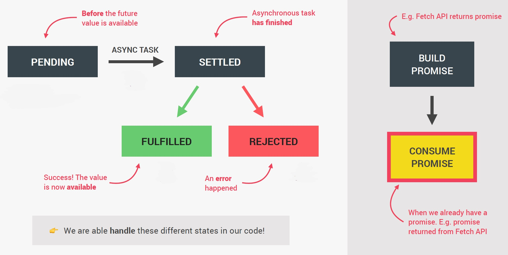

# Promises

Promises are the foundation of asynchronous programming in modern JavaScript. ==A promise is an **object returned by an asynchronous function**, which represents the current state of the operation. At the time the promise is returned to the caller, the operation often isn't finished, but **the promise object provides methods to handle the eventual success or failure of the operation**==.

Traditionally (before promises), asynchronous tasks were designed as callbacks; we use of callbacks to implement asynchronous functions. With that design, you call the asynchronous function, passing in your callback function; the function returns immediately and calls your callback when the operation is finished.

On the other hand, A promise allows to transform the callback-based API to a promise-based one. With a promise-based API, the asynchronous function starts the operation and returns a [`Promise`](https://developer.mozilla.org/en-US/docs/Web/JavaScript/Reference/Global_Objects/Promise) object. You can then attach handlers to this promise object, and these handlers will be executed when the operation has succeeded or failed.

## What is a Promise?

==A Promise is an **object** that is used as a **placeholder for the future result** of an **asynchronous operation**. In other words, a Promise is a **container** for an **asynchronously** delivered **value** or a **container** for a future **value**==.

> **Note**: The perfect example of a future value is the response coming from an AJAX call. When we start the AJAX call, there is no value yet, but we know that there will be some value in the future, so we can use a Promise to handle this future value.

Essentially, a Promise is a returned object to which you attach callbacks, instead of passing callbacks into a function. With Promises we no longer need to rely on _events_ and _callbacks_ passed into asynchronous functions to handle asynchronous results. ==Instead of _nesting callbacks_, we can **chain promises** for a sequence of asynchronous operations: escaping callback hell==:

```js
// In the old days, doing several asynchronous operations in a row would lead to the classic callback pyramid of doom (Callback Hell):
setTimeout(() => {
    console.log('1 second passed');
    setTimeout(() => {
        console.log('2 seconds passed');
        setTimeout(() => {
            console.log('3 seconds passed');
            setTimeout(() => {
                console.log('4 seconds passed');
            }, 1000);
        }, 1000);
    }, 1000);
}, 1000);

// With modern functions, we attach our callbacks to the returned promises instead, forming a promise chain
const wait = function (seconds) {
    return new Promise(function (resolve) {
        setTimeout(resolve, seconds * 1000);
    });
};

wait(1)
    .then(() => {
    	console.log('1 second passed');
    	return wait(1);
	})
    .then(() => {
    	console.log('2 second passed');
    	return wait(1);
	})
    .then(() => {
    	console.log('3 second passed');
    	return wait(1);
	})
    .then(() => {
    	console.log('4 second passed');
	});

```

A Promise is a proxy for a value not necessarily known when the promise is created. It allows you to associate handlers with an asynchronous action's eventual success value or failure reason. This lets asynchronous methods return values like synchronous methods: ==instead of immediately returning the final value, the asynchronous method returns a *promise* to supply the value at some point in the future==.

## The Promise lifecycle

Since Promises work with asynchronous operations, promises are ==time sensitive==, so they ==change over time==, and so promises can be in ==different states== and this is what they call the cycle of a promise.



In the very beginning, we say that a Promise is ==**pending**== and this is _before any value resulting from the asynchronous task is available_. Now, _during the pending time, the asynchronous task is still doing its work in the background_. When the asynchronous task finishes, we say that the promise is ==**settled**== and there are _two different types of settled_: ==fulfilled== and ==rejected==. Once settled, a promise can not be resettled. The immutability of a settled promise is an important feature. A promise is only settled once and so from there, the state will remain unchanged forever, so the promise was either fulfilled or rejected, but it's impossible to change that state.

A fulfilled promise is a promise that has **successfully resulted in a value**. On the other hand, a rejected promise means that there has been an **error during the asynchronous task**.

Now these two different states are very important to understand because when we use promises in our code, we will be able to _handle these different states_ in order to do something as a result of either a successful promise or a rejected one.

These different states that I showed you are relevant and useful when we use a promise to get a result, which is called to **consume a promise**. So we consume a promise when we already have a promise, for example, the promise that was returned from the [`fetch()`](https://developer.mozilla.org/en-US/docs/Web/API/fetch) function. But in order for a promise to exist in the first place, it must first be built, so it must be created. In the case of the `fetch` API, it's the `fetch()` function that builds the promise and returns it for us to consume, so in this case, we don't have to build the promise ourselves in order to consume it. Now, most of the time we will actually just consume promises, which is also the easier and more useful part, but sometimes we also need to build a promise and to not just consume it.

## References

1. [Promise - MDN](https://developer.mozilla.org/en-US/docs/Web/JavaScript/Reference/Global_Objects/Promise)
1. [What is a Promise? - medium.com](https://medium.com/javascript-scene/master-the-javascript-interview-what-is-a-promise-27fc71e77261#.aa7ubggsy)
1. [Using Promises - MDN](https://developer.mozilla.org/en-US/docs/Web/JavaScript/Guide/Using_promises)
1. [The Complete JavaScript Course. From Zero to Expert! - Jonas Schmedtmann](https://www.udemy.com/course/the-complete-javascript-course/?utm_source=adwords&utm_medium=udemyads&utm_campaign=JavaScript_v.PROF_la.EN_cc.ROWMTA-B_ti.6368&utm_content=deal4584&utm_term=_._ag_130756014153_._ad_558386196906_._kw__._de_c_._dm__._pl__._ti_dsa-774930039569_._li_1011789_._pd__._&matchtype=&gclid=CjwKCAjwiuuRBhBvEiwAFXKaNCuaAhZ8UB5kIldtb76eeAyfM0SUKeceBq3FKF24pNxDVe-_g0-DPxoCnWwQAvD_BwE)
