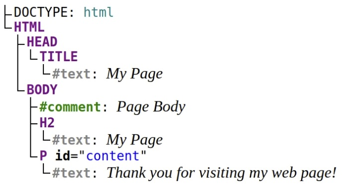

# DOM Nodes & Node Lists

The Document Object Model (DOM) is an interface that treats HTML or XML document as a tree structure, where **each node is an object of the document**. DOM also provides a set of methods to query the tree, alter the structure, style. DOM also uses the term _element: which is quite similar to a node_. So, what's the difference between a DOM node and an element? Let's find out!

## What's a DOM node?

The key to understanding the difference between a node and an element is to understand what a node is. From a higher viewpoint, a DOM document consists of a hierarchy of nodes. Each node can have a parent and/or children. Let's look at the following HTML document:

```html
<!DOCTYPE html>
<html>
  <head>
    <title>My Page</title>
  </head>
  <body>
    <!-- Page Body -->
    <h2>My Page</h2>
    <p id="content">Thank you for visiting my web page!</p>
  </body>
</html>
```

The document contains the following hierarchy of nodes:

`<html>` is a node in the document tree. It has 2 children: `<head>` and `<body>` nodes.
`<body>` is also a node having 3 children: a comment `<!-- Page Body -->`, heading `<h2>`, and paragraph `<p>`. The parent of the `<body>` node is `<html>` node.
The tags in the HTML document represent a node, what's interesting is that regular text is also a node. The paragraph node `<p>` has 1 child: the text node "Thank you for visiting my web page!".

## Node Types

How can you distinguish these different types of nodes? The answer lays in the DOM Node interface, particularly in the `Node.nodeType` property. `Node.nodeType` can have one of the following values that represents the type of the node:

- `Node.ELEMENT_NODE`
- `Node.ATTRIBUTE_NODE`
- `Node.TEXT_NODE`
- `Node.CDATA_SECTION_NODE`
- `Node.PROCESSING_INSTRUCTION_NODE`
- `Node.COMMENT_NODE`
- `Node.DOCUMENT_NODE`
- `Node.DOCUMENT_TYPE_NODE`
- `Node.DOCUMENT_FRAGMENT_NODE`
- `Node.NOTATION_NODE`

  The constants meaningfully indicate the node type: for example `Node.ELEMENT_NODE` represents an element node, `Node.TEXT_NODE` represents a text node, `Node.DOCUMENT_NODE` the document node, and so on.

## What is a NodeList?

- A NodeList object is a list (collection) of nodes extracted from a document.
- A NodeList object is almost the same as an HTMLCollection object.
- Some (older) browsers return a NodeList object instead of an HTMLCollection for methods like getElementsByClassName().
- All browsers return a NodeList object for the property childNodes.
- Most browsers return a NodeList object for the method querySelectorAll().

## DOM Element:

After getting a good grasp of what a DOM node is, now is the time to differentiate the DOM node and element.
If you get well the node term, then the answer is obvious: an element is a node of a specific type — element (`Node.ELEMENT_NODE`). Along with types like document, comment, text, etc.
In simple words, an element is a node that's written using a tag in the HTML document (`<html>`, `<head>`, `<title>`, `<body>`, `<h2>`, `<p>` are all elements because they are represented by tags.
The document type, the comment, the text nodes aren't elements because they are not written with tags:

```html
<!DOCTYPE html>
<html>
  <body>
    <!-- Page Body -->
    <p>Thank you for visiting my web page!</p>
  </body>
</html>
```

Node is constructor of a node, and HTMLElement is a constructor of an element in JavaScript DOM. A paragraph, being a node and also an element, is an instance of both Node and HTMLElement

Summary:

- A DOM document is a hierarchical collection of nodes. Each node can have a parent and/or children.
- Understanding the difference between a DOM node and an element is easy if you understand what a node is.
- Nodes have types, the element type being one of them. The element is represented by a tag in the HTML document.

  _Quiz: What type of node never has a parent node?_
