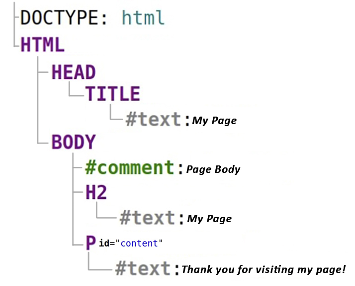
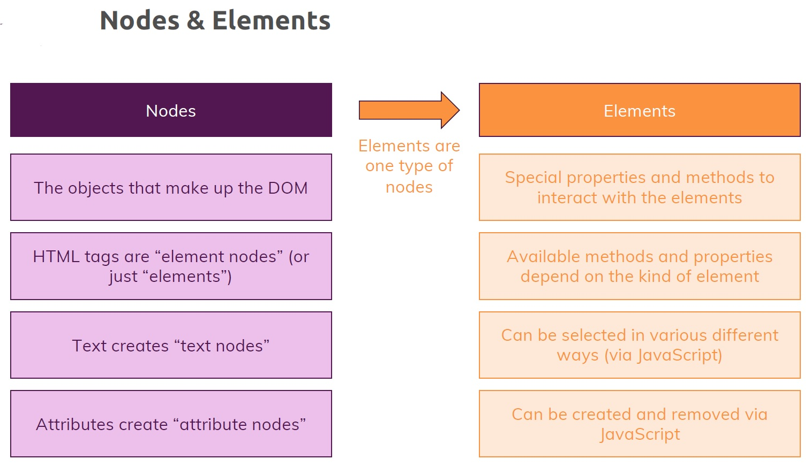

# DOM Nodes & Elements

Let's dive into nodes and elements. I kind of use these terms interchangeably but actually should be careful and you should at least understand what the difference is. So you have nodes and elements and ==nodes are the objects that make up the DOM==, ==everything in the DOM is a node==.

The Document Object Model (DOM) is an interface that treats HTML or XML document as a ==tree structure==, where ==each node is an object of the document==. DOM also provides a set of methods to query the tree, alter the structure, style. DOM also uses the term `Element` _which is quite similar to a_ `Node`. So, what's the difference between a DOM `Node` and an `Element`? Let's find out!

## What's a DOM node?

The key to understanding the difference between a `Node` and an `Element` is to understand what a `Node` is. From a higher viewpoint, a DOM document consists of a ==hierarchy of nodes==. Each `Node` can have a parent and/or children. Let's look at the following HTML document:

```html
<!DOCTYPE html>
<html>
  <head>
    <title>My Page</title>
  </head>
  <body>
    <!-- Page Body -->
    <h2>My Page</h2>
    <p id="content">Thank you for visiting my web page!</p>
  </body>
</html>
```

The document contains the following hierarchy of nodes:

`<html>` is a node in the document tree. It has 2 children: `<head>` and `<body>` nodes.
`<body>` is also a node having 3 children: a comment `<!-- Page Body -->`, heading `<h2>`, and paragraph `<p>`. The parent of the `<body>` node is `<html>` node.
The tags in the HTML document represent a node, what's interesting is that regular text is also a node. The paragraph node `<p>` has 1 child: the text node "Thank you for visiting my web page!".

## Node Types

How can you distinguish these different ==types of nodes==? The answer lays in the DOM Node interface, particularly in the `Node.nodeType` property. `Node.nodeType` can have one of the following values that represents the type of the node:

- `Node.ELEMENT_NODE`
- `Node.ATTRIBUTE_NODE`
- `Node.TEXT_NODE`
- `Node.CDATA_SECTION_NODE`
- `Node.PROCESSING_INSTRUCTION_NODE`
- `Node.COMMENT_NODE`
- `Node.DOCUMENT_NODE`
- `Node.DOCUMENT_TYPE_NODE`
- `Node.DOCUMENT_FRAGMENT_NODE`
- `Node.NOTATION_NODE`

The constants meaningfully indicate the node type: for example `Node.ELEMENT_NODE` represents an ==Element== Node, `Node.TEXT_NODE` represents a ==Text== Node, `Node.DOCUMENT_NODE` the ==Document== Node, and so on.

Important to understand is that not just HTML tags are loaded and created as objects but also all text that you have and these are created as so-called Text Nodes and that might already be strange what I'm pointing at here in the below image, this empty whitespace here in front of `head` tag is actually translated to a `Node` in the browser, this whitespace is part of the loaded node tree.


Now typically, you don't see that on the screen because due to the way styling works and so on, ==most **whitespace** is actually not rendered== but ==**whitespaces** are part of that DOM tree== and its called Text Nodes. So ==even the **whitespace** which you add in your HTML file for readability reasons is treated as a Text Node== because it is text in your HTML file, right?

Also ==the **normal text** is part of the DOM as Text Nodes== though and these really are two different types of nodes: you have `Element` nodes for all the elements which you have but then the content in the elements might be other elements but might also be text and text is indeed stored as objects but as a different kind of object, as `Text` Nodes, with different properties and different methods.

## DOM `Element`

After getting a good grasp of what a DOM Node is, now is the time to differentiate the DOM `Node` and `Element`.
If you get well the node term, then the answer is obvious: an Element is a node of a specific type — `Element` (`Node.ELEMENT_NODE`). Along with types like `Document`, `Comment`, `Text`, etc.

In simple words, an Element is a node that's written using a tag in the HTML document (`<html>`, `<head>`, `<title>`, `<body>`, `<h2>`, `<p>` are all elements because they are represented by tags.

The `Document` type, the `Comment`, the `Text` nodes aren't elements because they are not written with tags:

```html
<!DOCTYPE html>
<html>
  <body>
    <!-- Page Body -->
    <p>Thank you for visiting my web page!</p>
  </body>
</html>
```

`Node` is constructor of a node, and `HTMLElement` is a constructor of an Element in JavaScript DOM. A paragraph, being a Node and also an Element, is an instance of both `Node` and `HTMLElement`.

## Summary

- A DOM `document` is a hierarchical ==collection of nodes==. Each node can have a parent and/or children.
- Understanding the difference between a DOM `Node` and an `Element` is easy if you understand what a node is.
- Nodes have types, the `Element` type being one of them. The `Element` is represented by a tag in the HTML document.



## `Node` vs `Element`. Why matter?

Elements therefore are in the end just element Nodes as I just explained, so ==Elements are really just the Nodes which are created of HTML tags which were rendered, NOT the text in there==. Now why does this matter? Because on Element nodes, on Elements therefore, you have special properties and methods to interact with the elements, to change their style, to change their content and so on.

You also have special properties or methods on Text Nodes but you simply don't work with Text Nodes as often as you will work with Elements because typically you want to add a new HTML Element, you want to remove one, you want to change the style of one, you want to edit it in any other way. For text, you typically just want to change the text and then you typically just go to the Element that hold the text and change the child content which is the text of that Element, which is why you don't work with Text Nodes as often.

DOM Nodes are just ==JavaScript objects== in the end - i.e. ==reference values==. The `document` methods like `querySelector()` or `querySelectorAll()` ==return the **object references** (addresses)==.

## Reference

1. [JavaScript - The Complete Guide (Beginner + Advanced) - Maximilian Schwarzmüller](https://www.udemy.com/course/javascript-the-complete-guide-2020-beginner-advanced/?utm_source=adwords&utm_medium=udemyads&utm_campaign=JavaScript_v.PROF_la.EN_cc.ROWMTA-B_ti.6368&utm_content=deal4584&utm_term=_._ag_130756014153_._ad_558386196906_._kw__._de_c_._dm__._pl__._ti_dsa-774930039569_._li_1011789_._pd__._&matchtype=&gclid=Cj0KCQjw0umSBhDrARIsAH7FCoeU9W1FhcfHq4JH6InuqwKQdlnXPY4wnIG6-ZrfGPJ6hyB9zTE0NW8aAvGkEALw_wcB)
2. [What's the Difference between DOM Node and Element? - Dmitri Pavlutin](https://dmitripavlutin.com/dom-node-element/)
