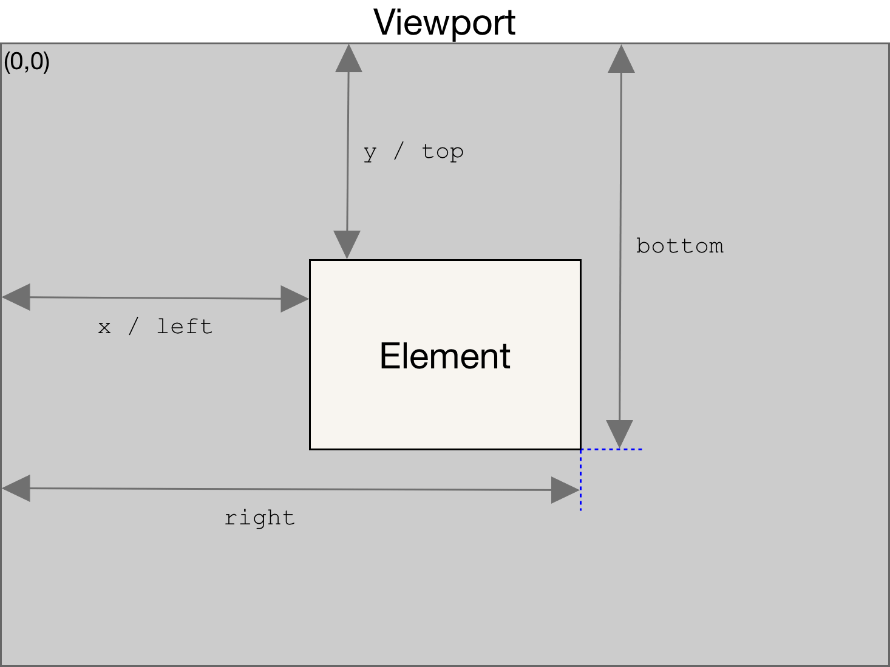

# getBoundingClientRect()

The `Element.getBoundingClientRect()` method returns a **DOMRect** object **providing information** about the **size** of an element and its **position** relative to the viewport.

## Syntax

```js
domRect = element.getBoundingClientRect();
```

### Value

The `getBoundingClientRect()` method returns a **DOMRect object** with **8 properties**:

- `left`
- `top`
- `right`
- `bottom`
- `x`
- `y`
- `width`
- `height`.

Properties other than `width` and `height` are relative to the top-left of the viewport.

> **Note**: The scrolling that has been done is taken into account. This means that the rectangle's edges (top, left, bottom, and right) change their values every time the scrolling position changes.



The `width` and `height` properties of the DOMRect object returned by the method include the `padding` and `border-width`, not only the content width/height. In the standard box model, this would be equal to the `width` or `height` property of the element + `padding` + `border-width`. But if `box-sizing: border-box` is set for the element this would be directly equal to its `width` or `height`.

## Reference

1. [Element.getBoundingClientRect() - MDN](https://developer.mozilla.org/en-US/docs/Web/API/Element/getBoundingClientRect)

2. [getBoundingClientRect() - w3schools](https://www.w3schools.com/jsref/met_element_getboundingclientrect.asp)
