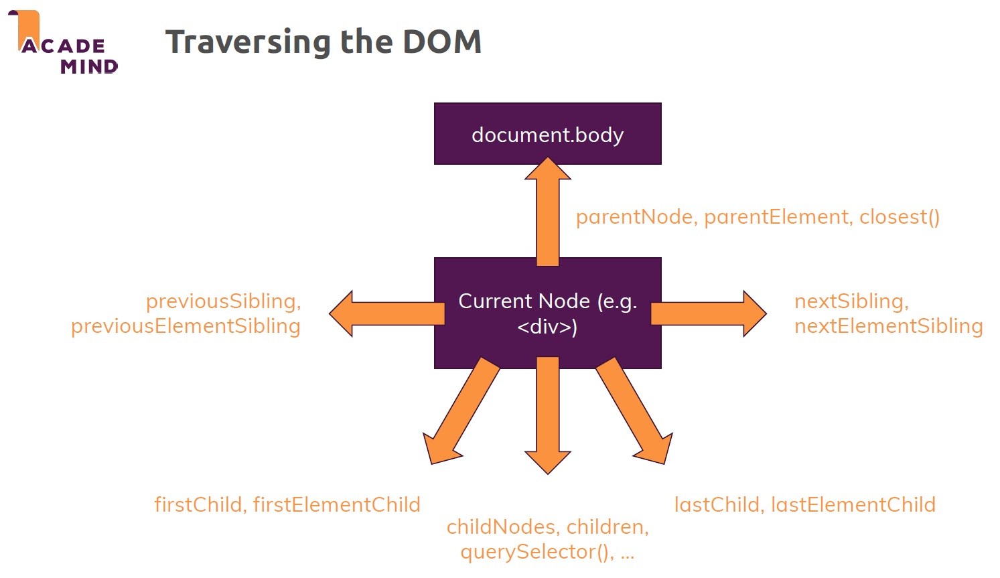

# Introduction to DOM Traversing

There is another connected concept, connected to selecting elements which is typically known as traversing the DOM. What does traversing the DOM mean?

It means that once you selected one element, one node therefore, you might be interested in diving into all of its child nodes, for example to add it all list items in a list or anything like that, so rather than manually selecting every element you might be interested in with `querySelector()` or so on, you could take an element which you already did select and then move to its children or its siblings and so on based on that element, that's what's traversing the DOM means.

Now as i said, DOM traversal means that you have a selected element, a selected node, and now you want to dive into some of the surrounding or nested elements or nested nodes and there, you've got a couple of directions into which you can go.

> **Note**: Only element nodes can have child nodes and therefore of course if you're on a child node so to say and you want to know all about the parent, it's an element node, ==text nodes can't have child nodes==, _you can't nest other content into text nodes for example, they can only hold text, no other nested content_.

> Note: `parentElement` and `parentNode` always refers to the nearest parent element and that always is guaranteed to be an `Element` node.

## Reference

1. [JavaScript - The Complete Guide (Beginner + Advanced) - Maximilian Schwarzmüller](https://www.udemy.com/course/javascript-the-complete-guide-2020-beginner-advanced/?utm_source=adwords&utm_medium=udemyads&utm_campaign=JavaScript_v.PROF_la.EN_cc.ROWMTA-B_ti.6368&utm_content=deal4584&utm_term=_._ag_130756014153_._ad_558386196906_._kw__._de_c_._dm__._pl__._ti_dsa-774930039569_._li_1011789_._pd__._&matchtype=&gclid=Cj0KCQjw0umSBhDrARIsAH7FCoeU9W1FhcfHq4JH6InuqwKQdlnXPY4wnIG6-ZrfGPJ6hyB9zTE0NW8aAvGkEALw_wcB)
