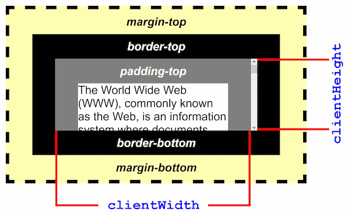

# clientHeight

The `clientHeight` property **returns the viewable height of an element** in pixels, including padding, but not the border, scrollbar or margin.

The `clientHeight` property is **read-only**.

The `Element.clientHeight` read-only property is zero for elements with no CSS or inline layout boxes; otherwise, it's the inner height of an element in pixels. It includes padding but excludes borders, margins, and horizontal scrollbars (if present).

`clientHeight` can be calculated as: CSS `height` + CSS `padding` - height of horizontal scrollbar (if present).

When `clientHeight` is used on the root element (the `<html>` element), (or on `<body>` if the document is in quirks mode), the viewport's height (excluding any scrollbar) is returned.



## Syntax

```js
element.clientHeight;
```

## Returned Value

A number.

## Reference

1. [Element.clientHeight - MDN](https://developer.mozilla.org/en-US/docs/Web/API/Element/clientHeight)

2. [Element clientHeight - w3schools](https://www.w3schools.com/jsref/prop_element_clientheight.asp)
