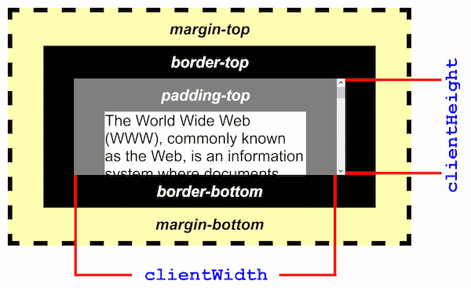

# clientWidth

The `clientWidth` property **returns the ==viewable width== of an element** in pixels, including padding, but not the border, scrollbar or margin.

The `clientWidth` property is ==read-only==.

The `Element.clientWidth` read-only property is zero for elements with no CSS or inline layout boxes; otherwise, it's the inner width of an element in pixels. It includes padding but excludes borders, margins, and horizontal scrollbars (if present).

When `clientWidth` is used on the root element (the `<html>` element), (or on `<body>` if the document is in quirks mode), the viewport's width (excluding any scrollbar) is returned.



## Syntax

```js
element.clientWidth;
```

## Returned Value

A number.

## Reference

1. [Element.clientWidth - MDN](https://developer.mozilla.org/en-US/docs/Web/API/Element/clientWidth)

2. [Element clientWidth - w3schools](https://www.w3schools.com/jsref/prop_element_clientwidth.asp)
