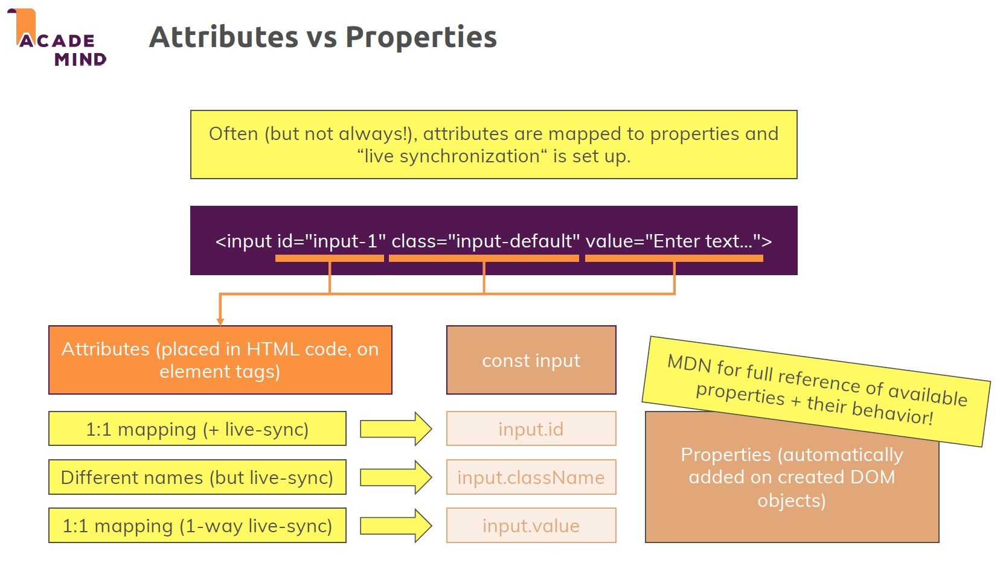

# HTMLElement.style

The `style` ==read-only== property returns the ==inline style== of an element in the form of a CSSStyleDeclaration object that contains a list of all styles properties for that element with values assigned for the attributes that are defined in the element's inline `style` attribute.

> **Note**: The CSSStyleDeclaration object contains all inline styles properties for the element. It does not contain any style properties set in the `<head>` section or in any external style sheets.

> **Note**: JavaScript syntax is slightly different from CSS syntax: `backgroundColor` vs `background-color`.

> **Note**: The `style` property has the same (and highest) priority in the CSS cascade as an inline style declaration set via the `style` attribute.

> **Note**: Use the `style` property instead of the the `setAttribute()` method, to prevent overwriting other properties in the style attribute.

## Syntax

```js
// Return a style property
element.style.property;

// Set a style property
element.style.property = value;
```

## Return Value

- **value** - the value of the specified property
- **Object** - the element's CSSStyleDeclaration object

## Setting styles

While `style` property is considered read-only, it is possible to set an inline style by assigning a string directly to the `style` property. In this case the string is forwarded to CSSStyleDeclaration.cssText. Using `style` in this manner will completely overwrite all inline styles on the element.

Therefore, to add specific styles to an element without altering other `style` values, it is generally preferable to set individual properties on the CSSStyleDeclaration object. For example, `element.style.backgroundColor = "red"`.

A style declaration is reset by setting it to `null` or an empty string, e.g., `element.style.color = null`.

## Getting style information

The `style` property is not useful for completely learning about the styles applied on the element, since it represents only the CSS declarations set in the element's inline style attribute, not those that come from style rules elsewhere, such as style rules in the `<head>` section, or external style sheets. To get the values of all CSS properties for an element you should use `window.getComputedStyle()` instead.

## Attributes vs Properties

When speaking about manipulating elements, it's also important to understand ==the difference between **attributes** and **properties**== because it's easy to confuse these two things or to not even be aware of these two different things because often, indeed ==attributes are mapped to properties== and ==some live synchronization is set up==.

==All attributes are placed in the HTML code==, so what you write in the HTML code is named an attribute, what you add on the HTML tag, that's an attribute of that tag.
What the browser does with these attributes is it creates such a DOM object based on the tag name and preconfigures it and preconfigures some of its properties based on the attributes because the important thing is that the attribute is the thing in your HTML code. ==The property is a value stored in the object that's created based on your HTML code== so to say.

==Objects in Javascript have properties==, no matter if there are some DOM objects or not. So of course for DOM objects, we also have properties and these simply reflect the configuration and setup and positioning and so on of the rendered DOM node, of the DOM object, and the idea of attributes is that you, if you're writing HTML code, can provide a certain default configuration to this to be created DOM object.

It's important to understand that ==not every attribute has a one-to-one mapping in properties== though. It's just important to know that ==not always the attribute name is equal to the property name==.



## Reference

1. [HTMLElement.style - MDN](https://developer.mozilla.org/en-US/docs/web/api/htmlelement/style)
2. [style property - w3schools](https://www.w3schools.com/jsref/prop_html_style.asp)
3. [JavaScript - The Complete Guide (Beginner + Advanced) - Maximilian Schwarzmüller](https://www.udemy.com/course/javascript-the-complete-guide-2020-beginner-advanced/?utm_source=adwords&utm_medium=udemyads&utm_campaign=JavaScript_v.PROF_la.EN_cc.ROWMTA-B_ti.6368&utm_content=deal4584&utm_term=_._ag_130756014153_._ad_558386196906_._kw__._de_c_._dm__._pl__._ti_dsa-774930039569_._li_1011789_._pd__._&matchtype=&gclid=Cj0KCQjw0umSBhDrARIsAH7FCoeU9W1FhcfHq4JH6InuqwKQdlnXPY4wnIG6-ZrfGPJ6hyB9zTE0NW8aAvGkEALw_wcB)
