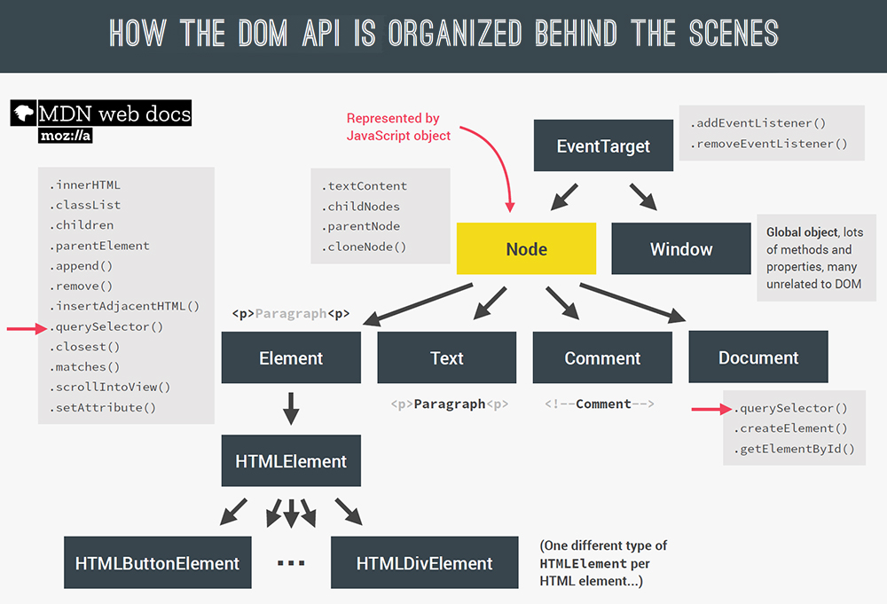
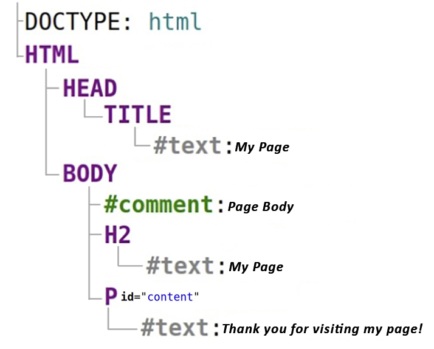

# DOM Nodes & Elements

Let's dive into nodes and elements. I kind of use these terms interchangeably but actually should be careful and you should at least understand what the difference is. So you have nodes and elements and ==nodes are the objects that make up the DOM, everything in the DOM is a node==.



==The Document Object Model (DOM) is an interface that treats HTML or XML document as a tree structure, where **each node is an object** of the document==. DOM also provides a set of methods to query the tree, alter the structure, style. DOM also uses the term `Element` _which is quite similar to a_ `Node`. So, what's the difference between a DOM `Node` and an `Element`?

> Every object located within a `document` is a node of some kind. In an HTML document, an object can be an element node but also a text node or attribute node.

## What's a DOM node?

The key to understanding the difference between a `Node` and an `Element` is to understand what a `Node` is. From a higher viewpoint, ==a DOM document consists of a **hierarchy of nodes**. Each `Node` can have a parent and/or children==. Let's look at the following HTML document:

```html
<!DOCTYPE html>
<html>
  <head>
    <title>My Page</title>
  </head>
  <body>
    <!-- Page Body -->
    <h2>My Page</h2>
    <p id="content">Thank you for visiting my web page!</p>
  </body>
</html>
```

The document contains the following hierarchy of nodes:


`<html>` is a node in the document tree; it has 2 children: `<head>` and `<body>` nodes.

`<body>` is also a node having 3 children: a comment `<!-- Page Body -->`, heading `<h2>`, and paragraph `<p>`; the parent of the `<body>` node is `<html>` node.

==The tags in the HTML document represent a node, what's interesting is that regular text is also a node==. The paragraph node `<p>` has 1 child: the text node "Thank you for visiting my web page!".

### Node Types

How can you distinguish these different ==types of nodes==? The answer lays in the DOM Node interface, particularly in the [`Node.nodeType`](https://developer.mozilla.org/en-US/docs/Web/API/Node/nodeType) property. `Node.nodeType` can have one of the following values that represents the type of the node:

- `Node.ELEMENT_NODE`
- `Node.ATTRIBUTE_NODE`
- `Node.TEXT_NODE`
- `Node.CDATA_SECTION_NODE`
- `Node.PROCESSING_INSTRUCTION_NODE`
- `Node.COMMENT_NODE`
- `Node.DOCUMENT_NODE`
- `Node.DOCUMENT_TYPE_NODE`
- `Node.DOCUMENT_FRAGMENT_NODE`
- `Node.NOTATION_NODE`

The constants meaningfully indicate the node type: for example `Node.ELEMENT_NODE` represents an ==Element== Node, `Node.TEXT_NODE` represents a ==Text== Node, `Node.DOCUMENT_NODE` the ==Document== Node, and so on.

For example, let's select the paragraph node, and look at its `nodeType` property:

```js
const paragraph = document.querySelector('p');
paragraph.nodeType === Node.ELEMENT_NODE; // => true
```

As expected `paragraph.nodeType` has the value `Node.ELEMENT_NODE`, indicating that the paragraph is an element. The paragraph also contains a text node:

```js
const paragraph = document.querySelector('p');
const firstChild = paragraph.childNodes[0];
firstChild.nodeType === Node.TEXT_NODE; // => true
```

There's a node type that represents the entire document tree of nodes — `Node.DOCUMENT_NODE`:

```js
document.nodeType === Node.DOCUMENT_NODE; // => true
```

What is important to understand is that ==not just HTML tags are created as node objects but also all text that you have, and these are created as so-called Text Nodes. What I'm pointing at here in the below image might be strange, but the empty whitespace in the front of the `head` tag is actually translated to a `Node` in the browser, so even that whitespace is part of the loaded node tree==.


Now typically, you don't see that on the screen because due to the way styling works and so on, ==most **whitespace** is actually not rendered but **whitespaces** are part of that DOM tree and its called Text Nodes. So even the **whitespace** which you add in your HTML file for readability reasons is treated as a Text Node because it is text in your HTML file==, right?

Also ==the **normal text** is part of the DOM as Text Nodes== though and these really are two different types of nodes: you have `Element` nodes for all the elements which you have but then the content in the elements might be other elements but might also be text and text is indeed stored as objects but as a different kind of object, as `Text` Nodes, with different properties and different methods.

## `Element`, `Comment`, `Text` nodes

After getting a good grasp of what a DOM Node is, now is the time to differentiate the DOM `Node` and `Element`. If you get well the node term, then the answer is obvious: ==an Element is **a node of a specific type** — `Element` (`Node.ELEMENT_NODE`). Along with types like `Document`, `Comment`, `Text`, etc.==

==In simple words, an `Element` is a node that's written using a tag in the HTML document (`<html>`, `<head>`, `<title>`, `<body>`, `<h2>`, `<p>` are all elements because they are represented by tags). The `Document` type, the `Comment`, the `Text` nodes aren't elements because they are not written with tags==:

```html
<!DOCTYPE html>
<html>
  <body>
    <!-- Page Body -->
    <p>Thank you for visiting my web page!</p>
  </body>
</html>
```

`Node` is constructor of a node, and `HTMLElement` is a constructor of an `Element` in JavaScript DOM. A paragraph, being a Node and also an Element, is an instance of both `Node` and `HTMLElement`:

```js
const paragraph = document.querySelector('p');
paragraph instanceof Node;        // => true
paragraph instanceof HTMLElement; // => true
```

## `Node` vs `Element`. Why matter?

Elements therefore are in the end just element nodes as I just explained, so ==elements are really just the nodes which are created of HTML tags which were rendered, NOT the text in there==. Now why does this matter? Because on element nodes, on elements therefore, you have special properties and methods to interact with the elements, to change their style, to change their content and so on.

You also have special properties or methods on Text Nodes but you simply don't work with Text Nodes as often as you will work with elements because typically you want to add a new HTML element, you want to remove one, you want to change the style of one, you want to edit it in any other way. For text, you typically just want to change the text and then you typically just go to the Element that hold the text and change the child content which is the text of that Element, which is why you don't work with Text Nodes as often.

==**DOM Nodes are just JavaScript objects** in the end - i.e. _reference values_. The `document` methods like `querySelector()` or `querySelectorAll()` return the **object references** (addresses)==.

## DOM properties: nodes and elements

Aside from differentiating nodes from elements, you need also to distinguish the DOM properties that contain specifically only nodes, or only elements.

The following properties of `Node` type evaluate to a node or a collection of nodes (`NodeList`):

```js
node.parentNode; // Node or null
node.firstChild; // Node or null
node.lastChild;  // Node or null
node.childNodes; // NodeList
```

However, the following properties are elements or collection of elements (`HTMLCollection`):

```js
node.parentElement; // HTMLElement or null
node.children;      // HTMLCollection
```

Since both `node.childNodes` and `node.children` return a list of children, why have both of these properties? Good question!

Consider the following paragraph element containing some text:

```html
<p>
  <b>Thank you</b> for visiting my web page!
</p>
```

Open the [demo](https://jsitor.com/3mPwoSVbYh), then look at `childNodes` and `children` properties of the parapgraph node:

```js
const paragraph = document.querySelector('p');
paragraph.childNodes; // NodeList:       [HTMLElement, Text]
paragraph.children;   // HTMLCollection: [HTMLElement]
```

`paragraph.childNodes` collection contains 2 nodes: the bold element `<b>Thank you</b>`, as well as the text node `for visiting my web page!`. However, `paragraph.children` collection contains only 1 item: the bold element `<b>Thank you</b>`. Because `paragraph.children` contains only elements, the text node wasn't included here because its type is text (`Node.TEXT_NODE`), and not an element (`Node.ELEMENT_NODE`). Having both `node.childNodes` and `node.children` lets you choose the collection of children you'd like to access: all children nodes or only children being elements.

## Live Node Lists vs Static Node Lists

### What is a NodeList?

- A `NodeList` object is a ==list (collection) of nodes== extracted from a document.
- A `NodeList` object is almost the same as an `HTMLCollection` object.
- Some (older) browsers return a `NodeList` object instead of an `HTMLCollection` for methods like `getElementsByClassName()`.
- All browsers return a `NodeList` object for the property `childNodes`.
- Most browsers return a `NodeList` object for the method `querySelectorAll()`.

### Static Node List

The Static Node List takes a ==**SNAPSHOT**== of the DOM, of what we select and does ==NOT update== that array-like when that part which we queried in the past changes. Now, that's not necessarily a disadvantage from a performance perspective, from a memory consumption perspective, this might even be better and I also want to highlight that of course ==the individual objects in there array-like are still **reference values**==, so an object in there array-like is still of course a live reference to the DOM objects that are responsible for what we see on the page.

So if I go to let's say `elements[0].textContent = 'One'`, that gets reflected on the screen because the ==items are reference values==, these are pointers at the objects, at the DOM objects in memory, just the overall array-like is just a snapshot build from what I've been selected in the past.

### Live Node List

On the other side, Live Node List is a ==**LIVE**== list array-like which will includes our most recent addition. So `getElementsByClassName()` or `getElementsByTagName()` always gives you array-like objects with live lists which will change when the items you queried in the past change, so when the number of array-like items changes I should say.

That can or cannot be an advantage, often it will not matter to be honest. It could lead to a ==higher memory consumption== if you're managing a lot of such live collections which change all the time but again, that will also probably only matter in rare niche cases but for the most part, `querySelectorAll()` simply should be used because it is more flexible, supports richer queries and therefore often is a common choice if you want to query for multiple items.

## References

1. [JavaScript - The Complete Guide (Beginner + Advanced) - Maximilian Schwarzmüller](https://www.udemy.com/course/javascript-the-complete-guide-2020-beginner-advanced/?utm_source=adwords&utm_medium=udemyads&utm_campaign=JavaScript_v.PROF_la.EN_cc.ROWMTA-B_ti.6368&utm_content=deal4584&utm_term=_._ag_130756014153_._ad_558386196906_._kw__._de_c_._dm__._pl__._ti_dsa-774930039569_._li_1011789_._pd__._&matchtype=&gclid=Cj0KCQjw0umSBhDrARIsAH7FCoeU9W1FhcfHq4JH6InuqwKQdlnXPY4wnIG6-ZrfGPJ6hyB9zTE0NW8aAvGkEALw_wcB)
2. [The Complete JavaScript Course. From Zero to Expert! - Jonas Schmedtmann](https://www.udemy.com/course/the-complete-javascript-course/?utm_source=adwords&utm_medium=udemyads&utm_campaign=JavaScript_v.PROF_la.EN_cc.ROWMTA-B_ti.6368&utm_content=deal4584&utm_term=_._ag_130756014153_._ad_558386196906_._kw__._de_c_._dm__._pl__._ti_dsa-774930039569_._li_1011789_._pd__._&matchtype=&gclid=CjwKCAjwiuuRBhBvEiwAFXKaNCuaAhZ8UB5kIldtb76eeAyfM0SUKeceBq3FKF24pNxDVe-_g0-DPxoCnWwQAvD_BwE)
3. [Node - MDN](https://developer.mozilla.org/en-US/docs/Web/API/Node)
4. [Node.nodeType - MDN](https://developer.mozilla.org/en-US/docs/Web/API/Node/nodeType)
5. [Element - MDN](https://developer.mozilla.org/en-US/docs/Web/API/Element)
6. [What's the Difference between DOM Node and Element? - Dmitri Pavlutin](https://dmitripavlutin.com/dom-node-element/)
