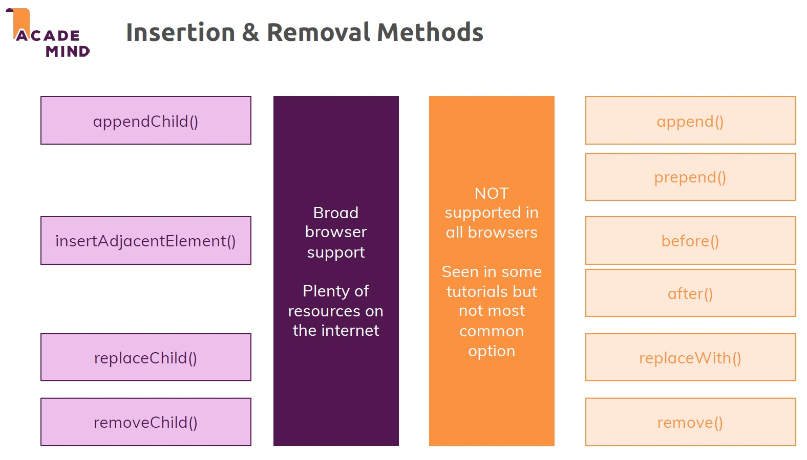

# Introduction to create, insert and remove elements

Let's have a look at how you can create and insert brand new elements. Now for that, we have basically two different ways of doing that:

1. We can and that might sound surprising but we can write some HTML code as a string in JavaScript and tell JavaScript and therefore the browser that it should take and parse that HTML code and render it in a certain place of our documentary.
2. We use the `createElement()` method on the `document` object to create a brand new node and manually then insert it somewhere in our document.

## Differences between `HTML String` & `createElement()`

### `HTML String` downside

Do you have an idea when using HTML code or even with the better `insertAdjacentHTML()` method might not be great? Performance is not an issue here with this `insertAdjacentHTML()` method and also not that we wouldn't have to re-render content, so that's not the reason.

A downside of `insertAdjacentHTML()` approach is that you tell the browser which element to render or which content to render and that can be any HTML content, doesn't have to be a single element, can be any as complex as you want HTML code. The downside just is you have no direct access to the newly rendered content.

Let's say you create a `
` element and later you would want to reach out to the `
` element and change it, or you inserted a button and you want to add an event listener. Well then you have to use `querySelector()` to query for that `
` element and this would allow us to get access to that `
` element. Now the more complex the HTML code is you inserted with `insertAdjacentHTML()`, the more complex is to query for the right things, so that you get the objects with which you can work, where you can add event listeners, where you can change the properties and so on. So the missing direct access to the inserted elements with the help of `insertAdjacentHTML()` method can be a problem.

Of course it's not if you don't plan on doing anything with the inserted elements in your JavaScript code but as soon as you need to add event listeners or change styles or read some values or do anything else with them in JavaScript, the `insertAdjacentHTML()` approach has the downside of not giving you direct access and if you find yourself inserting content with `insertAdjacentHTML()` and then querying for it thereafter, you're basically running two steps to get access to a newly added element, when there actually is only one step required and that's the case with `createElement()`.

### `document.createElement()` alternative

You always call `createElement()` on the `document`, you don't call `createElement()` on any other DOM node or DOM object, it's always `document.createElement()`.

The `document.createElement()` creates a new element, a new DOM object, just like you could select it but it creates it from scratch and it takes at least one argument and that's the tag name you want to create, so the tag name of the element you want to create (tag name without the brackets `<>`, just the tag name which you find between the angled brackets `<>`).

After you ==create== an element with `document.createElement()` you need to ==insert== it in the HTML DOM. After inserting, maybe if you want to ==set== it's content, to set it style, classes, attributes, maybe you want to attach it an event listener etc. That the main benefit of creating an element with the `document.createElement()`, it ==give you direct access to the element that you create it==.

## Some considerations about inserting elements

If you have an created or selected element, either because you selected it in the DOM with `querySelector()` or you created it with `createElement()` and that element is ==already part of the DOM, so it is already rendered==, if you then insert it somewhere else in the DOM, that element is ==NOT copied== or anything like that, instead the existing element is ==DETACHED== from the place where it was and moved to the new place.

This actually makes a lot of sense since ==objects are reference values== as you learned and the DOM objects you're working are nothing but normal objects in the end and therefore if we do something with them and we add them somewhere else, we always work with the same object. So of course the element is detached from the existing place and moved to the new one, it's not copy, so you need to be aware of this thing.

If you want a brand new element, you have to create a brand new one with `document.createElement()`. Just keep in mind that ==inserting the same element multiple times will move it== because we're working with objects and not with some automatically copied things.

You learned that inserting an element more than once will move that element and not copy it, so if you would want to copy an element, well then you can do this with another method which is available on every DOM node object an is called `cloneNode()`. This method will clone a node and will really return a brand new one.

## Browser support and which method to use

## Reference

1. [JavaScript - The Complete Guide (Beginner + Advanced) - Maximilian Schwarzmüller](https://www.udemy.com/course/javascript-the-complete-guide-2020-beginner-advanced/?utm_source=adwords&utm_medium=udemyads&utm_campaign=JavaScript_v.PROF_la.EN_cc.ROWMTA-B_ti.6368&utm_content=deal4584&utm_term=_._ag_130756014153_._ad_558386196906_._kw__._de_c_._dm__._pl__._ti_dsa-774930039569_._li_1011789_._pd__._&matchtype=&gclid=Cj0KCQjw0umSBhDrARIsAH7FCoeU9W1FhcfHq4JH6InuqwKQdlnXPY4wnIG6-ZrfGPJ6hyB9zTE0NW8aAvGkEALw_wcB)
