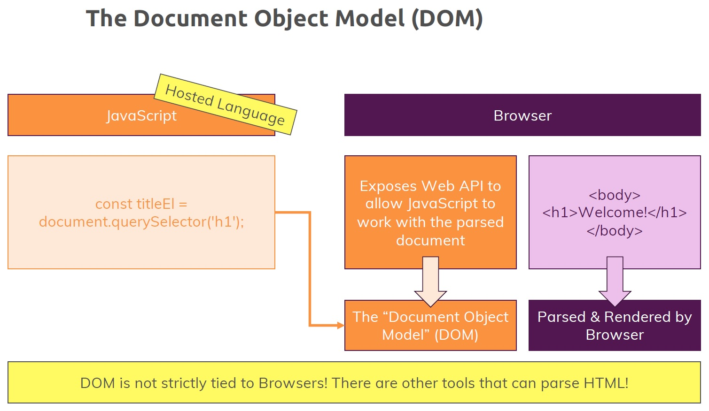
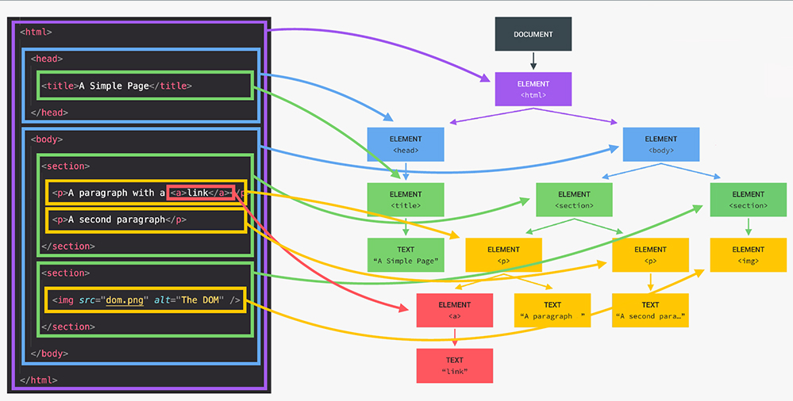
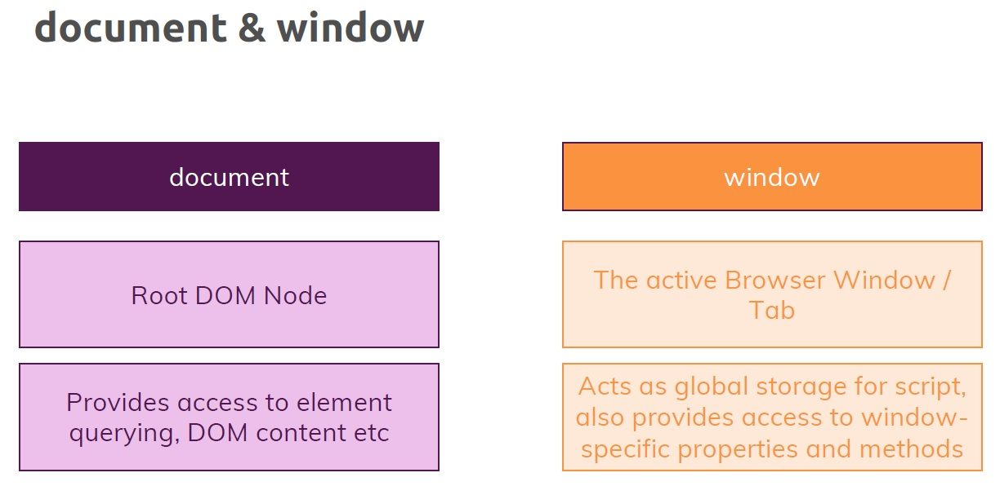

# Introduction to the Document Object Model (DOM)

What is the **D**ocument **O**bject **M**odel (DOM)? Before we ask to that question, let's understand ==what the browser does with our HTML document==, which is part of any web page we create, and ==how JavaScript works with our HTML document==.

## JavaScript & Browser

From the beginning we get JavaScript and we get the browser, these two pieces which interact all the time. Now don't forget that JavaScript is a **hosted language**, that means the browser provides the environment for JavaScript to run, it provides the JavaScript Engine, which in the end parses and understands all the JavaScript code and executes it. So the browser provides the Engine, but it also provides a bunch of Web APIs, a bunch of functionalities into which JavaScript can tap, so that JavaScript can interact with the browser, and implicit with our HTML document.

## Understanding the DOM and how it's created

When we work with HTML document, the browser parse and render that HTML document and exposes functionalities to let JavaScript interact with that rendered HTML. To be more precise, ==the browser exposes functionalities through a Web API that allow JavaScript to work with that parsed HTML document==, and in the end that parsed HTML document is called the **D**ocument **O**bject **M**odel (DOM).



## What is the DOM?

The DOM is a W3C (World Wide Web Consortium) standard. ==The DOM defines a **standard for accessing documents**==. The W3C DOM standard is separated into 3 different parts:

- Core DOM - standard model for all document types
- XML DOM - standard model for XML documents
- ==HTML DOM - standard model for HTML documents==

The HTML DOM is that loaded and rendered HTML document that we talk about. ==The HTML DOM is a **programming interface for web documents**. It represents the page so that programs can change the document structure, style, and content. The HTML DOM **represents the document as nodes and objects**; that way, programming languages can interact with the page==.

> **Note**: The HTML DOM represents a document with a logical tree. Each branch of the tree ends in a node, and each node contains objects. DOM methods allow programmatic access to the tree. With them, you can change the document's structure, style, or content.
>
> The HTML DOM is a standard **object** model and **programming interface** for web documents (HTML). It defines:
>
> - The HTML elements as **objects**
> - The **properties** of all HTML elements
> - The **methods** to access all HTML elements
> - The **events** for all HTML elements
>
> In other words: **The HTML DOM is a standard for how to get, change, add, or delete HTML elements.** All of the properties, methods, and events available for manipulating and creating web pages are organized into objects.

==**The HTML DOM connects web pages to scripts or programming languages** by representing the structure of a HTML document in memory==. Usually it refers to JavaScript, even though modeling HTML, SVG, or XML documents as objects are not part of the core JavaScript language.

 The HTML DOM model is constructed as a **tree of objects**:



With the object model, JavaScript gets all the power it needs to create dynamic HTML:

- JavaScript can change all the HTML elements in the page
- JavaScript can change all the HTML attributes in the page
- JavaScript can change all the CSS styles in the page
- JavaScript can remove existing HTML elements and attributes
- JavaScript can add new HTML elements and attributes
- JavaScript can react to all existing HTML events in the page
- JavaScript can create new HTML events in the page

## DOM and JavaScript

==The DOM is not a programming language, but without it, the JavaScript language wouldn't have any model or notion of web pages, HTML documents, SVG documents, and their component parts==. The document as a whole, the head, tables within the document, table headers, text within the table cells, and all other elements in a document are parts of the DOM for that document. They can all be accessed and manipulated using the DOM and a scripting language like JavaScript.

> **Note**: The DOM is not part of the JavaScript language, but is instead a Web API used to build websites.

==The DOM was designed to be independent of any particular programming language==, making the structural representation of the document available from a single, consistent API. Even if most web developers will only use the DOM through JavaScript, implementations of the DOM can be built for any language.

## Accessing the DOM

You don't have to do anything special to begin using the DOM. You use the API directly in JavaScript from within what is called a *script*, a program run by a browser.

When you create a script, whether inline in a `<script>` element or included in the web page, you can immediately begin using the API for the [`document`](https://developer.mozilla.org/en-US/docs/Web/API/Document) or [`window`](https://developer.mozilla.org/en-US/docs/Web/API/Window) objects to manipulate the document itself, or any of the various elements in the web page (the descendant elements of the document).

The `document` represents any web page loaded in the browser and serves as an entry point into the web page's content.

> Generally is not recommended to mix the structure of the page (written in HTML) and manipulation of the DOM (written in JavaScript), the JavaScript parts will be grouped together in the `<script>`, separated from the HTML.
>
> ```html
> // Not recommended
> <body onload="console.log('Welcome to my home page!');">
> …
> </body>
> ```
>
> ```js
> // Recommended
> document.body.addEventListener("load", function() {
>  console.log('Welcome to my home page!');
> });
> ```

So JavaScript can work with HTML document through `document` object, which in the end represent what the browser rendered or what the browser made of the HTML document which was provided by us. So in other words, the browser exposes to us a ==Web API, a `document` object, which is globally available, which is **NOT created by you** but which the **browser exposes to you** to give you access to all the different ways of interacting with the HTML document==.

Now I mentioned the `document`, this is one important piece in working with the loaded HTML document, there also is another important global object and actually, `document` is a property of that other global object and that's the `window` object.



Now the difference is that `document` in the end is the root DOM node which the browser exposes to us. That means that ==`document` is the topmost entry point to get access to all that rendered HTML code==. So `document` provides you various methods and functionalities to get access to the elements, to query for HTML elements, to interact with its DOM contents, so to interact with a parsed HTML document.

`window` on the other hand is a ==global object== which as I just said actually has `document` as property, so ==`window` is the real topmost global object made available to you in JavaScript in the browser==, and that in the end reflects the active browser window or tab if you want to call it like this. So it's basically your global entry point, your global storage if you want to call it like this for your script, so ==`window` gives you access to all the features that the browser wants to expose to you==.

> In simple terms, the `window` object represents something like the browser, and the `document` object is the root of the HTML document itself.

## References

1. [JavaScript - The Complete Guide (Beginner + Advanced) - Maximilian Schwarzmüller](https://www.udemy.com/course/javascript-the-complete-guide-2020-beginner-advanced/?utm_source=adwords&utm_medium=udemyads&utm_campaign=JavaScript_v.PROF_la.EN_cc.ROWMTA-B_ti.6368&utm_content=deal4584&utm_term=_._ag_130756014153_._ad_558386196906_._kw__._de_c_._dm__._pl__._ti_dsa-774930039569_._li_1011789_._pd__._&matchtype=&gclid=Cj0KCQjw0umSBhDrARIsAH7FCoeU9W1FhcfHq4JH6InuqwKQdlnXPY4wnIG6-ZrfGPJ6hyB9zTE0NW8aAvGkEALw_wcB)
1. [Introduction to the DOM - MDN](https://developer.mozilla.org/en-US/docs/Web/API/Document_Object_Model/Introduction)
1. [JavaScript HTML DOM - w3schools](https://www.w3schools.com/js/js_htmldom.asp)
1. [Document - MDN](https://developer.mozilla.org/en-US/docs/Web/API/Document)
1. [Node - MDN](https://developer.mozilla.org/en-US/docs/Web/API/Node)
