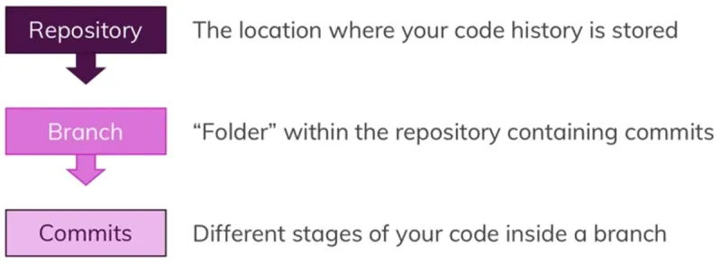

# Version control with Git

Git is a ==version control system== and allows you to ==manage your source code history== efficiently. Whenever you work on your code, changes can be saved with Git and you can ==jump back to any previously saved versions==. ==Without tools like Git, you would have to create manual copies of your code==, which would be quite cumbersome and impossible to maintain once your application grows.

Besides local version control and code management, you can also ==push your projects and all your commits ("snapshots") to remote storages==. The most prominent (free!) remote service is GitHub.

Using Git is totally optional! It's also not a tool that's related to JavaScript in any way - ==you can indeed use Git in ANY (programming) project==.

## Git vs Github

These terms can be confusing, especially for beginners. Git is a ==version control system== which you can download to your computer, GitHub is a ==hosting & collaboration provider== which hosts your Git projects. It is a web based solution allowing you to upload your Git Repositories to it.

Uploading your code from your local Git environment to GitHub makes your code available to anybody who wants to contribute to your project.

## Repositories, Branches & Commits

A ==Repository== is the _location where your code is stored_, so a folder on your machine containing your project code. After turning this folder into a Git Repository, Git manages the project code version history.

The code is not directly stored in the Repository though. Inside our Repository we have "subfolders", so-called ==Branches==. After we added the first code to our Repository, a default "master" Branch is created. We are not limited to one Branch though, _a Repository typically contains multiple Branches_. So these are Repositories and Branches, but where is our code stored?

Our code is stored inside our Branches! _A Branch contains different versions of our code, our_ ==Commits==. _Each Commit is a snapshot of a specific version of the code_.

## How to use Git

Git runs in the terminal (MacOS) or the Command Prompt (Windows) only, so it doesn't come with a Graphical User Interface (GUI). If you're working with an IDE, you can also use the integrated terminal.

## The Main Commands

### Configure git and create a repository + .gitignore for specify folders/files that you don't want into your repository

- `git init`
- You need to have an account on Github or any other service that is similar to GitHub in order to store our local repository in the cloud.
- `git config` --global user.name GithubUsername
- `git config` --global user.email e-mailAdress

Before steps below we need to have in our directory created the .gitignore file. If VScode didn't create it automatically for you, then you need to create this file manually.

### Commit files to repository

- `git status`
- `git add -A`
- `git commit -m “commitMessage”`

### Restore a previous commit or restore a commit by ids

- `git log`

- `git reset --hard HEAD` or `git reset --hard idOfCommit`

### Create, switch and merge a branch

- `git branch` (list branch/s that you currently have)

- `git branch` nameOfBranch (create)

- `git checkout` nameOfBranch (switch)

- `git merge` nameOfBranch (merge)

### Share & update

- `git remote add origin https://github.com/GithubUsername/projectName.git`
  (with this code we let our local repository know about this `https://github.com/GithubUsername/projectName.git remote repository)

- `git push origin [name of branch you want to push. ex: master]`
  (we can now push code to this remote branch, which remember is called "origin", and of course, you could give this “origin” another name, but "origin" is simply the standard name)

### Delete branch locally & remotely

- `git branch -d` localBranchName (delete branch locally)
- `git push origin --delete` remoteBranchName (delete branch remotely)

## References

1. [Git Tutorial for Beginners - Crash Course - academind.com](https://academind.com/tutorials/git-the-basics)
