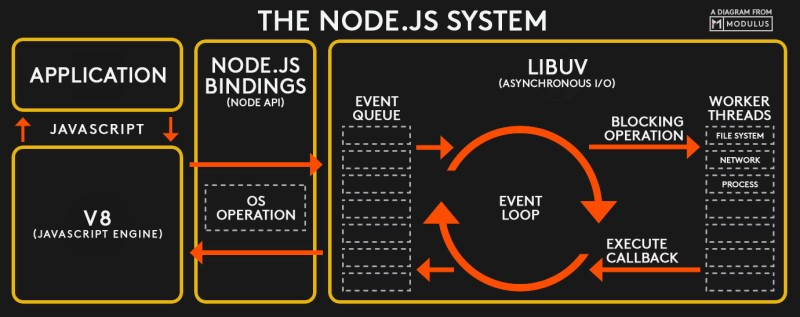

# Introducing asynchronous JavaScript

JavaScript is a **single-threaded language** and, at the same time, also **non-blocking**, **asynchronous** and **concurrent**.

JavaScript is a single-threaded programming language which means** only one thing can happen at a time**. That is, the **JavaScript Engine can only process one statement at a time in a single thread**.

While the single-threaded languages simplify writing code because you don’t have to worry about the concurrency issues, this also means you can’t perform long operations such as network access without blocking the main thread.
Imagine requesting some data from an API. Depending upon the situation the server might take some time to process the request while blocking the main thread making the web page unresponsive.

That’s where asynchronous JavaScript comes into play. Using asynchronous JavaScript (such as callbacks, promises, and async/await), you can perform long network requests without blocking the main thread.

## Runtime

JavaScript is an **interpreted language**, not a compiled one. This means that it **needs an interpreter which converts the JavaScript code to a machine code**. There are several types of **interpreters** (known as **Engines**). The most popular browser engines are V8 (Chrome), Quantum (Firefox) and WebKit (Safari). Incidentally, V8 is also used in a popular non-browser runtime, Node.js.

**A JavaScript Runtime is basically a container which includes all the different pieces that are necessary to execute JavaScript code**. The heart of every JavaScript Runtime is the Engine (V8, Quantum, WebKit, etc.), so in Engine code is actually executed and the objects are stored in memory.

Each engine contains a **Memory Heap**, a **Call Stack**, a **Web API**, a **Callback Queue** and an **Event Loop**, all implemented in its own way for faster and safer interpretation of the JavaScript code.

A `stack` is a continuous region of memory, **allocating local context for each executed function**. A `heap` is a much larger region, **storing everything allocated dynamically**. A `Call Stack` is a data structure which basically **records where we are in the program**.

Next we have the **Web APIs** environment. These are some APIs provided to the engine, but which are actually **not part of the JavaScript language itself**, so that's things like the DOM, Timers, the fetch API, the geolocation API and so on and so forth.

Next up, there is the **Callback Queue** and this is a data structure that holds all the ready to be executed callback functions that are attached to some event that has occurred. Finally, whenever the Call Stack is empty the **Event Loop** takes callbacks from the Callback Queue and puts them into Call Stack so that they can be executed.

So the **Event Loop is the essential piece that makes asynchronous behavior possible in JavaScript**. It's the reason why we can have a non blocking concurrency model in JavaScript.


Each browser has its own version of **JavaScript Runtime** with a set of **Web API's**, methods that developers can access from the `window` object.

## Single-Thread Language

A **single-thread language** is one with a **single Call Stack** and a **single Memory Heap**. It means that it **runs only one thing at a time**.

> **Note**: JavaScript has only **one threat of execution** and so it can **only do one thing at a time**. There is absolutely no multitasking happening in JavaScript itself.

## Call Stack

Let's write a simple code and track what's happening on the Call Stack.


As you can see, the functions are added to the Call Stack, executed and later deleted. It's the so-called **LIFO way - Last In, First Out**. Each entry in the Call Stack is called a `stack frame`. **Knowledge of the Call Stack is useful for reading error stack traces**. Generally, the exact reason for the error is at the top in first line, though the order of code execution is bottom-up.

## Long-running synchronous functions that work in the Call Stack

We'll start by looking at the problem with long-running synchronous functions, which make asynchronous programming a necessity.

Consider the following code:

```js
console.log('Start');

console.log('Wait...');
let number;
for (let i = 0; i < 1000000; i++) {
  number = i;
}

console.log('Finish');
```

What we should note here is that the browser effectively steps through the program one line at a time, in the order we wrote it, and at each point it waits for the line to finish its work, before going on to the next line. It has to do this, because each line depends on the work that was done in the preceding lines. You'll find that while our `for` loop is running, our program is completely unresponsive: the user can't type anything, or click anything, or do anything else. This is the basic problem with long-running synchronous functions. What we would like here is a way that our program can:

- start a long-running operation by calling a function
- have the function start the operation and return right away, so our program can still be responsive to other events
- be notified with the result of the operation, when it eventually completes.

That's what an asynchronous function offers us

Asynchronous programming is a technique that enables your program to start a potentially **long-running task**, and then rather than having to wait until that task has finished, to be able to continue to be **responsive to other events while the long-running task runs**. Once the task is completed, your program is presented with the result.

```js
console.log('Start');

alert('I am blocking the JavaScript thread !!!');

console.log('Finish');
```

## Blocked Call Stack

Here is an example of blocking the JavaScript thread. Let's try to read a `foo` file and a `bar` file using the Node.js synchronous function `readFileSync`.


As you see, the JavaScript Engine waits until the first call in `readFileSync` is completed, but this will not happen because there is no `foo` file, so the second function will never be called.

## Asynchronous Behavior With Regular Callbacks (Callback Queue and Event Loop)

In a synchronous language, only **one thing can be done at a time**. Imagine an `alert()` on the page, blocking
the user from accessing any part of the page until the `OK` button is clicked. If everything in JavaScript that took a significant amount of time blocked the browser, then we would have a pretty bad user experience. This is where `concurrency` and the `Event Loop` come in.

When you run some JavaScript code in a browser, the **Engine starts to parse the code**. Each line is executed and popped on and off the Call Stack. But, what about Web API's? **Web API's are not something JavaScript recognizes, so the parser knows to pass it off to the browser for it to handle**. When the browser has finished running its method, it puts what is needed to be ran by JavaScript into the Callback Queue. The Callback Queue can't be ran until the Call Stack is completely empty. So, the Event Loop is constantly checking the Call Stack to see if it is empty so that it can add anything in the Callback Queue back into the Call Stack. And finally, once it is back in the Call Stack, it is ran and then popped off the stack.


In the GIF above, we can see that the first function is pushed to the Call Stack and `Hi` is immediately executed in the console.

Then, we call the `setTimeout` function provided by the browser's WebAPI. It goes to the Call Stack and its asynchronous callback `foo` function goes to the WebApi's queue, where it waits for the call, set to happen after 3 seconds.

In the meantime, the program continues the code and we see `Hi. I am not blocked` in the console.

After it is invoked, each function in the WebAPI queue goes to the `Callback Queue`. It is where functions wait until the Call Stack is empty. When it happens, they are moved there one by one.

So, when our `setTimeout` timer finishes the countdown, our `foo` function goes to the Callback Queue, waits until the Call Stack becomes available, goes there, is executed and we see `Hi from asynchronous callback` in the console.

The question is, how does the runtime know that the Call Stack is empty and how is the event in the Callback Queue invoked? Meet Event Loop. It is a part of the JS engine. This process constantly checks if the Call Stack is empty and, if it is, monitors whether there is an event in the Callback Queue waiting to be invoked.

That's all the magic behind the scenes!

Another example:

```js
console.log('1');
// goes on call stack and runs 1
setTimeout(() => {
  console.log('2'), 1000;
});
// gets sent to web api
// web api waits 1 sec, runs and sends to callback queue
// the javascript engine keeps going
console.log('3');
// goes on call stack and runs 3
// event loop keeps checking and see call stack is empty
// event loop sends calback queue into call stack
// 2 is now ran

// 1
// 3
// 2

// Example with 0 second timeout

console.log('1');
setTimeout(() => {
  console.log('2'), 0;
});
console.log('3');

// 1
// 3
// 2

// Still has the same output
```

In the last example, we get the same output. How does this work if it waits 0 seconds? The JavaScript engine will still send off the setTimeout() to the Web API to be ran and it will then go into the callback queue and wait until the call stack is empty to be ran. So, we end up with the exact same end point.

> Note: Until 2009, JavaScript was only run inside of the browser. That is when Ryan Dahl decided it would be great if we could use JavaScript to build things outside the browser. He used C and C++ to build an executable (exe) program called Node JS. Node JS is a JavaScript runtime environment built on Chrome's V8 engine that uses C++ to provide the event loop and callback queue needed to run asynchronous operations.
> 

## Asynchronous Behavior With Regular Callbacks & Promises (Callback Queue, Microtask Queue, Event Loop)


So, here is what the Event Loop does. It looks into the Call Stack and determines whether it's empty or not, except of course for the global context, then if the stack is indeed empty which means that there's currently no code being executed, then it will take the first callback from the Callback Queue and put it on the Call Stack to be executed and this is called an **Event Loop tick**. So **each time the Event Loop takes a callback from the Callback Queue we say that there was an Event Loop tick**. So, as we can see the Event Loop has the extremely important task of doing coordination between the Call Stack and the callbacks in the Callback Queue. So, **the Event Loop is basically who decides exactly when each callback is executed**.

Another thing that becomes clear from this whole explanation is that the **JavaScript language itself has actually no sense of time, that's because everything that is asynchronous does not happen in the Engine. It's the Runtime who manages all the asynchronous behavior and it's the Event Loop who decides which code will be executed next, but the Engine itself simply executes whatever code it has given**.

The image started loading asynchronously in the Web APIs environment and not in the Call Stack. We then used `addEventListener` to attach a callback function to the image `load` event and this callback is basically an asynchronous code, it's code that we deferred into the future because we only want to execute it once the image has loaded and in the meantime, the rest of the code kept running. Now `addEventListener` did not put the callback directly in the Callback Queue, it simply registered the callback, which then kept waiting in the web APIs environment until the `load` event was fired off. Only then the environment put the call back into Callback Queue. Then while in the Callback Queue the callback kept waiting for the Event Loop to pick it up and put it on the Call Stack, and this happened as soon as the callback was first in line and the Call Stack was empty. And, that's it actually, so all this happened so that the image did not have to load in the Call Stack, but in the background in a non blocking way.

So, in a nutshell, **the Web APIs environment, the Callback Queue and the Event Loop, all together make it possible that asynchronous code can be executed in a non blocking way even with only one thread of execution in the engine**.

Now with Promises things work in a slightly different way which is why I included this promise example as well. So, let's say that the data has now finally arrived and so the fetch is done. Now, callbacks related to Promises like this one that we registered with the promises `then()` method do actually not go into the Callback Queue. Instead, **callbacks of Promises have a special queue for themselves, which is the so called Microtasks Queue**. Now, what is special about the **Microtasks Queue is that it basically has priority over the Callback Queue**. So, at the end of an Event Loop tick, so after a callback has been taken from the Callback Queue, **the Event Loop will check if there are any callbacks in the Microtasks Queue and if there are, it will run all of them before it will run any more callbacks from the regular Callback Queue**.

But anyway, as you can hopefully see the idea of running asynchronous code with regular callbacks and with microtasks coming from Promises is very similar. **The only difference is that they go into different queues and that the Event Loop gives microtasks priority over regular callbacks**.


Example for Promises (Job Queue or Microtask Queue)

```js
// 1 Callback Queue ~ Task Queue
setTimeout(() => {
  console.log('1', 'is the loneliest number');
}, 0);

setTimeout(() => {
  console.log('2', 'can be as bad as one');
}, 10);

// 2 Job Queue ~ Microtask Queue
Promise.resolve('hi').then(data => console.log('2', data));

// 3
console.log('3', 'is a crowd');

// 3 is a crowd
// 2 hi
// undefined Promise resolved
// 1 is the loneliest number
// 2 can be as bad as one
```

## Wrapping up the Theory

Even though JavaScript is a single threaded language, there are worker threads that work in the background that don't block the main thread. Just like a browser creates a new thread when you open a new tab. The workers work through messages being sent, but don't have access to the full program.

### Concurrency & Parallelism

**Concurrency** means executing multiple tasks at the same time but not simultaneously. E.g. two tasks works in overlapping time periods.

**Parallelism** means performing two or more tasks simultaneously, e.g. performing multiple calculations at the same time.

### Threads & Processes

**Threads** are a sequence of code execution which can be executed independently of one another.

**Process** is an instance of a running program. A program can have multiple processes.

### Synchronous & Asynchronous

In **synchronous** programming, tasks are executed one after another. Each task waits for any previous task to be completed and is executed only then.

In **asynchronous** programming, when one task is executed, you can switch to a different task without waiting for the previous one to be completed.

### Synchronous and Asynchronous in a Single and Multi-threaded Environment

**Synchronous with a single thread**: Tasks are executed one after another. Each task waits for its previous task to get executed.

Synchronous with multiple threads: Tasks are executed in different threads but wait for any other executing tasks on any other thread.

**Asynchronous with a single thread**: Tasks start being executed without waiting for a different task to finish. At a given time, only a single task can be executed.

**Asynchronous with multiple threads**: Tasks get executed in different threads without waiting for other tasks to be completed and finish their executions independently.

## JavaScript classification

If we consider how JS engines works under the hood, we can classify JS as an asynchronous and single-threaded interpreted language. The word "interpreted" is very important because it means that the language will always be runtime-dependent and never as fast as compiled languages with built-in multi-threading.

It is noteworthy that Node.js can achieve real multi-threading, provided that each thread is started as a separate process. There are libraries for this, but Node.js has a built-in feature called Worker Threads.

All Event Loop GIFs come from the Loupe application created by Philip Roberts, where you can test your asynchronous scenarios.

Reference

1. [The Complete JavaScript Course. From Zero to Expert! - Jonas Schmedtmann](https://www.udemy.com/course/the-complete-javascript-course/?utm_source=adwords&utm_medium=udemyads&utm_campaign=JavaScript_v.PROF_la.EN_cc.ROWMTA-B_ti.6368&utm_content=deal4584&utm_term=_._ag_130756014153_._ad_558386196906_._kw__._de_c_._dm__._pl__._ti_dsa-774930039569_._li_1011789_._pd__._&matchtype=&gclid=CjwKCAjwiuuRBhBvEiwAFXKaNCuaAhZ8UB5kIldtb76eeAyfM0SUKeceBq3FKF24pNxDVe-_g0-DPxoCnWwQAvD_BwE)

2. [Asynchronous and Single-threaded JavaScript? Meet the Event Loop - thecodest.co](https://thecodest.co/blog/asynchronous-and-single-threaded-javascript-meet-the-event-loop/)

3. [JavaScript Cheat Sheet: The Advanced Concepts - ZTM](https://zerotomastery.io/cheatsheets/javascript-cheatsheet-the-advanced-concepts/)
