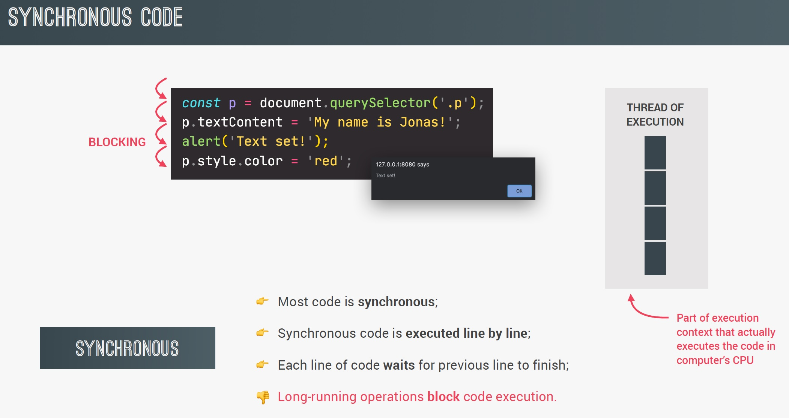
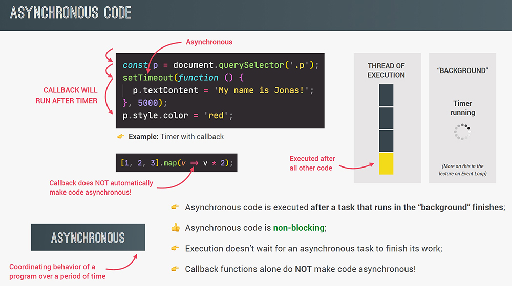
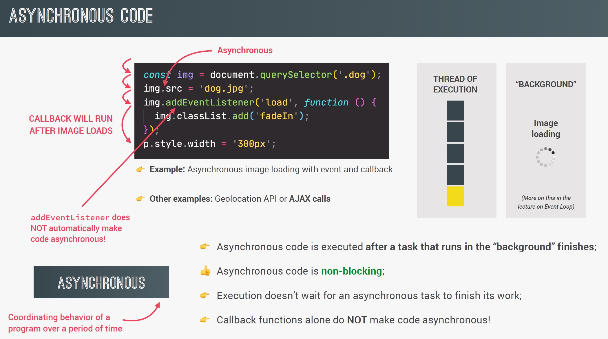

# Asynchronous JavaScript, AJAX and APIs

## Synchronous code

## Asynchronous code

Asynchronous simply means that we don't have the data right now. When we build modern websites, we don't have all the data initially, do we? I mean, we have our HTML page, our CSS page, some JavaScript, but as the page is being loaded we also have to make a request, maybe to a database, maybe we need to make a request across the web to fetch some third party API. All of these require asynchronous code because it's information we don't have yet, we need to get it. We're simply saying to JavaScript "Hey, can you go find this out for me? And when you're done with it, come back and give me that information", because JavaScript has no idea what the worldwide web or internet is. JavaScript is single threaded, it's a programming language. On the other hand, the web browser or Node.js allows us to use `async` or asynchronous code so we can interact with things outside the world of JavaScript.

As we saw in above example, we need a callback function to implement the asynchronous behavior, right? However, that does not mean that callback functions automatically make code asynchronous. That is just not the case, okay? For example, the `Array.map()` method accepts a callback function as well, but that doesn't make the code asynchronous. Only certain functions such as `setTimeout()` work in an asynchronous way. We just have to know which ones do and which ones don't, okay? But please understand this very important fact that callback functions alone do not make code asynchronous, that's essential to keep in mind.

Above example is about loading an image. So the first two lines run in a synchronous way, one after the other. Now in the second line, we set the source attribute of the image that we selected in the first line and this operation is actually asynchronous. **So setting the `src` attribute of any image is essentially loading an image in the background while the rest of the code can keep running**. And this makes sense, right? Imagine that it's a huge image, we wouldn't want our entire code to wait for the image to load and that's why setting the source attribute was implemented in JavaScript in an asynchronous way. Now, once the image has finished loading, a load event will automatically be emitted by JavaScript and so we can then listen for that event in order to act on it. Listening for the load event is exactly what we do here in the next line as well. So here we use `addEventListener` and to register a callback function for the `load` event. So just like in the previous example, we provide a callback function that will be executed once the image has been loaded and not right away, because again, all this code is non-blocking. So instead of blocking, execution moves on right to the next line immediately. Then once the image is completely loaded, it's displayed on the webpage and the load event is admitted. And since we're listening for that event, our callback function is finally executed.

There's just one more important thing that I need to mention which is the fact that **event listeners alone do not make code asynchronous**, just like **callback functions alone do also not make code asynchronous**. For example, an event listener listening for a click on a button is not doing any work in the background, it's simply waiting for a click to happen, but it's not doing anything and so there is no asynchronous behavior involved at all.

## What are AJAX calls?

**A**synchronous **J**avaScript **A**nd **X**ML allows us to communicate with remote web servers in an **asynchronous way**. With AJAX calls, we can **request data** from web servers dynamically.

## What is an API?

**A**pplication **P**rogramming **I**nterface are piece of software that can be used by another piece of software, in order to allow applications to talk to each other.

There are be many types of APIs in web development: DOM API, Geolocation API, own class API, "online" API (called just API).

> **Note**: “online” API are application running on a server, that receives requests for data, and sends data back as response;

> **Note**: we can build our own web APIs (requires back-end development, e.g. with node.js) or use 3rd-party APIs.
> There is an API for everything:
>
> - Weather data
> - Data about countries
> - Flights data
> - Currency conversion data
> - APIs for sending email or SMS
> - Google Maps
> - Millions of possibilities...

So AJAX stands for Asynchronous JavaScript And XML, so the X there stands for XML and XML is a data format which used to be widely used to transmit data on the web. However, **these days basically no API uses XML data anymore**. The term AJAX is just an old name that got very popular back in the day and so it's still used today, even though we don't use XML anymore. So instead, **most APIs these days use the JSON data format. So JSON is the most popular data format today because it's basically just a JavaScript object, but converted to a string**.

## References

1. [The Complete JavaScript Course. From Zero to Expert! - Jonas Schmedtmann](https://www.udemy.com/course/the-complete-javascript-course/?utm_source=adwords&utm_medium=udemyads&utm_campaign=JavaScript_v.PROF_la.EN_cc.ROWMTA-B_ti.6368&utm_content=deal4584&utm_term=_._ag_130756014153_._ad_558386196906_._kw__._de_c_._dm__._pl__._ti_dsa-774930039569_._li_1011789_._pd__._&matchtype=&gclid=CjwKCAjwiuuRBhBvEiwAFXKaNCuaAhZ8UB5kIldtb76eeAyfM0SUKeceBq3FKF24pNxDVe-_g0-DPxoCnWwQAvD_BwE)
